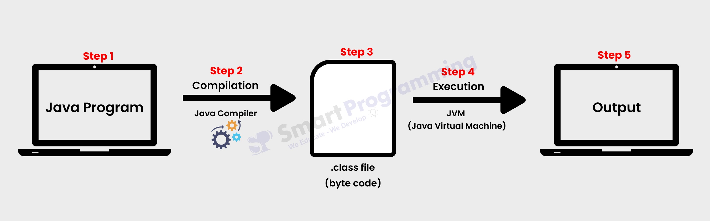
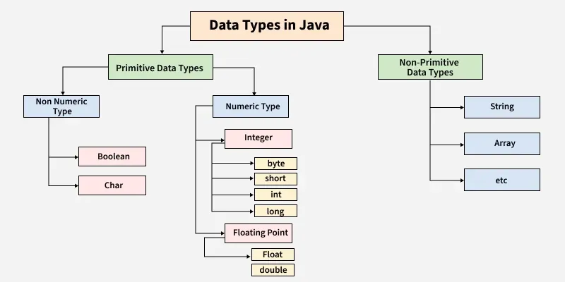

# Chapter 1: Getting Started with Java

**Name:** Daymian Snowden

**Assignment:** Midterm

---
## Chapter covers:
- Why Java was chosen for this course
- Compare/contrast with Python and C/C++
- The compilation process in detail
- Data type handling in Java
- How Java fits into the software development industry
---
### Why Java was chosen for this course?
Object-Oriented Programming (OOP), also referred to as Object-Oriented Design (OOD), is a relatively new way to
approach programming. Previously, computer scientists pretty much entirely used procedural programming, which is
based upon calling procedure from structured programming. A program is written as a series of computations that are carried
out based on the language employed; basically, programs consist of functions, routines, and subroutines.

Let's compare this to the OOP approach. First coined around the late 1950s through the 60s, the artificial intelligence group
at MIT began to experiment with the idea of objects in programming. I have a particular love for history and biology, so delving deeper
into this history was fascinating. A programmer and mathematician, Dr. Alan Kay, penned a particular interesting email explaining the
new OOP concept. In an email, he explains the origins of OOP: 

> Dr. Alan Kay on the Meaning of “Object-Oriented Programming”
> * When and where was the term "object-oriented" used first?  
> 
> At Utah sometime after Nov 66 when, influenced by Sketchpad, Simula,
the design for the ARPAnet, the Burroughs B5000, and my background in
Biology and Mathematics, I thought of an architecture for
programming. It was probably in 1967 when someone asked me what I was
doing, and I said: "It's object-oriented programming".  
> 
> The original conception of it had the following parts. 
> - I thought of objects being like biological cells and/or individual
computers on a network, only able to communicate with messages (so
messaging came at the very beginning -- it took a while to see how to
do messaging in a programming language efficiently enough to be
useful). 
> - I wanted to get rid of data. The B5000 almost did this via its almost unbelievable HW architecture. I realized that the
cell/whole-computer metaphor would get rid of data, and that "<-"
would be just another message token (it took me quite a while to
think this out because I really thought of all these symbols as names
for functions and procedures.
> - My math background made me realize that each object could have
several algebras associated with it, and there could be families of
these, and that these would be very very useful. The term
"polymorphism" was imposed much later (I think by Peter Wegner) and
it isn't quite valid, since it really comes from the nomenclature of
functions, and I wanted quite a bit more than functions. I made up a
term "genericity" for dealing with generic behaviors in a
quasi-algebraic form. 
> - I didn't like the way Simula I or Simula 67 did inheritance
(though I thought Nygaard and Dahl were just tremendous thinkers and
designers). So I decided to leave out inheritance as a built-in
feature until I understood it better.

I'll talk more about OOP in the next chapters, but I had to share what I thought was an interesting origin story. But why do we choose to use Java in this course?
Are there other OOP languages? Well, technically speaking, we could employ OOP in a variety of programming languages. However, languages vary in their capacity to support
OOP techniques. Some languages were designed with OOP in mind, while other languages employ tools or add-ons to support OOP in addition to other
paradigms (such as procedural programming). One of the most influential OOP programming languages was Smalltalk, developed by Alan Kay himself. 

Java was originally designed for interactive television programming by James Gosling, Mike Sheridan, and Patrick Naughton during the early 1990s, but it would find utility elsewhere.
Fun fact! Black Mirror's Bandersnatch has you make decisions as video game designer, as a programmer during the 1980s. I wonder if the show runners were
influenced by the early forays of Java? Anyways, Java was initially referred to as Oak, then Green, and finally Java. Java would eventually release to the public in
January of 1996, and quickly became popular as Java applets were incorporated into the most widely used web browsers.

There are other languages we could use, but Java is great choice for learning OOP, including but not limited to:
- Designed for OOP, based on previous OOPs
- Java coined "write once, run anywhere"; it is still easy to transfer code between platforms (like iOS and Windows OS)
- Requires explicit defining of variable types, good for students learning data type handling 
- Requires compilation before runtime, catching errors earlier
- Widely used among several modern industries utilizing computer science
- Huge library of resources and tools that are easily accessible
- Supported use in the popular Integrated Development Environments (IDEs)

### Compare & contrast with Python and C/C++
Well, we have talked a lot about Java. Python, C, and C++ are all different (but related) programming languages. They're all
fairly popular and widely used, although for different reasons. Let's go oldest to newest!

C is the oldest language of the bunch, created in 1972 by Dennis Ritchie, it was designed to give the programmer more direct access to the 
central processing unit (CPU) of a system. Basically, Dennis was not able to use the languages available at the time to make full use of increasingly
better hardware.  So he took B and modified it until a new compiler was written altogether, resulting in C. The language really hasn't changed much! 
- C uses static typing, similar to Java (we will talk more about data typing in a bit)
- C has relatively complex syntax when compared to Java, requiring additional packages/libraries for even basic functions
- C is considered a procedural language, whereas Java is considered an OOP language
- C requires manual memory management, where Java uses an automatic "garbage collector"
- C still sees use today in compilers, embedded systems, and OS-level coding, while Java is used more for apps, mobile development, and backend processes
- C has the faster execution times than Java because C shares the same language as the programming parts of its machine -
it is considered a low-level language, while Java requires compilation before running

Moving on! Let's consider C++. Developed in 1985 by Bjarne Stroustrup, C++ was developed as a high-level programming language for general use. Bjarne was working on "C with Classes",
an attempt to incorporate OOP principles into C. During its development, C++ focused on large systems and software with limited resources. It has been extolled for its performance,
efficiency, and flexibility. 
- C++ and Java both use static typing
- C++ has relatively more complicated syntax than Java, but more user-friendly than C with additional features
- C++ uses manual memory management and Resource acquisition is initialization (RAII), which
allows users to bind the life cycle of an object between the end of initialization and before
finalization starts; this allows programmers to prevent memory resource leaks in a simplified way
- C++ commonly sees use in games, simulations, and system software
- C++ has faster execution speeds than Java; while both languages require compilation, Java requires "translation" into an intermediate
bytecode before interpretation into machine code while C++ is compiled directly into the machine's code
- C++ uses procedural and OOP design elements, while Java is considered an OOP language

Finally, let's cover Python. Developed by through the 1980s by Guido van Rossum, it was first released in 1991.
It is a high-level langauge stresses readability and relies heavily on extensions while maintaining a small base library.
Like most programming languages, it was created to overcome existing shortcomings of available languages. Inspired by the ABC,
what started as a hobby project would eventually foster a community seeing Guido as the "benevolent dictator for life" (BDFL)
of Python.
- Python uses dynamic typing, where Java uses static
- Python has a lovely, simple syntax compared to Java
- Python and Java both have automatic memory management via a garbage collector
- Python sees use in data science, machine learning, AI, scripting, and web development
- Python has slower execution speeds than Java since Python is an interpreted language,
so its code is translated and executed line-by-line (Java is a compiled language)
- Python is considered multi-paradigmal; it has elements of procedural, object-oriented, and functional programming

### The compilation process in detail
What is compilation? Welp, in computer programming, there are generally two ways to execute a computer program.
The first way is considered interpretation, where software reads a program (usually code) and the computer executes the instructions. 
The other way is called compilation, when our program is first translated by software  (at least once) before the computer can execute the code.
Basically, when programs require some sort of translation before hardware can follow the instructions, their coding language is considered a compiled language.
However, things get fuzzy. Programming languages can be either compiled or interpreted, while some languages use both compilers and interpreters.
There are indeed hybrid approaches, which blur the line between interpretation and compilation, usually created with the intent of maximizing benefits between the two implementations.  

Java is considered a compiled language, for the most part.
Almost all Java applications are compiled to bytecode before they see use in hardware.
Technically, you can run single line Java source files, doing a sort of compilation in real-time.
But most applications using Java are going to utilize some measure of compilation.
This allows platforms that support Java to run compiled Java code without the need for recompilation.
Also, the Java language supports more dynamic coding features when compared with other compiled languages.
Two such features include the ability to modify code during run time, or examine and modify its structure and behavior (reflective programming).

Generally speaking though, most all Java programs follow the basic sequence noted in the image below (assuming our program works correctly, of course)
- Step 1. Java program contains java (source) code, written by the programmer.
- Step 2. The Java Compiler reads the file, checks for errors, and saves the resulting bytecode into a class file.
  - What is bytecode? It is a set of instructions that Java a Virtual Machine (JVM) uses to execute its commands.
  For the most part, programmers don't have to have an in-depth knowledge of bytecode.
  The important thing to note is that this crucial step is what allows Java programs to run seamlessly between platforms without requiring recompilation every time.
- Step 3. Our resulting bytecode can be read any machine that has a Java virtual machine; neat!
- Step 4. The JVM reads the bytecode and translates into the native operating system's machine code
- Step 5. The JVM executes the instructions, performing the instructions contained within

*Figure 1: How Java Works -  https://smartprogramming.in/tutorials/java/how-java-works*

### Data type handling in Java
We talked a little bit about data types earlier when discussing the differences between Java and C, C++, and Python.
Unlike other languages, the programmer must assign a data type to each variable.
We consider Java statically-typed in this way, as we must declare our variable type before we can use them.

What is a data type? Well, it depends on the data. Different programming languages will differentiate between what data each variable can store.
Generally speaking, data types are differentiated based on:
- Possible values (what information the data can contain)
- Possible operations (how the data can be manipulated)
- Possible representations (how the data can be interpreted)
- Possible size (how much data is allowed to be stored)

There are two main categories of data types in Java: primitive and non-primitive.
The range of values that each data type can hold is limited by the data type, and its size largely determines the potential range.

*Figure 2: Data Types in Java -  https://www.geeksforgeeks.org/java/java-data-types/*

**Primitive Data Types**
- These are predefined by Java; they are native and have their own keywords reserved to use them
- Primitive data types must hold a value; they cannot be null
- There are two non-numeric data types
    - **Boolean**: Used to store true or false values, commonly employed in conditional statements and logic operations; size is typically 1 bit but JVM-dependent (often 1 byte in practice); only two possible values: true or false
    - **Char**: Used to store single Unicode characters including the letters, digits, and symbols used in human-to-human communication; size is 2 bytes (16 bits); range from '\u0000' (0) to '\uffff' (65,535)
- There are six numeric types classified as either integer or floating point (decimal) values
    - **Integer (Four types)**
        - **byte**: Used for saving memory in large arrays or when working with raw binary data; size is 1 byte (8 bits); range from -128 to 127
        - **short**: Used when memory savings matter but byte is too restrictive; size is 2 bytes (16 bits); range from -32,768 to 32,767
        - **int**: Default choice for integer values in most situations; size is 4 bytes (32 bits); range from very negative to relatively large
        - **long**: Used when int range is insufficient, such as for large calculations or representing time in milliseconds; size is 8 bytes (64 bits); range from very negative to quite large
    - **Floating point (Two types)**
        - **float**: Used for decimal values when precision beyond 6-7 significant digits is not required and memory is a concern;
      size is 4 bytes (32 bits); provides ~7 decimal digits of precision, from negative to positive values
        - **double**: Default choice for decimal values, offering greater precision; size is 8 bytes (64 bits); negative and positive range; provides ~15 decimal digits of precision

**Non-Primitive Data Types**
- These are also called reference types because they refer to the memory addresses of objects
- Except for the String type, these types are created directly by programmers
- Non-primitive data types can be null; they do not have to hold a value
- Examples:
    - **String**: Used to store sequences of characters (text); immutable in Java, meaning once created, the content cannot be changed; size depends on the length of the text and character encoding
    - **Array**: Used to store multiple values of the same type in a single variable; provides indexed access to elements; size is fixed at creation and depends on the number of elements and their type
    - **Class**: User-defined blueprint for creating objects; defines the properties (fields) and behaviors (methods) that objects of the class will have; size depends on its fields and the data they contain
    - **Interface**: Used to define a contract that classes can implement; specifies method signatures without implementation; enables polymorphism and abstraction in Java programs
    - **Object**: The root class of all Java classes; used as a generic reference type when the specific type is unknown or varies; all non-primitive types inherit from Object
### How Java fits into the software development industry
That was a lot of information! We covered some history, compared languages, and dug into the meat and potatoes of Java.
So why is Java one of the most popular programming languages in the software development industry?
What are the use cases? When should we consider using Java over another language?
- **Enterprise Applications**: The "write once, run anywhere" capability of Java dominates backend systems in large organizations.
It has robust stability and mature frameworks like Spring and Hibernate. Banks, insurance companies, and Fortune 500 corporations
all rely on Java to run their systems and user applications reliably across different platforms.
- **Android Mobile Development**: Java is one of the primary languages for Android development.
Chances are good that if you're building mobile apps for the Android operating systems, you will want to use Java for at least parts of your program.
- **Web Applications**: Java servlets, JSPs, and frameworks like Spring Boot are all used to build scalable web applications.
E-commerce platforms, social media backends, and streaming services also all use Java for handling their massive audiences and constant use.
- **Financial Services**: Trading platforms, banking systems, and financial analysis tools like to use Java because its strong static typing and compile-time error checking.
When accuracy and reliability matter most, Java's syntax becomes more of a benefit rather than a burden.
- **Big Data and Cloud Computing**: Technologies like Apache Hadoop, Apache Kafka, and Apache Spark were all built with Java.
Because Java has high performance times and robust memory management, it is an ideal candidate for processing massive datasets and utilizing cloud-native microservices.
- **Scientific and Research Applications**: Java's portability means research code can run on different systems without modification.
Considering that universities, research institutions, and think tanks may not even share a native tongue, such groups can appreciate the ability to run the same code regardless of their platform.
Furthermore, Java has access to a variety of extensions that enable it to compete with Python concerning certain tasks.
- **When to choose Java:**
  - Platform independence
  - Long-term maintainability
  - Strong typing for catching errors early
  - Integration with existing enterprise systems
  - Android application Development
  - Error-catching compilation process
- **When to consider a different language**
  - You need rapid prototyping
  - You want better data science capabilities
  - You require maximum performance, like when doing system-level programming
  - In these cases, consider languages like Python or C++

No programming language is the best for every situation. A good programmer knows this, and chooses the right tools (languages) for the right jobs (problem-solving).

---
### Academic Integrity Statement
I understand that my learning is dependent on individual effort and struggle, and I acknowledge that this assignment is a 100% original work and that I received no other assistance other than what is listed here.

**Acknowledgements and assistance received:**
- Java OOP (Object Oriented Programming) Concepts - https://www.geeksforgeeks.org/java/object-oriented-programming-oops-concept-in-java/
- Java OOP - https://www.w3schools.com/java/java_oop.asp
- Differences between Procedural and Object Oriented Programming - https://www.geeksforgeeks.org/software-engineering/differences-between-procedural-and-object-oriented-programming/
- Object-oriented programming - https://en.wikipedia.org/wiki/Object-oriented_programming
- Dr. Alan Kay on the Meaning of “Object-Oriented Programming” - http://userpage.fu-berlin.de/~ram/pub/pub_jf47ht81Ht/doc_kay_oop_en
- Java (programming language) - https://en.wikipedia.org/wiki/Java_(programming_language)
- Java Conventions document - https://www.oracle.com/technetwork/java/codeconventions-150003.pdf
- C vs C++ vs Java vs Python vs JavaScript - https://www.geeksforgeeks.org/java/c-vs-java-vs-python/
- C (programming language) - https://en.wikipedia.org/wiki/C_(programming_language)
- Low-level programming language - https://en.wikipedia.org/wiki/Low-level_programming_language
- Low-Level vs. High-Level Programming Languages - https://www.coursera.org/articles/high-level-programming-languages
- C++ - https://en.wikipedia.org/wiki/C%2B%2B
- Why Java Language is Slower Than CPP for Competitive Programming? - https://www.geeksforgeeks.org/java/why-java-language-is-slower-than-cpp-for-competitive-programming/
- Resource acquistion is initialization - https://en.wikipedia.org/wiki/Resource_acquisition_is_initialization
- Python (programming language) - https://en.wikipedia.org/wiki/Python_(programming_language)
- How Java Works - https://smartprogramming.in/tutorials/java/how-java-works
- Compiled Language - https://en.wikipedia.org/wiki/Compiled_language
- Compilation and Execution of a Java Program - https://www.geeksforgeeks.org/java/compilation-execution-java-program/
- Programming language implementation - https://en.wikipedia.org/wiki/Programming_language_implementation
- Java bytecode - https://en.wikipedia.org/wiki/Java_bytecode
- Java Data Types - https://www.w3schools.com/java/java_data_types.asp
- Java Data Types - https://www.geeksforgeeks.org/java/java-data-types/
- Data Types in Programming - https://www.w3schools.com/programming/prog_data_types.php
- What is Java used for - https://www.coursera.org/articles/what-is-java-used-for
- Top 20 Java Applications in Real World [2025] - https://www.geeksforgeeks.org/blogs/top-applications-of-java-in-real-world/
- Module 0: Tool and Infrastructure Set-Up - Course Page
- Module 1: Data Definitions, Classes and Testing in Java - Course Page

I did not use generative AI in any form to create this content and the final content was not adapted from generative AI created content.

I did not view content from anyone else’s submission including submissions from previous semesters nor am I submitting someone else’s previous work in part or in whole.

I am the only creator for this content. All sections are my work and no one else’s with the exception being any starter content provided by the instructor. If asked to explain any part of this content, I will be able to.

By putting your name and date here, you acknowledge that all of the above is true and you acknowledge that lying on this form is a violation of academic integrity and will result in no credit on this assignment and possible further repercussions as determined by the Khoury Academic Integrity Committee.

#### Signed: Daymian Snowden
#### Date: 10/12/2025

---