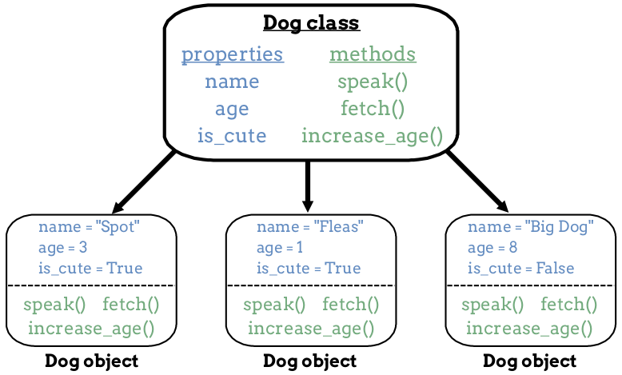
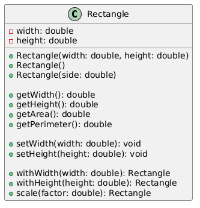

# Chapter 2: Object Oriented Design with Java Basic

**Name:** Daymian Snowden

**Assignment:** Midterm

---
## Chapter covers:
- OOD terminology and philosophy
- Introduction to class
- Basic class design 
- Constructors 
- The *this* pointer
- Getters/setters
- OOD pros and cons
- Example problems showing the difference between an OOD approach vs procedural approach
---
### Object-Oriented Design (OOD) and Recap
We talked a little bit about OOD in chapter 1, but let's discuss it in detail.
Rather than approach problems as independent problems, OOD seeks to build a cohesive system of objects.
These objects contain states, behaviors, and identities. 
In Java, these are represented by fields (state), methods (behavior), and a unique memory reference (identity).
As such, OOD treats objects as representations of real or abstract entities, and us programmers use their interactions and relationships to achieve our aims.
Instead of using separate entities to represent either data or functions, OOD uses objects to represent and manipulate data simultaneously.
Much like Dr. Alan Kay explained earlier, objects work like cells; each contains their own internal data, methods, relationships, and independence.
Rather than asking ourselves "what steps do I need to perform to complete a task", we ask ourselves "what objects exist and how can their interactions meet our requirements".

Let's go over some terminology, principles, and design that will further explain the OOD paradigm.

**Important OOD Terminology**

- **Class**: A blueprint or template that defines the structure and behavior of objects. 
  - It specifies what fields (data) and methods (behavior) objects created from this class will have. 
  - They are basically plans — it defines a resulting object without being an object itself.


- **Object (or Instance)**: A concrete realization of a class created in memory. 
  - If a class is the blueprint, an object is the resulting item. 
  - Each object has its own copy of the class's fields, but also shares the class's methods.


- **Method**: Any function defined within a class that describes what objects (of that class) can do.
  - Methods represent the behavior of objects
  - Methods can also access and modify the object's fields


- **Field (Attribute/Property)**: A variable defined within a class that holds data.
    - Fields represent the state of objects and define what information each object stores.


- **Constructor**: This is a special method that is called when creating a new object using the `new` keyword.
    - Constructors initialize an object's fields and prepare it for use.
    - A constructor has the same name as its class and has no return type.


- **Encapsulation**: The practice of bundling data (fields) and the methods that operate on that data together within a class, which also can hide the internal implementation details. 
  - In Java, access modifiers (`private`, `public`, `protected`) that control what parts of a class are visible to other classes. 
  - Encapsulation protects object integrity by preventing external code from directly manipulating internal state.


- **Inheritance**: A mechanism where a new class (subclass/child) is created based on an existing class (superclass/parent), inheriting its fields and methods. 
  - This establishes an "is-a" relationship and promotes code reuse.
  - For example, if `Dog` inherits from `Animal`, a dog becomes an animal and automatically has all the properties and behaviors of its class (animal).


- **Polymorphism**: The ability for objects of different classes to respond to the same method call in different ways.
  - Fun fact! Polymorphism literally means "many forms".
  - Polymorphism allows you to write general code that works with multiple specific types.
    For instance, `animal.makeSound()` could be programmed to produce different results on the `animal`, such as a dog, cat, or goose.


- **Abstraction**: The practice of hiding complex implementation details and exposing only essential features.
  - Abstraction lets you focus on **what** an object does, not **how** it does it.
  - We focus on using classes to simplify otherwise complex systems.
  - It's like driving a car; while driving, we are (hopefully) not concerned about the nuance of fuel injection or electrical wiring, and instead focusing on steering, braking, etc.
  - In Java, we primarily use abstract classes and interfaces as abstractions.


- **Composition**: Build complex objects by combining simpler objects, establishing "has-a" relationships between classes.
  - Promotes code reuse and creates flexible designs that are easier to modify when compared to inheritance hierarchies.
  - Objects contain instances of other objects as fields and delegate responsibilities to them
  - Example: A `Car` *has an* `Engine`, *has a* `Transmission`, and *has* `Wheel` objects; the car contains these objects and uses their methods, but is itself a distinct object.


- **Message Passing**: The process by which objects communicate with each other through method calls.
  - For example, if we call `student.calculateGPA()`, we are actually sending a message to the student object and requesting it to perform that action (calculate student GPA).
  

- **Contract**: A promise or agreement about what methods a class must provide.
  - Any class that implements or extends an interface or abstract class must provide a set of specific methods with these signatures
  - Here is an example contract below:
```java
// This interface is a CONTRACT
public interface Flyable {
void fly();      // Contract: You MUST have a fly() method
void land();     // Contract: You MUST have a land() method
}

// Bird must fulfill the contract
public class Bird implements Flyable {
    @Override
    public void fly() {
        System.out.println("Flapping wings");
    }

    @Override
    public void land() {
        System.out.println("Landing on branch");
    }
}

``` 
Just to make sure we are on the same page. Classes and objects are different but related!
An object can be created using a class. Observe the image below for further clarification.

  
*Figure 1: Relationship Between Classes and Objects -  https://education.launchcode.org/data-analysis/chapters/classes-and-objects/creating-classes.html*

If it's still not making sense, it will soon!

**Key Principles (SOLID)**

The SOLID principles are five design guidelines that help create maintainable, flexible, and understandable object-oriented code. The acronym stands for:

- **Single Responsibility Principle (SRP)**: A class should have only one reason to change, meaning it should have only one job or responsibility.
  - If a class tries to do too many things, changes to one responsibility can break functionality related to another.
  - For example, a `Student` class should handle student data and behavior; it should not be used for database connections or file I/O.


- **Open/Closed Principle (OCP)**: Classes should be open for extension but closed for modification.
  - You should be able to add new functionality by creating new classes (through inheritance or composition) without changing existing, working code.
  - This principle reduces the risk of breaking existing functionality when adding features.


- **Liskov Substitution Principle (LSP)**: Objects of a subclass should be able to replace objects of the superclass without breaking the program. 
  - For example, if `Dog` extends `Animal`, you should be able to use a `Dog` object anywhere an `Animal` object is expected.
  - In this way, we say that subclasses must honor the contracts established by their parent classes.


- **Interface Segregation Principle (ISP)**: Clients should not be forced to depend on interfaces they don't use.
  - Rather than creating one large, general-purpose interface, we should create smaller, specific interfaces.
  - For example, instead of a giant `Animal` interface with methods for all the locomotion types, we should instead create separate `Flys`, `Swims`, and `Runs` interfaces.


- **Dependency Inversion Principle (DIP)**: High-level modules should not depend on low-level modules; instead, both should depend on abstractions.
  - Quiz time! What's an abstraction? An abstraction is simplified representation of something more complicated.
  - Additionally, abstractions should not depend on details!
  - Details should depend on abstractions, which should encourage interfaces over concrete implementations, resulting in more flexible and testable code.

**System Design**

System design in OOD involves identifying the major components (classes and objects) of your program, then determining how they interact in relation to one's goals.
Key considerations include:

- **Identifying Objects and Classes**: Analyze the problem domain to determine what entities exist.
  - Look at nouns in the problem description—these often become classes and objects.
  - Define classes based on the objects in the system.
  - For a university system, we would identify students, courses, professors, etc.


- **Defining Relationships**: Determine how objects relate to each other.
  - Common relationships include "has-a" (composition), "is-a" (inheritance), and "uses-a" (dependency).
  - For example, a University *has an* HR department, a professor *is an* employee, and a course *uses a* classroom.


- **Establishing Responsibilities**: Decide what each class is responsible for.
  - Apply SRP to keep classes focused.
  - Define methods for each class.
  - A `Course` class should manage enrollment and grading, while a separate `Transcript` class manages a student's academic history.


- **Planning for Change**: Design systems that can accommodate future requirements without major rewrites.
  - Implement the classes and objects, preferably using a test based framework when appropriate.
  - Use interfaces and abstract classes to define contracts
  - Concrete classes implement contracts in different ways.

**Object Design**

Object design focuses on the internal structure of individual classes—what fields they contain, what methods they provide, and how they maintain their invariants (rules that must always be true).
Key aspects include:

- **Choosing Fields**: Determine what data each object needs to store to represent its state.
  - Fields should be directly related to the class's responsibilities.
  - A `BankAccount` needs a `balance` and `accountNumber`; we don't need to know the account holder's favorite color.


- **Defining Methods**: Create methods that allow objects to perform their responsibilities and interact with other objects.
  - Methods should have clear, single purposes and descriptive names.
  - It is better to use many small methods over a few large methods, as this reduces the scale of errors and helps during debugging.


- **Access Control**: Use access modifiers appropriately.
  - Make fields `private` by default to enforce encapsulation, and provide `public` methods (getters/setters) only when external access is necessary.
  - Protect internal implementation details, in accordance with abstraction and encapsulation.


- **Maintaining Invariants**: Ensure objects can never enter an invalid state.
  - If a `Rectangle` must always have positive dimensions, the constructor and setter methods should not allow for negative values.


- **Designing Constructors**: Provide constructors that initialize objects in valid states.
  - Consider offering multiple constructors for different initialization scenarios.
  - Ensure all constructors result in properly configured objects.

**Common Object Design Patterns**

While we've covered general principles concerning object design, there are recurring problems in OOD that experience developers have identified (to the benefit of all). 
These observations eventually resulted in design patterns as proven solutions to common design challenges.
Using these design patterns will often make code more maintainable, flexible, and understandable. 
Here are some fundamental patterns, although this list is definitely not exhaustive:

- **Creational patterns:** deals with object creation mechanisms; provides flexible ways to create objects appropriate to the situation.
  - **Singleton**: Ensures a class has only one instance throughout the program and provides a global point of access to it.
  Useful for managing shared resources like database connections or configuration settings.
  - **Factory Method**: Defines an interface for creating objects but allows subclasses to decide which class to instantiate.
  This pattern delegates the instantiation logic to subclasses, which makes code more flexible and easier to extend.


- **Structural Patterns**: deals with object composition and relationships between classes; provides ways to change a portion of code without requiring changes to the entire structure.
  - **Adapter**: Converts the interface of one class into an interface that clients expect, allowing incompatible classes to work together.
  Imagine a power adapter that lets you plug a US device into a European outlet; same concept.
  - **Composite**: Composes objects into tree structures to represent part-whole hierarchies (like folders containing files and other folders).
  This allows clients to treat individual objects and compositions uniformly, where we can perform the same operations on a single file, or even an entire folder structure.


- **Behavioral Patterns**: deals with communication between objects and the assignment of responsibilities; provides ways to make interactions more flexible and easier to understand.
  - **Observer**: Defines a one-to-many dependency between objects where changes to one object automatically notify and update all dependent objects.
  This pattern is commonly found in event-driven systems, such that multiple users can respond to events.
  - **Strategy**: Defines a family of interchangeable algorithms and encapsulates each one, allowing the algorithm to vary independently. 
  For example, a sorting system could swap between quicksort, mergesort, or bubblesort without changing the code that calls the sort method.

These patterns represent a lot of collective failures between years of programmers. 
We don't have to memorize them all, but it is extremely helpful to apply these patterns to save time and develop robust solutions.
At the end of the day, why do the work that's already been done, right?
As it is, computer science is a vast field, and one can barely scratch the surface without revealing an overwhelming amount of content.

### Introduction to Classes

A class in Java is the fundamental building block of OOD.
They are effectively a user-created, custom data type to represent something meaningful in your program.
Java provides primitive types like `int`, `double`, and `boolean`, and these are good. 
However, with classes, we can bundle related data and behavior together and create good objects.

Every class has several key components:
- **Class Declaration**: Defines the class name and access level
- **Fields**: Variables that hold the object's state
- **Constructors**: Special methods that initialize new objects
- **Methods**: Functions that define what objects can do
- **Access Modifiers**: Keywords like `private` and `public` that control visibility

### Basic Class Design

When designing a class, we need to answer some questions:
1. What does this object represent?
2. What data does it need to store? (fields)
3. What can it do? (methods)
4. How should it be created? (constructors)

As an example, let's design a `Rectangle` class, one step at a time.

**Step 1/2: What does this object represent? What data does it need to store?**

A rectangle represents a shape with a width and height:
```java
public class Rectangle {
    private double width;
    private double height;
}
```

Notice that we used `private` for fields. Why would we do that?
This is encapsulation! We don't want outside code directly changing these values without validation.
Essentially, we are protecting our code from our code.

**Step 3: Decide what operations make sense - What should it do?**

What should a rectangle be able to do?
Maybe it moves! Maybe it's decoration?
In this case, we will keep it simple and include a method to calculate its area and perimeter:
```java
public class Rectangle {
    private double width;
    private double height;
    
    public double getArea() {
        return width * height;
    }
    
    public double getPerimeter() {
        return 2 * (width + height);
    }
}
```

Notice the data types that we had to use.
Static typing means without noting `double`, Java would show an error during compilation, as it wouldn't know what data type to use.
We also use double instead of a larger data type because we don't want to inefficiently allocate more memory than necessary. 

**Step 4: Add validation and constructors**

We need to ensure rectangles always have positive dimensions.
Which brings us to the constructor methods section!


We will cover getters & setters afterwards, no worries.


**Things to remember, before we move on:**
- Keep fields private (encapsulation); make methods public only when necessary
- Use meaningful names that clearly communicate purpose, with a preference for simplicity
- Keep methods focused on a single responsibility

### Constructors

Constructors are special methods that run when we create a new object using the `new` keyword.
They initialize the object's fields, and when properly coded, ensure objects start in a valid state.
Before we dig in further, a couple of rules we must follow when using constructors in Java!

**Constructor Rules:**
- Must have the exact same name as the class
- Have no return type - not even `void` is allowed
- Can (and probably should) have parameters

Notice how we have three different constructors with the same name but different parameters? 

This is called **constructor overloading**.
Constructors are considered overloaded when there are multiple constructors with different parameters within the same class.
We will talk more about overloading later, but I just wanted to point it out for now.

**Example: Rectangle Constructors**
```java
public class Rectangle {
    private double width;
    private double height;
    
    // Constructor with parameters
    public Rectangle(double width, double height) {
        // Validate input - important for all constructors
        if (width <= 0 || height <= 0) {
            throw new IllegalArgumentException("Dimensions must be positive");
        }
        this.width = width;
        this.height = height;
    }
    
    // Default constructor (creates a 1x1 square)
    public Rectangle() {
        this.width = 1.0;
        // Note: since we specified `double`, we use '1.0', not '1'
        this.height = 1.0;
    }
    
    // Constructor for squares (only one dimension needed)
    public Rectangle(double side) {
        this(side, side);  // Calls the two-parameter constructor
    }
}

// Usage:
Rectangle rect1 = new Rectangle(5.0, 3.0);  // 5x3 rectangle
Rectangle rect2 = new Rectangle();           // 1x1 square (default)
Rectangle rect3 = new Rectangle(4.0);        // 4x4 square
```

**Let's take a minute to talk about the above code and what is going on:**

- **Constructor overloading**
  - Constructor overloading provides flexibility by allowing classes to have multiple constructors with different parameters.
  - Users can create objects depending on what information they have available, which may vary depending on the user.
  - The default constructor is especially useful - we can create an object first, then set its values later.


- **What Happens Without a Constructor?**
  - If we don't write any constructors, Java provides a default no-argument constructor automatically. 
  - Once a constructor is created by the programmer, Java stops providing the default one. 
  - If you want both parameterized and no-argument constructors, **you must write both explicitly**.


- **Constructor Chaining:**
  - Notice `this(side, side)` in the square constructor? 
  - This calls another constructor in the same class, avoiding code duplication. 
  - Always call `this()` as the first statement if you use it!

Actually, let's talk more about `this`!

### The *this* Keyword

  
*Figure 2: Hopefully this joke makes sense in a bit - https://www.buzzfeed.com/andriamoore/andrew-garfield-spider-man-meme-movie*


Huh? What is `this`? Oh, you mean `this`?
More specifically, what is the `this` keyword in Java?

In Java, `this` is a reference to the current object — the object whose method or constructor is being called.
Effectively, when we use `this`, the object points to itself.
There are few cases when it's useful to use `this`.

**Use Case 1: Disambiguating Field Names**

This is the most common use, for when parameter names match field names:
```java
public class Student {
    private String name;
    private int studentID;
    
    public Student(String name, int studentID) {
        // Without "this", Java wouldn't know which "name" you mean
        this.name = name;           // this.name = the field
        this.studentID = studentID; // name = the parameter
    }
}
```

Without `this`, the assignment `name = name` would just assign the parameter to itself - but we want it to apply to the field!
This is actually a fairly common mistake, especially among programmers coming from other languages.
When we want to assign a parameter to an object field, we need to specify `this`!
```java
public void setName(String name) {
    name = name;  // Wrong! This assigns parameter to itself
}

public void setName(String name) {
    this.name = name;  // Correct! Assigns parameter to field
}
```

**Use Case 2: Calling Other Constructors**

Look familiar? I should hope so! We did this earlier with constructor chaining:
```java
public class Rectangle {
    private double width;
    private double height;
    
    public Rectangle(double width, double height) {
        this.width = width;
        this.height = height;
    }
    
    // Square constructor calls the rectangle constructor
    public Rectangle(double side) {
        this(side, side);  // Must be first statement
    }
}
```

**Use Case 3: Passing the Current Object**

Sometimes, we want to pass the current object to another method:
```java
public class Student {
    private String name;
    
    public void enrollInCourse(Course course) {
        course.addStudent(this);  // Pass this student to the course
    }
}
```

**Use Case 4: Returning the Current Object**

We can use `this` in a similar fashion as we did with constructor chaining - now introducing method chaining!
By calling multiple methods in a row, each method will return `this` (the current object)
```java
public class StringBuilder {
    public StringBuilder append(String text) {
        // ... append logic ...
        return this;  // Return the current object
    }
}

// Allows chaining:
StringBuilder sb = new StringBuilder()
    .append("Hello")
    .append(" ")
    .append("World");

System.out.println(sb.toString());  // Prints: Hello World
```

Using `this` is technically optional when there's no ambiguity, but it makes code clearer.
These are equivalent:
```java
public double getArea() {
    return this.width * this.height;  // Explicit
}

public double getArea() {
    return width * height;  // Implicit - Java knows you mean this object's fields
}
```

As such, most programmers omit `this` when it's not needed.
*Some* style guides prefer always using it for clarity, and it may depend on what your development guidelines are.

Now, let's move to getters and setters!

### Getters and Setters

Getters and setters (accessor and mutator methods) provide controlled access to private fields.
They're a key part of encapsulation, where we protect access to our code's data unless otherwise necessary.

**Why Not Just Make Fields Public?**

Well, I can think of at least one example...
```java
// Fields are public
public class BankAccount {
    public double balance;  // Literally anyone can change this!
}

BankAccount account = new BankAccount();
account.balance = -1000;  // Welcome to indentured servitude!
```

Public fields allow anyone to modify data without validation, which breaks invariants, cause bugs, and leads to lawsuits.

**The Better Approach: Getters and Setters**  
So, what can we do instead? I mean, we do need access to the account balance somehow.
```java
public class BankAccount {
    private double balance;  // Protected from direct access
    
    // Getter - allows reading the value
    public double getBalance() {
        return balance;
    }
    
    // Setter - allows controlled modification
    public void setBalance(double newBalance) {
        if (newBalance < 0) {
            throw new IllegalArgumentException("Balance cannot be negative");
        }
        this.balance = newBalance;
    }
}

BankAccount account = new BankAccount();
account.setBalance(1000);  // OK
account.setBalance(-500);  // Throws exception - validation works!
```

**Getter Naming Convention:**  
A quick note on proper Java etiquette.
- When using boolean fields: `isFieldName()` or `hasFieldName()`
- For all other types: `getFieldName()`
```java
public class Student {
    private boolean enrolled;
    private String name;
    
    public boolean isEnrolled() {  // Boolean getter uses "is"
        return enrolled;
    }
    
    public String getName() {  // Regular getter uses "get"
        return name;
    }
}
```

**Do We Always Need Getters & Setters?**

Short answer, no.
Long answer, not every field needs both! 
Consider the following use cases:
- **Read-only fields**: Provide only a getter (like a student ID, which shouldn't change)
- **Write-only fields**: More rare, but sometimes you only need a setter (like for passwords)
- **No access**: Some fields are purely internal and need neither, which may change depending on the context

**Computed Properties:**

There is useful property of getters - they don't have to return stored fields directly!
Instead, we can use them to calculate values:
```java
public class Rectangle {
    private double width;
    private double height;
    
    // Not stored as a field - computed on demand
    public double getArea() {
        return width * height;
    }
}
```

In fact, this typically a good way to store information. In this case, storing area as a field ensures the area automatically stays correct when dimensions change.
Let's take a look at the `Rectangle` class we were making earlier, and integrate what we learned to make a properly designed class!

```java
public class Rectangle {
    private double width;
    private double height;
    
    // Constructor with parameters
    public Rectangle(double width, double height) {
        // Validate input - important for all constructors
        if (width <= 0 || height <= 0) {
            throw new IllegalArgumentException("Dimensions must be positive");
        }
        this.width = width;
        this.height = height;
    }
    
    // Default constructor (creates a 1x1 square)
    public Rectangle() {
        this.width = 1.0;
        // Note: since we specified `double`, we use '1.0', not '1'
        this.height = 1.0;
    }
    
    // Constructor for squares (only one dimension needed)
    public Rectangle(double side) {
        this(side, side);  // Calls the two-parameter constructor
    }
    
    // Getters
    public double getWidth() {
        return width;
    }
    
    public double getHeight() {
        return height;
    }
    
    // Computed property - no field storage needed
    public double getArea() {
        return width * height;
    }
    
    // Again, using computer property with a getter
    public double getPerimeter() {
        return 2 * (width + height);
    }
    
    // Setters used for validation
    public void setWidth(double width) {
        if (width <= 0) {
            throw new IllegalArgumentException("Width must be positive");
        }
        this.width = width;
    }
    
    public void setHeight(double height) {
        if (height <= 0) {
            throw new IllegalArgumentException("Height must be positive");
        }
        this.height = height;
    }
    
    // Method chaining - using setters that return 'this'
    public Rectangle withWidth(double width) {
        setWidth(width);
        return this;  // Return current object for chaining
    }
    
    public Rectangle withHeight(double height) {
        setHeight(height);
        return this;  // Return current object for chaining
    }
    
    public Rectangle scale(double factor) {
        this.width *= factor;
        this.height *= factor;
        return this;  // Return current object for chaining
    }
}

// Usage examples:
Rectangle rect1 = new Rectangle(5.0, 3.0);  // 5x3 rectangle
Rectangle rect2 = new Rectangle();           // 1x1 square (default)
Rectangle rect3 = new Rectangle(4.0);        // 4x4 square

// Using our getters
System.out.println("Area: " + rect1.getArea());           // Area: 15.0
System.out.println("Perimeter: " + rect1.getPerimeter()); // Perimeter: 16.0

// Using our setters
rect2.setWidth(10.0);
rect2.setHeight(5.0);
System.out.println("New area: " + rect2.getArea());  // New area: 50.0

// Method chaining - nice and readable!
Rectangle rect4 = new Rectangle()
    .withWidth(8.0)
    .withHeight(4.0)
    .scale(2.0);  // Now 16x8

System.out.println("Chained rectangle area: " + rect4.getArea());  // Resulting Area: 128.0
```
We now have a properly designed class! Notice that we are able to generate objects with various parameters through our constructors, but they remain children of this class.
This is a template which we can use and modify for our needs, and shows the power behind OOD.


In fact, here is a UML design that represents our `Rectangle` class. Typically, a programmer would start with their UML design, then create the program.
I am providing here, so we can connect the dots to our finished! UML designs are just one way that programmers can visualize OOD, and represent a valuable design tool.

  
*Figure 3: UML class diagram for the `Rectangle` class -  https://editor.plantuml.com/*

### OOD Pros and Cons
Nothing is monolith, right? There are times when problems would be better solved using a different approach.
Before we get into that, let's review the pros and cons.

**OOD Pros**

- **Modularity**: OOD simplifies development and maintenance by decomposing complicated structures into smaller, more manageable components.
  Each class focuses on a single, specific responsibility, resulting in a system that is easier to understand and modify.

- **Reusability**: Objects and classes can be reused across different projects, reducing redundancy and saving time.
  There is no reason we can use classes like `Date` or `Money` in other applications, likely with little to no modification.

- **Scalability**: OOD facilitates system growth; when used properly, it should be simple to incorporate new objects without interfering with existing functionality.
  Adding new animal types to our previous zoo example should require no changes to existing code, only additions.

- **Maintainability**: Encapsulation of data and behavior within objects also simplifies troubleshooting and updates.
  If a bug occurred in the `Rectangle` class, we would know exactly where to look — we would not have to search through procedural code, likely scattered across multiple files.

- **Clear Mapping to Real-World Problems**: By modeling software after real-world entities and their interactions, OOD is a more intuitive and easier to understand approach to most systems.
  Non-programmers are often able to understand class diagrams because they mirror real systems.

- **Flexibility and Extensibility**: Through inheritance and polymorphism, OOD allows for extending and adapting systems with minimal changes.
This allows code to accommodate future requirements efficiently. The Open/Closed Principle also relates to this flexibility.

**OOD Cons**

- **Steeper Learning Curve**: OOD requires understanding abstract concepts, like abstraction, inheritance, polymorphism, and encapsulation.
  Beginners often find procedural programming initially more natural, as it mirrors step-by-step instructions.


- **Over-Engineering Risk**: It's easy to create unnecessarily complex class hierarchies when simpler solutions would suffice.
  Why create five classes for a small data set when 20 lines of procedural functions would do the same thing?
  Knowing when to apply OOD versus when it just adds complexity is just another part of understanding OOD and programming in general.


- **Performance Overhead**: Object creation, method calls, and polymorphic dispatch add small performance costs compared to procedural code.
  For most applications, we consider these effects negligible and an acceptable price to pay. 
  However, in performance-critical systems (like action video games or real-time systems), every microsecond makes all the difference.


- **Initial Development Time**: Setting up a proper OOD system with classes, interfaces, and relationships takes more upfront time than writing procedural code.
  Oftentimes, developers will spend a good portion of their work time on UML designs and testing methods.
  But for something like a small, one-off script, it is hard to justify the overhead OOD can require.


- **Memory Usage**: Speaking of overhead... objects carry overhead. By this, I mean each object stores its fields plus metadata about its type.
  (Remember when we talked about bytecode earlier? Anyway...) An array of simple procedural structures uses less memory than an array of objects.
  Again, this doesn't always matter, but memory-constrained environments do exist still.


- **Inappropriate for Some Problems**: Mathematical computations, simple data transformations, and linear scripts don't benefit from OOD.
  Using objects to calculate standard deviation is almost certainly overkill.


- **Maintenance of Class Hierarchies**: Deep inheritance trees can become rigid and difficult to modify.
  Once a parent class has over three layers of child classes, it becomes a bit of a maintenance nightmare.
  This is why developers would eventually "favor composition over inheritance" as an OOD design principle.

### Example Problem: Distance Between Two Points

When would it be better to take a more procedural approach rather than OOD?
We will use Java for both examples, although this difference would be even more pronounced if compared to a procedural language (like Python).
With that said, let's examine calculating the distance between two points.

**Procedural Approach:**
```java
public class Geometry {
    public static double distance(double x1, double y1, double x2, double y2) {
        double dx = x2 - x1;
        double dy = y2 - y1;
        return Math.sqrt(dx * dx + dy * dy);
    }
}

// Usage - straightforward and efficient
double dist = Geometry.distance(0, 0, 3, 4);  // Returns 5.0
System.out.println("Distance: " + dist);
```

**OOD Approach:**
```java
public class Point {
    private double x;
    private double y;
    
    public Point(double x, double y) {
        this.x = x;
        this.y = y;
    }
    
    public double distanceTo(Point other) {
        double dx = this.x - other.x;
        double dy = this.y - other.y;
        return Math.sqrt(dx * dx + dy * dy);
    }
    
    // Getters
    public double getX() { return x; }
    public double getY() { return y; }
}

// Usage - requires creating objects
Point p1 = new Point(0, 0);
Point p2 = new Point(3, 4);
double dist = p1.distanceTo(p2);
System.out.println("Distance: " + dist);
```

**Why Procedural Wins This Case:**

1. **No State Management**: We're not tracking points over time; we simply need a one-time calculation.
   Creating objects here just adds unnecessary overhead.

2. **Syntax Aligns**: The procedural version `distance(x1, y1, x2, y2)` directly mirrors the mathematical formula d = √[(x₂-x₁)² + (y₂-y₁)²].

3. **Performance**: No object allocation or garbage collection needed.
   For calculations performed millions of times, this would make a difference!

4. **Simplicity**: Four parameters in, one result out.
   No classes, no objects, just pure function.

5. **Thread Safety**: Stateless functions are automatically thread-safe.
   Multiple threads can call `distance()` simultaneously without any synchronization.


### Example Problem: Managing A Zoo

Now let's examine a case where OOD clearly makes more sense than a procedural approach. What if you became a zoo manager?
Managing a zoo, with different types of animals? Now it's time to bring in `Classes` and `Objects`!

**Procedural Approach (Not Ideal, Do Not Recommend, NOT FUN):**
```java
public class ZooManagement {
    private static String[] animalNames = new String[100];
    private static String[] animalTypes = new String[100];
    private static int[] hungerLevels = new int[100];
    private static int animalCount = 0;
    
    public static void addAnimal(String name, String type) {
        animalNames[animalCount] = name;
        animalTypes[animalCount] = type;
        hungerLevels[animalCount] = 0;
        animalCount++;
    }
    
    public static void makeSound(int index) {
        // Giant switch statement that grows with each new animal
        // Absolutely disgusting to look at
        switch(animalTypes[index]) {
            case "Lion":
                System.out.println(animalNames[index] + " roars!");
                break;
            case "Elephant":
                System.out.println(animalNames[index] + " trumpets!");
                break;
            case "Penguin":
                System.out.println(animalNames[index] + " squawks!");
                break;
            // Adding new animals means modifying this function
            // Every. Single. Time.
        }
    }
    
    public static void feedAll() {
        for (int i = 0; i < animalCount; i++) {
            if (animalTypes[i].equals("Lion")) {
                System.out.println("Feeding " + animalNames[i] + " meat");
                hungerLevels[i] = 0;
            } else if (animalTypes[i].equals("Elephant")) {
                System.out.println("Feeding " + animalNames[i] + " hay");
                hungerLevels[i] = 0;
            }
            // More conditionals for each animal type...
            // This doesn't get better
        }
    }
}

// Usage - error-prone
ZooManagement.addAnimal("Emilio", "Lion");
ZooManagement.makeSound(0);  // Which animal is index 0? Ohhhh...
```

**Problems with Procedural Approach:**
- Parallel arrays are fragile and error-prone
- Adding new animal types requires modifying multiple functions
- Giant switch/if statements that grow, forever
- No encapsulation—any code can corrupt the arrays
- Hard to ensure data consistency

**OOD Approach (Clean and Extensible):**
```java
// Abstract base class
public abstract class Animal {
    protected String name;
    protected int hungerLevel;
    
    public Animal(String name) {
        this.name = name;
        this.hungerLevel = 0;
    }
    
    // Abstract methods - each animal implements differently
    public abstract void makeSound();
    public abstract void feed();
    
    // Common behavior
    public void increaseHunger() {
        hungerLevel++;
    }
    
    public String getName() {
        return name;
    }
}

// Specific animals
public class Lion extends Animal {
    public Lion(String name) {
        super(name);
    }
    
    @Override
    public void makeSound() {
        System.out.println(name + " roars!");
    }
    
    @Override
    public void feed() {
        System.out.println("Feeding " + name + " meat");
        hungerLevel = 0;
    }
}

public class Elephant extends Animal {
    public Elephant(String name) {
        super(name);
    }
    
    @Override
    public void makeSound() {
        System.out.println(name + " trumpets!");
    }
    
    @Override
    public void feed() {
        System.out.println("Feeding " + name + " hay");
        hungerLevel = 0;
    }
}

// Zoo manages the collection
public class Zoo {
    private ArrayList animals = new ArrayList<>();
    
    public void addAnimal(Animal animal) {
        animals.add(animal);
    }
    
    // Polymorphismmmm, we love it 
    // Works for ANY animal type!
    public void feedAll() {
        for (Animal animal : animals) {
            animal.feed();  // Each animal feeds itself correctly
        }
    }
    
    public void makeAllSounds() {
        for (Animal animal : animals) {
            animal.makeSound();
        }
    }
}

// Usage - clean, type-safe
Zoo myZoo = new Zoo();
myZoo.addAnimal(new Lion("Emilio"));
myZoo.addAnimal(new Elephant("Biggie"));
myZoo.addAnimal(new Lion("Meg"));

myZoo.feedAll();        // Polymorphism handles everything!
myZoo.makeAllSounds();  // Each animal makes its own sound

// Want to add penguins? Just create the class
// No existing code changes! Boom.
myZoo.addAnimal(new Penguin("Skipper"));
```

**Why OOD Slays Procedural Here:**

1. **Encapsulation**: Each animal knows its own data and behavior.
   You can't accidentally corrupt a lion's hunger level from outside the class.

2. **Inheritance**: Common animal behavior (hunger management) is inherited by all subtypes.
   No code duplication needed.

3. **Polymorphism**: The zoo treats all animals the same way (`animal.feed()`, `animal.makeSound()`), but doesn't need to know their specific types.
   No giant switch statements, yes.

4. **Extensibility**: If we wanted to add a new animal, we can do that!
   Just create a new class extending `Animal`.
   Zero changes to existing code as well.

5. **Maintainability**: The `Lion` class contains all the logic it needs.
   In procedural code, lion logic is scattered all over the place.

6. **Type Safety**: The compiler ensures you can only add `Animal` objects to the zoo.
   In procedural code with parallel arrays, we could accidentally add mismatched data.

7. **Real-World Modeling**: The code structure mirrors reality, mirrors OOD - there *is* a zoo, it *has* animals, each animal *is a* specific type.
   This makes the code intuitive, in the context of our current zoo situation.

And that's that. An in-depth exploration of OOD, and introduction to its key components (especially in relation to Java).
Let's move on the next chapter, shall we? We did an introduction to classes, but there are still some parts we should explore.
*Sigh** actually, there are a lot of parts. Prepare for code.

---
### Academic Integrity Statement
I understand that my learning is dependent on individual effort and struggle, 
and I acknowledge that this assignment is a 100% original work and that I received no other assistance other than what is listed here.

**Acknowledgements and assistance received:**
- Course Content, primarily modules and lecture content
- Object-oriented programming - https://en.wikipedia.org/wiki/Object-oriented_programming
- Object-Oriented Design (OOD) - System Design - https://www.geeksforgeeks.org/system-design/oops-object-oriented-design/
- Object-Oriented Design (OOD) - https://science.jrank.org/programming/ObjectOriented_Design_OOD.html
- Object (computer science) - https://en.wikipedia.org/wiki/Object_(computer_science)
- Object-oriented design: Designing low-level design - https://medium.com/@kumar.atul.2122/object-oriented-design-designing-low-level-design-1b5ff9f3d0be
- Chapter 11 Designing Classes - https://books.trinket.io/thinkjava2/chapter11.html
- Java Classes and Objects - https://www.w3schools.com/java/java_classes.asp
- Best Practices for Creating Java Object Classes - https://medium.com/strategio/best-practices-for-creating-java-object-classes-b4cdba3b995f
- Class Design Best Practices in OOP Explained - https://arjancodes.com/blog/best-practices-for-class-design-in-object-oriented-programming/
- Java Constructors - https://www.w3schools.com/java/java_constructors.asp
- Understanding Java Method Overloading - https://www.geeksforgeeks.org/overloading-in-java/
- Java 'this' Keyword - https://www.javatpoint.com/this-keyword
- Encapsulation in Java - https://www.geeksforgeeks.org/encapsulation-in-java/
- PUML Rectangle Class Design - https://editor.plantuml.com/
- Java Access Modifiers - https://docs.oracle.com/javase/tutorial/java/javaOO/accesscontrol.html
- SOLID Principles Explained - https://www.freecodecamp.org/news/solid-principles-explained-in-plain-english/
- Refactoring Guru: Design Patterns - https://refactoring.guru/design-patterns
- Oracle Java Tutorials: Classes and Objects - https://docs.oracle.com/javase/tutorial/java/javaOO/index.html

I did not use generative AI in any form to create this content and the final content was not adapted from generative AI created content.

I did not view content from anyone else’s submission including submissions from previous semesters nor am I submitting someone else’s previous work in part or in whole.

I am the only creator for this content. All sections are my work and no one else’s with the exception being any starter content provided by the instructor.
If asked to explain any part of this content, I will be able to.

By putting your name and date here, you acknowledge that all of the above is true and you acknowledge that lying on this form is a violation of academic integrity and will result in no credit on this assignment and possible further repercussions as determined by the Khoury Academic Integrity Committee.

#### Signed: Daymian Snowden
#### Date: 10/15/2025

---