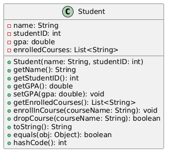

# Chapter 3: Getting Deeper with Class Objects and Class Construction

**Name:** Daymian Snowden

**Assignment:** Midterm

---
## Chapter covers:
- Static vs instance members
- Method overriding and method overloading
- The Object class and common overrides
- Access modifiers in-depth
- Immutability and defensive programming
- Complete class design example
- Common implementation mistakes to avoid
---

### Class and Recap

In Chapter 2, we learned the fundamentals of class design—constructors, the `this` keyword, getters/setters, and when to use OOD.
We may have gotten a little overboard and branched into questions that Chapter 3 was meant to answer; that's totally okay!
There's still lots to cover, especially how Java handles classes at the implementation level.
There is a lot of code in this section! A lot of it was adapted from existing sources, with variations in comments and content.
As such, we don't have a lot of images. Please, mentally prepare yourself for reading Java code. The examples here form the meat and potatoes.
We also repeat ourselves about certain rules and practices, intentionally. Memorization typically requires some amount of repeated exposure, unfortunately.
All that said, let's look at static vs instance behavior, proper method overriding, and some advanced design techniques that can prove useful.

### Static vs Instance Members

We have to know the difference between Java's static (class-level) and instance (object-level) members.
If we don't, we are robbing ourselves of a vital tool.
So let's show the differences!

**The `static` Keyword**

The `static` keyword in Java means "belongs to the class itself, not to any particular object."
What this means is when we mark a field or method as static, there's only one copy shared by all instances of the class.
If we did not use the `static` keyword, each object would get its own copy of fields and is able to call methods on its own data.
Sometimes, we don't want this to happen, and other times, we do; it depends on the use case.

**Instance Fields vs Static Fields**

Instance fields belong to each individual object (they lack the `static` keyword):
```java
public class Rectangle {
    private double width;   // Instance field - each Rectangle has its own
    private double height;  // Instance field - each Rectangle has its own
}

Rectangle rect1 = new Rectangle(5.0, 3.0);
Rectangle rect2 = new Rectangle(10.0, 7.0);
// rect1 and rect2 each have their own width and height from the instance fields
```

Static fields belong to the class, and are thus shared by all instances:
```java
public class Rectangle {
    private double width;
    private double height;
    private static int rectangleCount = 0;  // Static field - shared by ALL rectangles
    
    public Rectangle(double width, double height) {
        this.width = width;
        this.height = height;
        rectangleCount++;  // Increments the shared counter when the constructor runs
    }
    
    public static int getRectangleCount() {
        return rectangleCount;
    }
}

Rectangle rect1 = new Rectangle(5.0, 3.0);
Rectangle rect2 = new Rectangle(10.0, 7.0);
System.out.println(Rectangle.getRectangleCount());  // Prints: 2
```
If the code above did not use a `static` keyword, each rectangle would only track itself, always return a `rectangleCount` of 1.
Also, notice how we access the static field through the class name (`Rectangle.getRectangleCount()`), not through an object.

**Static Methods vs Instance Methods**

Instance methods operate on specific object data:
```java
public class Rectangle {
    private double width;
    private double height;
    
    // Instance method - needs a specific Rectangle's width and height
    public double getArea() {
        return width * height;  // Uses this rectangle's data
    }
}

Rectangle rect = new Rectangle(5.0, 3.0);
double area = rect.getArea();  // Called on a specific rectangle object
```

Meanwhile, static methods don't need any object. Instead, they belong to the class:
```java
public class MathUtils {
    // Static method - doesn't need any object data
    public static double distance(double x1, double y1, double x2, double y2) {
        double dx = x2 - x1;
        double dy = y2 - y1;
        return Math.sqrt(dx * dx + dy * dy);
    }
}

// Called on the class itself, no object needed
double dist = MathUtils.distance(0, 0, 3, 4);
```

**Key Rules for Static Methods:**
- Cannot access instance fields
    - Why? Because there's no "this" object for reference
- Cannot access instance methods directly
    - See the explanation below
    - Can only access other static members directly
- Cannot use the `this` keyword (what would `this` refer to?)

**Why can't static methods access instance methods directly?**
Static methods do not have a `this` - you cannot call an instance method by name while within a static method.
```java
public class Rectangle {
    private double width;
    private double height;
    
    // Instance method
    public double getArea() {
        return width * height;
    }
    
    // Static method
    public static void printSomething() {
        // getArea();  // ERROR - which rectangle's area? There's no "this"!
        
        // Instead, we would have access through a specific object:
        Rectangle rect = new Rectangle(5.0, 3.0);
        rect.getArea();  // Now we know which rectangle we are looking at
    }
}
```
**Class-Level vs Object-Level Behavior**

It is useful to think of static members as belonging to class.
Meanwhile, instance members belong to individual objects.

Class-level (static):
- Shared across all instances
- Accessed via class name
- Able to exist even if no objects are created
- Used mostly for utility functions, constants, counters (as seen previously)

Object-level (instance):
- Unique to each object
- Accessed via object reference
- Only able to exist when objects are created
- Used for object-specific data and behaviors

**Use Cases**

When would choose to use **static**?
- Utility methods that don't need object state (`Math.sqrt()`, `Integer.parseInt()`)
- Constants that should be shared (`Math.PI`, `Integer.MAX_VALUE`)
- Counters to track the number of objects
- Factory methods that create objects
    - More on this below!
- Main method (when the entry point must be static)

**Real quick: What is a factory method?**
A factory method is a static method that creates and returns objects of a class.
We can call a factory method to create objects instead of calling a constructor using `new`.
This can be useful when we want to return cached/reused objects, rather than creating new ones.
Here is an example of a factory method in action.
```java
public class Color {
    private int red;
    private int green;
    private int blue;
    
    // Private constructor that forces use of factory methods
    private Color(int red, int green, int blue) {
        this.red = red;
        this.green = green;
        this.blue = blue;
    }
    
    // Factory methods - these static methods create Color objects
    public static Color createRed() {
        return new Color(255, 0, 0);
    }
    
    public static Color createGreen() {
        return new Color(0, 255, 0);
    }
    
    public static Color createBlue() {
        return new Color(0, 0, 255);
    }
    
    public static Color createCustom(int r, int g, int b) {
        return new Color(r, g, b);
    }
}

// Usage
Color red = Color.createRed();  // Using factory method instead of new Color(...)
Color custom = Color.createCustom(128, 64, 32);
```

When should we use **instance**?
- Data that varies per object (student names, rectangle dimensions, etc.)
- Methods that operate on object-specific data
- Behavior that represents what individual objects can do
- Anything that requires `this`

**Example: Math.PI vs rectangle.getArea()**

Let's compare these two common scenarios:
```java
// Static constant will be the same for everyone, belonging to the Math class
public class Math {
    public static final double PI = 3.14159265358979323846; // That's all the sig figs you'll get from me
}

// Usage - accessed through class name, not object
double circumference = 2 * Math.PI * radius;
// PI doesn't belong to any particular circle, but can be accessed still
```
Compare this with the instance method.
```java
// Instance method because we need specific object data
public class Rectangle {
    private double width;
    private double height;
    
    public double getArea() {
        return width * height;
    }
}

// Usage - accessed through object, not class name
Rectangle myRect = new Rectangle(5.0, 3.0);
double area = myRect.getArea();
// Our area depends on this specific rectangle's dimensions
```

**Common Mistake: Using a static method to access an instance field**
During your coding adventures, watch out for this! It can and will cause you trouble.
```java
public class Rectangle {
    private double width;
    private double height;
    
    // This is incorrect!
    // Here we have a static method trying to access instance fields
    public static double getArea() {
        return width * height;  // Compile error
        // Which width? Which height?
    }
}
```

Static methods don't have access to instance fields because they don't operate on a specific object.
There's no `this`, so Java doesn't know which object's `width` and `height` to use.

### Method Overriding and Method Overloading

**Method Overloading**

Method overloading means having multiple methods with the **same name** but **different parameters** in the **same class**.
I know, it's a bit of a mouthful, but hopefully it makes sense in a second.
We already saw this with constructors in Chapter 2, but it also applies to regular methods too.
To begin, let's go over some rules.

**Rules for Method Overloading:**
- Methods must have the same name
- Methods must have different parameter lists (they must differ in number, type(s), or order of parameters)
- Return type alone is NOT enough to distinguish methods
    - They must also have different parameter lists!
    - Can have different return types, but again, the parameters must differ
    - I cannot stress enough the difference in parameters
- Can have different access modifiers (private, protected, public)
- Can throw different exceptions

Let's examine a simple calculator program.
```java
public class Calculator {
    // Overloaded methods - same name, different parameters
    
    public int add(int a, int b) {
        return a + b;
    }
    
    public double add(double a, double b) {
        return a + b;
    }
    
    public int add(int a, int b, int c) {
        return a + b + c;
    }
    
    // This would NOT compile - return type alone isn't enough
    // public double add(int a, int b) {  // ERROR - conflicts with first add()
    //     return (double)(a + b);
    // }
}

// Usage - Java will choose a method based on arguments
// This process may require fine-tuning, depending on the number of parameters and what returns we want
Calculator calc = new Calculator();
int sum1 = calc.add(5, 3);           // Calls first method
double sum2 = calc.add(5.5, 3.2);    // Calls second method
int sum3 = calc.add(1, 2, 3);        // Calls third method
```

**So why use overloading?**
- It provides convenience for users of your class
- Allows the same operation with different input types, reducing the amount of code to write
- More intuitive Application Programming Interface (API)
    - Can use one method name instead of `addInts()`, `addDoubles()`, etc.
    - What is an API? We will talk a more about this, hold fast.

**Method Overriding**

Method overriding means a subclass provides its own implementation of a method, one that is already defined in its parent class.
This is a fundamental part of polymorphism and it's application.
And do you know where we should begin? That's right! The rules.

**Rules for Method Overriding:**
- Method must have the exact same name
- Method must have the exact same parameter list
- Method must have the same or more accessible visibility (access cannot be reduced by operation)
- Method must have the same or compatible return type (covariant returns are allowed)
- Cannot override `static` methods (these are hidden, not overridden)
- Cannot override `final` methods
- Cannot override `private` methods (since they are not inherited)
```java
public class Animal {
    public void makeSound() {
        System.out.println("Some generic animal sound");
    }
    
    public void eat() {
        System.out.println("The animal is eating");
    }
}

public class Dog extends Animal {
    @Override   // This annotation is optional
                // But it comes highly recommended
    public void makeSound() {
        System.out.println("Woof!");
    }
    // eat() is inherited but not overridden - uses parent's version
} 

public class Cat extends Animal {
    @Override
    public void makeSound() {
        System.out.println("Meow!");
    }
    @Override
    public void eat() {
        System.out.println("The cat delicately nibbles its food");
    }
}

// Usage - polymorphism in action
Animal animal1 = new Dog();
Animal animal2 = new Cat();

animal1.makeSound();  // Prints: Woof!
animal2.makeSound();  // Prints: Meow!
animal1.eat();        // Prints: The animal is eating
animal2.eat();        // Prints: The cat delicately nibbles its food
```

**The `@Override` Annotation**

In a perfect world, we would always use `@Override` annotation when we override a method.
Doing so effectively tells the compiler "Yes, I am trying to override a parent method. Let me do it. Please."
If you make a mistake (wrong parameter types, misspelled name, etc.), the compiler will catch it, and provide vital assistance in debugging.

Take the code below, for example. Without `@Override`, the third method would compile but create a NEW method instead of overriding.
The annotation protects you from subtle bugs.
```java
public class Dog extends Animal {
    @Override
    public void makeSound() {  // Correct override
        System.out.println("Woof!");
    }

    @Override
    public void makesound() {  // COMPILE ERROR - method doesn't exist in parent
        // Spelling counts!
        System.out.println("Woof!");
    }

    // WITHOUT @Override - compiles but creates a NEW method (BUG!)
    public void makesound() {  // No error, but doesn't override anything
        System.out.println("Woof!");
    }
}
```
I know, you may be getting sick of animals. I am sorry.
They are easy to use!

**Overloading vs Overriding: Side by Side Comparison**

One more time, with feeling! Let's review this chart before moving on, yea?

| Aspect | Overloading | Overriding |
|--------|------------|------------|
| Same name | ✓ Yes | ✓ Yes |
| Same parameters | ✗ No (must differ) | ✓ Yes (must match) |
| Same class | ✓ Yes | ✗ No (different classes in hierarchy) |
| Inheritance required | ✗ No | ✓ Yes |
| Compile-time or runtime | Compile-time (static polymorphism) | Runtime (dynamic polymorphism) |
| Purpose | Convenience, flexibility | Specialization, polymorphism |

**Example Showing Both:**
```java
public class Shape {
    // Can be overridden by subclasses
    public double getArea() {
        return 0.0;
    }
}

public class Rectangle extends Shape {
    private double width;
    private double height;
    
    // Overriding parent's getArea()
    @Override
    public double getArea() {
        return width * height;
    }
    
    // Overloading - same class, different parameters
    public double getArea(double scale) {
        return width * height * scale;
    }
    
    // Another overload
    public double getArea(double widthScale, double heightScale) {
        return width * widthScale * height * heightScale;
    }
}

// Usage
Rectangle rect = new Rectangle(5.0, 3.0);
double area1 = rect.getArea();           // Override: 15.0
double area2 = rect.getArea(2.0);        // Overload: 30.0
double area3 = rect.getArea(2.0, 3.0);   // Overload: 90.0
```

### The Object Class and Common Overrides

Every single class in Java actually inherits from another class called `Object`.
As if things weren't confusing enough!
In fact, this is the root of Java's entire class hierarchy.
So we should probably talk more about it...

**Object Inheritance**

When we write:
```java
public class Student {
    // ...
}
```

Java actually treats it as:
```java
public class Student extends Object {
    // ...
}
```

This means every class automatically inherits several methods from `Object`.
We are not going to go over all of them, but there are three important ones that deserve mention:
- `toString()` - converts object to string representation
- `equals()` - compares objects for equality
- `hashCode()` - generates a hash code for the object

**The `toString()` Method**

The `toString()` method determines how your object represents itself as a string.
By default, `Object.toString()` returns something pretty useless.

**Default behavior (We don't like):**
```java
public class Student {
    private String name;
    private int studentID;
    
    public Student(String name, int studentID) {
        this.name = name;
        this.studentID = studentID;
    }
}

Student student = new Student("Marcus", 12345);
System.out.println(student);  // Prints: Student@4554617c
// Great...
```

**Overridden behavior (Our preference):**
```java
public class Student {
    private String name;
    private int studentID;
    
    public Student(String name, int studentID) {
        this.name = name;
        this.studentID = studentID;
    }
    
    @Override
    public String toString() {
        return "Student[name=" + name + ", ID=" + studentID + "]";
    }
}

Student student = new Student("Sarah", 12345);
System.out.println(student);  // Prints: Student[name=Sarah, ID=12345]
// Now we're cooking!
```

**Is it worth overriding `toString()`?**
- It will make debugging easier
- It does not take a long time
- Logging becomes more informative
- String concatenation is fairly intuitive
- Automatically called by `System.out.println()`

**The `equals()` Method**

The `equals()` method determines how objects compare for equality.
By default, `Object.equals()` only checks if two references point to the exact same object in memory (reference equality).
Sometimes that works, but most of the time we want to look at value equality instead.

**Default behavior (usually wrong):**
```java
Student s1 = new Student("James", 12345);
Student s2 = new Student("James", 12345);

System.out.println(s1 == s2);        // false - different objects in memory
System.out.println(s1.equals(s2));   // false - default equals() checks reference
// But they have the same data! We want this to be true.
```

**Overridden behavior (correct):**
```java
public class Student {
    private String name;
    private int studentID;
    
    // Constructor would be here...
    
    @Override
    public boolean equals(Object obj) {
        // Step 1: Check if same reference
        if (this == obj) {
            return true;
        }
        
        // Step 2: Check if obj is null or different class
        if (obj == null || getClass() != obj.getClass()) {
            return false;
        }
        
        // Step 3: Cast and compare fields
        Student other = (Student) obj;
        return studentID == other.studentID && 
               name.equals(other.name);
    }
}

Student s1 = new Student("Elena", 12345);
Student s2 = new Student("Elena", 12345);
System.out.println(s1.equals(s2));   // true - same data!
```

**The `hashCode()` Method**

The `hashCode()` method returns an integer hash code representing the object.
This is critical for hash-based collections like `HashMap`, `HashSet`, etc.
If you don't know about hashing... You can go look up hashing, it's actually not that bad.
Okay, fine, hashing is basically converting data into a fixed string of characters (a hash value) using a mathemathical function.
It's a great way to make the most of memory constraints, and can offer quicker runtimes too.
Anyway, back to it...

**The hashCode contract:**
- If two objects are equal according to `equals()`, they MUST have the same hash code
- If two objects have the same hash code, they don't have to be equal (collisions are allowed)
    - *Sidenote: Don't talk to me about collisions until I've had my coffee*
- Hash codes should remain consistent during an object's lifetime (if used in collections)

**So, why does this matter:**
```java
Set<Student> students = new HashSet<>();
Student s1 = new Student("Rashid", 12345);
students.add(s1);

Student s2 = new Student("Rashid", 12345);
System.out.println(students.contains(s2));  
// Without proper hashCode(): false (WRONG!)
// With proper hashCode(): true (CORRECT!)
```

**Implementing `hashCode()`:**

When implemented correctly, it should look something like this...
```java
public class Student {
    private String name;
    private int studentID;
    
    // Constructor, equals()...
    
    @Override
    public int hashCode() {
        // Combine hash codes of all fields used in equals()
        int result = 17;  // Start with a prime number
        result = 31 * result + studentID;
        result = 31 * result + (name != null ? name.hashCode() : 0);
        return result;
    }
}
```

Modern Java actually provides an even simpler way:
```java
@Override
public int hashCode() {
    return Objects.hash(name, studentID);
}
```

**We Override These Together: `equals()` and `hashCode()`**

You must always override `equals()` and `hashCode()` together.
Why? Well, because if we override only one, we break the hash code contract and will cause bugs in collections.
If two objects are equal according to `equals()`, they MUST return the same hashCode()!

**The golden rule:**
- Override `equals()` → Must override `hashCode()`
- Override `hashCode()` → Must override `equals()`
- Override `toString()` → Always a good idea, just helpful to do

**Example: Person Class**

Here's a class with all three overrides in action:
```java
public class Person {
    private String firstName;
    private String lastName;
    private int age;
    
    public Person(String firstName, String lastName, int age) {
        this.firstName = firstName;
        this.lastName = lastName;
        this.age = age;
    }
    
    @Override
    public String toString() {
        return "Person[" + firstName + " " + lastName + ", age=" + age + "]";
    }
    
    @Override
    public boolean equals(Object obj) {
        if (this == obj) return true;
        if (obj == null || getClass() != obj.getClass()) return false;
        
        Person other = (Person) obj;
        return age == other.age &&
               firstName.equals(other.firstName) &&
               lastName.equals(other.lastName);
    }
    
    @Override
    public int hashCode() {
        return Objects.hash(firstName, lastName, age);
    }
}

// Usage
Person p1 = new Person("Kenji", "Tanaka", 28);
Person p2 = new Person("Kenji", "Tanaka", 28);

System.out.println(p1);              // Person[Kenji Tanaka, age=28]
System.out.println(p1.equals(p2));   // True
System.out.println(p1.hashCode() == p2.hashCode());  // True

// Works correctly in collections
Set<Person> people = new HashSet<>();
people.add(p1);
System.out.println(people.contains(p2));  // True!
```

### Access Modifiers In-Depth

Access modifiers control what code can see and use your classes, fields, and methods.
We talked about them earlier, but let's get more into it.
Java provides four levels of access, from most restrictive to least restrictive.

**The Four Access Levels**

1. **`private`**: Only visible within the same class
2. **Package-private (no modifier)**: Visible within the same package
3. **`protected`**: Visible within the same package AND subclasses in other packages
4. **`public`**: Visible everywhere
```java
public class AccessExample {
    private int privateField;           // Only this class
    int packagePrivateField;            // This package
    protected int protectedField;       // This package + subclasses
    public int publicField;             // Everyone
    
    private void privateMethod() { }         // Only this class
    void packagePrivateMethod() { }          // This package
    protected void protectedMethod() { }     // This package + subclasses
    public void publicMethod() { }           // Everyone
}
```

**Private: Most Restrictive**

We use `private` for:
- All fields
    - Unless we have a reason otherwise
- Helper methods that are implementation details
- Anything that should never be accessed outside the class
```java
public class BankAccount {
    private double balance;  // Nobody outside this class can touch it
    
    public void deposit(double amount) {
        if (isValidAmount(amount)) {  // Private helper method
            balance += amount;
        }
    }
    
    private boolean isValidAmount(double amount) {
        return amount > 0;
    }
}
```

**Why make fields private?**
- Forces encapsulation
- Allows validation in setters
- Can change code without breaking other code (in theory, there is always a way to break something)
- Prevents accidental corruption of object state

**Package-Private (Default): Same Package Only**

If you don't specify an access modifier, you get package-private access.
This is useful for classes that work together in the same package but shouldn't be exposed outside.
You might not see this used much, depending on what you are doing.
```java
// In package: com.university

class DatabaseConnection {  // No public - package-private class
    void connect() { }       // Package-private method
}

public class StudentService {
    private DatabaseConnection db = new DatabaseConnection();  // OK - same package
}
```
```java
// In package: com.application

import com.university.DatabaseConnection;  // COMPILE ERROR - not accessible
```

**Protected: Package + Subclasses**

We use `protected` for:
- Methods that subclasses should be able to override
- Fields that subclasses need to access
    - However, we can also do this using private + protected getters
- Anything that's part of the "family interface" but not a part of the public API
```java
public class Animal {
    protected String species;  // Subclasses can access
    
    protected void metabolize() {  // Subclasses can override
        // Common metabolism logic
    }
}

public class Dog extends Animal {
    public void printSpecies() {
        System.out.println(species);  // OK - inherited protected field
    }
    
    @Override
    protected void metabolize() {  // OK - can override protected method
        super.metabolize();
        // Add dog-specific metabolism
    }
}
```
**Wait, You Keep Saying API?**

In the context of a `class`, the API is the set of public methods and fields that other code can use.
It's basically the "contract" between your class and the rest of the program.
Think of it as the control panel of your class -  it determines which buttons and switches others can press.

For example, a `Student` class API could include:
- `getName()`, `getGPA()`, `enrollInCourse()`
    - These are all public methods users can call
- However, the API does NOT include private fields or private helper methods

A good API is:
- Easy to learn and use
- Hard to misuse or abuse
- Stable, consistent - doesn't change often, and not drastically
- Well-documented (of course, this is kind of a given at this point)
    - If it's good code, documentation is worth its weight in characters
    - If it's bad code, the documentation is worth twice as much

**Public: Least Restrictive**

Use `public` for:
- Class API methods that others should call
- Constants (often `public static final`)
- Classes that are meant to be used outside their package
```java
public class Math {
    public static final double PI = 3.14159265358979323846;  // Public constant
    
    public static double sqrt(double a) {  // Public utility method
        // ...
    }
}
```

**Access Modifiers and Inheritance**

We brought this up a little bit before, but let's talk more about access and inheritance.
When overriding methods, we cannot reduce visibility (access):
```java
public class Parent {
    public void publicMethod() { }
    protected void protectedMethod() { }
}

public class Child extends Parent {
    @Override
    public void publicMethod() { }  // OK - same visibility
    
    @Override
    public void protectedMethod() { }  // OK - increasing visibility
    
    // @Override
    // private void publicMethod() { }  // ERROR - reducing visibility!
}
```

**Protecting Class Invariants**

Access modifiers are your primary tool for maintaining invariants.
Yea, coder speak... An invariant is a rule or condition that must always be true about an object's state.
For example, when we make it so a rectangle's width and height must always be positive, or a bank account's balance cannot be negative.
Access modifiers help enforce these rules by controlling who can modify the object's data.
In an increasing digital and dangerous world, it helps to keep one's data safe.
```java
public class Rectangle {
    private double width;   // Private - protected from direct access
    private double height;  // Private - protected from direct access
    
    // Invariant: width and height must always be positive
    
    public void setWidth(double width) {
        if (width <= 0) {
            throw new IllegalArgumentException("Width must be positive");
        }
        this.width = width;  // Invariant maintained
    }
    
    // If width was public, anyone could do: rect.width = -5; and break the invariant!
}
```

**"Program to an Interface, Not an Implementation"**

Ever heard of the Gang of Four? Me neither, until now.
They are a group of programmers (Erich Gamma, Richard Helm, Ralph Johnson, and John Vlissides) behind this famous design principle.
It's design philosophy that depends on abstractions (interfaces, abstract classes), rather than concrete implementations.
Access modifiers support the use of abstractions by hiding implementation details.

**Bad: Dependent on an implementation**
```java
public class ShoppingCart {
    public ArrayList<Item> items;  // Public field - exposes implementation
}

// Client code is tightly coupled to ArrayList
ShoppingCart cart = new ShoppingCart();
for (int i = 0; i < cart.items.size(); i++) {
    // ...
}
```

**Good: Dependent on an interface**
```java
public class ShoppingCart {
    private List<Item> items;  // Private field, interface type
    
    public List<Item> getItems() {
        return Collections.unmodifiableList(items);  // Defensive copy
    }
}

// Client code uses List interface
ShoppingCart cart = new ShoppingCart();
for (Item item : cart.getItems()) {
    // ...
}
// ShoppingCart can change to LinkedList internally without breaking clients
```

**General Design Guidelines (Best Practices):**
- Make everything `private` by default
- Only make things more accessible when necessary
- Never make fields public
    - There are rare exceptions, like constants
- It's usually better to use `private` fields with `public` methods, rather than `protected` fields
- Keep implementation details hidden - keep it hidden, keep it safe.

### Immutability and Defensive Programming

**What Are Immutable Objects?**

An immutable object is one whose state cannot change after construction.
Once created, it stays the same forever. A curse? Maybe, but useful.

Examples of immutable classes in Java:
- `String` - you can't modify a string, only create new ones
- `Integer`, `Double`, all wrapper classes
- `LocalDate`, `LocalDateTime` (Java 8+ date/time classes)

**Why Are Immutable Objects Useful?**

Benefits of immutability:
- **Thread-safe** - multiple threads can share immutable objects without synchronization
- **Simpler to understand** - no need to track state changes
- **Safer to share** - can't be corrupted by malicious or buggy code
- **Good hash keys** - hash code never changes, so it's safe for HashMap/HashSet
- **Easier to test** - predictable behavior, no hidden state changes
- **Can be freely cached** - no risk of stale data

**Creating Immutable Classes**

That's right. More rules!
Once we know what we can and can't do, it's easier to move forward.

Rules for creating an immutable class:
1. Make the class `final` (prevents subclasses from adding mutability)
2. Make all fields `private final`
3. Don't provide setter methods
4. Don't let methods modify the object's state
5. Make defensive copies of mutable objects in constructors and getters

**Example: Immutable Person Class**
```java
public final class Person {  // Rule 1: Class is final
    private final String name;      // Rule 2: Fields are private final
    private final int age;          // Rule 2: Fields are private final
    private final LocalDate birthDate;  // Rule 2: Immutable date type
    
    public Person(String name, int age, LocalDate birthDate) {
        // Validate and set - no defensive copy needed for String/int/LocalDate (already immutable)
        if (name == null || birthDate == null) {
            throw new IllegalArgumentException("Name and birth date cannot be null");
        }
        if (age < 0) {
            throw new IllegalArgumentException("Age cannot be negative");
        }
        
        this.name = name;
        this.age = age;
        this.birthDate = birthDate;
    }
    
    // Rule 3: Only getters, no setters
    public String getName() {
        return name;
    }
    
    public int getAge() {
        return age;
    }
    
    public LocalDate getBirthDate() {
        return birthDate;  // Safe - LocalDate is immutable
    }
    
    // Rule 4: Methods that "modify" return NEW objects instead
    public Person withAge(int newAge) {
        return new Person(this.name, newAge, this.birthDate);
    }
    
    @Override
    public String toString() {
        return "Person[name=" + name + ", age=" + age + ", birthDate=" + birthDate + "]";
    }
}

// Usage
Person person = new Person("Maya", 25, LocalDate.of(1998, 5, 15));
// person.setAge(26);  // Doesn't exist - can't modify!

Person older = person.withAge(26);  // Creates a NEW person
System.out.println(person.getAge());  // Still 25
System.out.println(older.getAge());   // 26
```

**The `final` Keyword**

When do use the `final` keyword? There are at least three primary uses:

1. **Final classes** - cannot be extended
```java
public final class String {  // Nobody can extend String
    // ...
}
```

2. **Final methods** - cannot be overridden
```java
public class Parent {
    public final void criticalMethod() {  // Subclasses cannot override
        // ...
    }
}
```

3. **Final variables** - can only be assigned once
```java
public class Example {
    private final int constantValue = 42;  // Cannot be changed
    private final List<String> items;
    
    public Example() {
        items = new ArrayList<>();  // Must be assigned in constructor
        // constantValue = 50;  // ERROR - already assigned!
    }
}
```

**Important:** `final` for objects means the reference can't change, but the object's contents can!
```java
private final List<String> items = new ArrayList<>();

public void example() {
    items.add("Hello");  // OK - modifying the list's contents
    // items = new ArrayList<>();  // ERROR - can't reassign the reference
}
```

**Defensive Copying**

When your class contains mutable objects, we have to make defensive copies.
This maintains immutability!

**Without defensive copying (broken immutability, very bad):**
```java
public final class Team {
    private final List<String> members;
    
    public Team(List<String> members) {
        this.members = members;  // DANGER - storing reference to mutable list
    }
    
    public List<String> getMembers() {
        return members;  // DANGER - exposing mutable list
    }
}

// Client can break immutability:
List<String> people = new ArrayList<>();
people.add("Yuki");
Team team = new Team(people);

people.add("Hassan");  // Fudge - modified the team's internal list!
System.out.println(team.getMembers());  // [Yuki, Hassan] - team changed!

team.getMembers().add("Sofia");  // Oh no - we modified through getter!
System.out.println(team.getMembers());  // [Yuki, Hassan, Sofia] - broken immutability!
```

**With defensive copying (correct immutability, we like):**
```java
public final class Team {
    private final List<String> members;
    
    public Team(List<String> members) {
        // Defensive copy in constructor
        this.members = new ArrayList<>(members);
    }
    
    public List<String> getMembers() {
        // Defensive copy in getter
        return new ArrayList<>(members);
        // Or: return Collections.unmodifiableList(members);
    }
}

// Client cannot break immutability:
List<String> people = new ArrayList<>();
people.add("Priya");
Team team = new Team(people);

people.add("Diego");  // Original list modified, but team's copy is unchanged
System.out.println(team.getMembers());  // [Priya] - team unchanged!

team.getMembers().add("Amara");  // Modifies the returned copy, not internal list
System.out.println(team.getMembers());  // [Priya] - still unchanged!
```

**Protecting Against Maleficence and Misuse**

Defensive programming means assuming your code will be misused (accidentally or maliciously), so we must anticipate and protect against human hazards.

Key defensive techniques:
- Validate all inputs in constructors and setters
- Make defensive copies of mutable parameters
- Return defensive copies of mutable fields
- Use immutable objects when possible
- Make classes final to prevent malicious subclasses
- Never trust client code to "play nice"
    - People get paid to break code, so

**Example: Defensive BankAccount**
```java
public final class BankAccount {  // Final - can't be subclassed
    private final String accountNumber;
    private double balance;  // Mutable, but protected
    
    public BankAccount(String accountNumber, double initialBalance) {
        // Validate inputs
        if (accountNumber == null || accountNumber.isEmpty()) {
            throw new IllegalArgumentException("Account number cannot be null or empty");
        }
        if (initialBalance < 0) {
            throw new IllegalArgumentException("Initial balance cannot be negative");
        }
        
        this.accountNumber = accountNumber;
        this.balance = initialBalance;
    }
    
    public void deposit(double amount) {
        // Validate
        if (amount <= 0) {
            throw new IllegalArgumentException("Deposit amount must be positive");
        }
        if (Double.isNaN(amount) || Double.isInfinite(amount)) {
            throw new IllegalArgumentException("Invalid deposit amount");
        }
        
        balance += amount;
    }
    
    public void withdraw(double amount) {
        // Validate
        if (amount <= 0) {
            throw new IllegalArgumentException("Withdrawal amount must be positive");
        }
        if (amount > balance) {
            throw new IllegalArgumentException("Insufficient funds");
        }
        
        balance -= amount;
    }
    
    public double getBalance() {
        return balance;  // Primitive - returned by value, safe
    }
    
    public String getAccountNumber() {
        return accountNumber;  // String is immutable, safe
    }
}
```

**So why Is `String` Immutable?**

Java made `String` immutable for several critical reasons:

1. **Security** - Strings are used for passwords, file paths, network connections, database queries
    - If strings were mutable... Well, one part of code could change a password while another part uses it
    - SQL injection attacks would be easier if strings could be modified after validation
        - You do not want an SQL injection attack ruining your day

2. **String Pool** - Java maintains a pool of string literals for memory efficiency
    - `String s1 = "hello";` and `String s2 = "hello";` share the same object
    - This is effectively "allowed" because strings can't change

3. **Thread Safety** - Immutable objects are automatically thread-safe
    - Multiple threads can share strings without synchronization

4. **Hash Keys** - Strings are commonly used as keys in HashMap
    - If strings were mutable, their hash codes could change, breaking the HashMap
```java
// Because String is immutable:
String password = "secret123";
checkPassword(password);
// Can be confident password wasn't changed by checkPassword()

// If String were mutable (hypothetical):
String password = "secret123";
checkPassword(password);
// password might now be "hacked!" - can't trust it!
```

### Complete Class Design Example

Let's design a complete class that demonstrates all the principles we've covered.
We'll create a `Student` class for a university management system.
First, let's consider our requirements, then move onto to design.

**Requirements:**
- Store student name, ID, GPA, and enrolled courses
- Validate all inputs
- Properly override Object methods
- Use appropriate access modifiers
- Implement defensive programming
- Includes proper documentation

**UML Diagram:**

*Figure 1: `Student` PUML Design -  https://editor.plantuml.com/*


**Implementation:**
```java
import java.util.ArrayList;
import java.util.Collections;
import java.util.List;
import java.util.Objects;

/**
 * Represents a student in a university system.
 * This class maintains student information including name, ID, GPA, and enrolled courses.
 * All fields are validated to maintain invariants.
 * 
 * Required invariants:
 * - Student ID must be positive
 * - GPA must be between 0.0 and 4.0
 * - Name cannot be null or empty
 * - Enrolled courses list is never null
 */
public final class Student {
    // Constants
    private static final double MIN_GPA = 0.0;
    private static final double MAX_GPA = 4.0;
    
    // Fields - all private for encapsulation
    private final String name;              // Immutable - no setter
    private final int studentID;            // Immutable - no setter
    private double gpa;                     // Mutable - has validated setter
    private final List<String> enrolledCourses;  // Mutable contents, defensive copies
    
    /**
     * Constructs a new Student with the given name and ID.
     * 
     * @param name the student's name
     * @param studentID the student's unique ID
     * @throws IllegalArgumentException if name is null/empty or ID is not positive
     */
    public Student(String name, int studentID) {
        // Validate inputs
        if (name == null || name.trim().isEmpty()) {
            throw new IllegalArgumentException("Name cannot be null or empty");
        }
        if (studentID <= 0) {
            throw new IllegalArgumentException("Student ID must be positive");
        }
        
        // Initialize fields
        this.name = name.trim();
        this.studentID = studentID;
        this.gpa = 0.0;  // Default GPA
        this.enrolledCourses = new ArrayList<>();
    }
    
    /**
     * Returns the student's name.
     * 
     * @return the student's name
     */
    public String getName() {
        return name;  // String is immutable, safe to return
    }
    
    /**
     * Returns the student's ID.
     * 
     * @return the student's ID
     */
    public int getStudentID() {
        return studentID;  // Primitive, returned by value, safe
    }
    
    /**
     * Returns the student's current GPA.
     * 
     * @return the GPA between 0.0 and 4.0
     */
    public double getGPA() {
        return gpa;
    }
    
    /**
     * Sets the student's GPA.
     * 
     * @param gpa the new GPA
     * @throws IllegalArgumentException if GPA is not between 0.0 and 4.0
     */
    public void setGPA(double gpa) {
        if (gpa < MIN_GPA || gpa > MAX_GPA) {
            throw new IllegalArgumentException(
                "GPA must be between " + MIN_GPA + " and " + MAX_GPA
            );
        }
        if (Double.isNaN(gpa)) {
            throw new IllegalArgumentException("GPA cannot be NaN");
        }
        
        this.gpa = gpa;
    }
    
    /**
     * Returns a defensive copy of the enrolled courses list.
     * Modifications to the returned list will not affect this student.
     * 
     * @return an unmodifiable view of enrolled courses
     */
    public List<String> getEnrolledCourses() {
        // Return unmodifiable view for defensive programming
        return Collections.unmodifiableList(enrolledCourses);
    }
    
    /**
     * Enrolls the student in a course.
     * 
     * @param courseName the name of the course
     * @throws IllegalArgumentException if course name is null or empty
     */
    public void enrollInCourse(String courseName) {
        if (courseName == null || courseName.trim().isEmpty()) {
            throw new IllegalArgumentException("Course name cannot be null or empty");
        }
        
        String normalizedName = courseName.trim();
        if (!enrolledCourses.contains(normalizedName)) {
            enrolledCourses.add(normalizedName);
        }
    }
    
    /**
     * Drops a course from the student's enrollment.
     * 
     * @param courseName the name of the course to drop
     * @return true if the course was dropped, false if student wasn't enrolled
     */
    public boolean dropCourse(String courseName) {
        if (courseName == null) {
            return false;
        }
        return enrolledCourses.remove(courseName.trim());
    }
    
    /**
     * Returns a string representation of this student.
     * 
     * @return a string containing student information
     */
    @Override
    public String toString() {
        return String.format("Student[ID=%d, name=%s, GPA=%.2f, courses=%d]",
                           studentID, name, gpa, enrolledCourses.size());
    }
    
    /**
     * Compares this student to another object for equality.
     * Two students are equal if they have the same student ID.
     * 
     * @param obj the object to compare to
     * @return true if the objects are equal, false otherwise
     */
    @Override
    public boolean equals(Object obj) {
        // Check reference equality
        if (this == obj) {
            return true;
        }
        
        // Check null and class type
        if (obj == null || getClass() != obj.getClass()) {
            return false;
        }
        
        // Cast and compare
        Student other = (Student) obj;
        
        // Students are equal if they have the same ID
        // (ID is unique identifier in a university system)
        return studentID == other.studentID;
    }
    
    /**
     * Returns a hash code for this student.
     * 
     * @return a hash code based on the student ID
     */
    @Override
    public int hashCode() {
        // Hash code based on student ID (used in equals)
        return Objects.hash(studentID);
    }
}
```

**Usage Example:**
```java
// Create a student
Student karim = new Student("Karim Hassan", 12345);

// Set GPA
karim.setGPA(3.75);

// Enroll in courses
karim.enrollInCourse("CS 5004");
karim.enrollInCourse("CS 5008");
karim.enrollInCourse("CS 5100");

// Display student info
System.out.println(karim);
// Output: Student[ID=12345, name=Karim Hassan, GPA=3.75, courses=3]

// Get courses (defensive copy - safe to use)
List<String> courses = karim.getEnrolledCourses();
System.out.println("Enrolled in: " + courses);
// courses.add("CS 9999");  // Throws UnsupportedOperationException - list is unmodifiable

// Drop a course
boolean dropped = karim.dropCourse("CS 5008");
System.out.println("Dropped: " + dropped);  // true

// Test equality
Student karim2 = new Student("Karim Hassan", 12345);
System.out.println(karim.equals(karim2));  // true - same ID

// Use in collections
Set<Student> students = new HashSet<>();
students.add(karim);
System.out.println(students.contains(karim2));  // true - now the equals and hashCode work correctly
```

**Future Testing Considerations:**

This class is designed to be easily testable.
In a future chapter, we'll come back to this example and write unit tests to verify the following:

**Boundary conditions are met:**
- GPA at exactly 0.0 and 4.0 (should work)
- GPA below 0.0 and above 4.0 (should throw exception)
- Empty string names (should throw exception)
- Negative student IDs (should throw exception)

**Normal operation (no errors):**
- Enrolling in courses
- Dropping courses
- Setting valid GPAs

**Testing edge cases:**
- Enrolling in the same course twice (should not duplicate)
- Dropping a course not enrolled in (should return false)
- Modifying returned course list (should not affect student)

**Object method behavior functions correctly:**
- `toString()` format is correct
- `equals()` works with same ID, different data
- `hashCode()` is consistent with `equals()`
- Objects work correctly in HashSet and HashMap

### Common Implementation Mistakes to Avoid

Before we wrap up, let's review common mistakes developers make when implementing classes.
If you read nothing else in the section, check this portion out, please!
Hopefully, it helps save hours of debugging and make your code generally better.

**Mistake 1: Forgetting to Override `equals()` and `hashCode()` Together**

**The Problem:**
```java
public class Student {
    private int studentID;
    
    @Override
    public boolean equals(Object obj) {
        // ... properly implemented ...
    }
    
    // MISSING hashCode()!
}

// Breaks collections
Set<Student> students = new HashSet<>();
Student s1 = new Student(12345);
students.add(s1);

Student s2 = new Student(12345);
System.out.println(students.contains(s2));  // false - wrong, wrong, wrong.
```

**The Fix:**
Always override both methods together, and ensure they use the same fields.

**Mistake 2: Making Everything Public**

**The Problem:**
```java
public class Rectangle {
    public double width;   // Anyone can break invariants
    public double height;
    
    public double getArea() {
        return width * height;
    }
}

Rectangle rect = new Rectangle();
rect.width = -5;  // Uh oh. Negative width breaks invariants...
```

**The Fix:**
Make fields private and provide controlled access through methods.

**Mistake 3: Not Validating in The Setters**

**The Problem:**
```java
public class Student {
    private double gpa;
    
    public void setGPA(double gpa) {
        this.gpa = gpa;  // No validation!
    }
}

student.setGPA(-1.5);  // Invalid GPA accepted
student.setGPA(Double.NaN);  // NaN accepted - this breaks the calculations.
```

**The Fix:**
Always validate inputs that could break invariants.

**Mistake 4: Returning References to Mutable Fields**

**The Problem:**
```java
public class Team {
    private List<String> members = new ArrayList<>();
    
    public List<String> getMembers() {
        return members;  // Direct reference to internal list!
    }
}

Team team = new Team();
team.getMembers().clear();  // And we cleared the team's internal list... Oh no.
```

**The Fix:**
Return defensive copies or unmodifiable views:
```java
public List<String> getMembers() {
    return Collections.unmodifiableList(members);
    // Or: return new ArrayList<>(members);
}
```

**Mistake 5: Misusing Static**

**The Problem:**
```java
public class Counter {
    private static int count = 0;  // Shared across ALL instances!
    
    public Counter() {
        count++;
    }
}

Counter c1 = new Counter();
Counter c2 = new Counter();
// Both c1 and c2 share the same count - not what we want.
```

**The Fix:**
Only use static when you truly want class-level (not instance-level) behavior.

**Mistake 6: Not Using `@Override`**

**The Problem:**
```java
public class Student {
    // Typo: "hashcode" instead of "hashCode"
    public int hashcode() {  // Creates NEW method, doesn't override!
        return Objects.hash(studentID);
    }
}

// HashSet won't work correctly - using default hashCode()
```

**The Fix:**
Always use `@Override` - the compiler will catch mistakes:
```java
@Override
public int hashCode() {  // Compiler verifies this overrides Object.hashCode()
    return Objects.hash(studentID);
}
```

**Mistake 7: Comparing Objects with `==` Instead of `equals()`**

This one seems especially trivial, but if you started coding in different languages, it's easy to do!

**The Problem:**
```java
Student s1 = new Student("Lucia", 12345);
Student s2 = new Student("Lucia", 12345);

if (s1 == s2) {  // Compares references, not values
    // This will never execute!
}
```

**The Fix:**
Use `equals()` for value comparison:
```java
if (s1.equals(s2)) {  // Compares values
    // This executes correctly
}
```

**Quick Reference: Best Practices Checklist**

One last time, with feeling. When implementing a class, make sure that:
- Fields `private` by default
- All inputs in constructors and setters are validated
- Use override `equals()`, `hashCode()`, and `toString()` when appropriate
- Use `@Override` annotation when using any overridden methods
- Return defensive copies of mutable fields
- Make defensive copies of mutable parameters
- Use static only for class-level behavior
- Document your class and public methods
- Maintain class invariants, at all times
- Consider immutability when possible it implement

And that's that! Whew.
I was hoping for a shorter chapter honestly...
We've covered advanced class implementation in Java, from static members to defensive programming.
In the next chapter, we'll explore unit testing and test driven development.
---

### Academic Integrity Statement
I understand that my learning is dependent on individual effort and struggle,
and I acknowledge that this assignment is a 100% original work and that I received no other assistance other than what is listed here.

**Acknowledgements and assistance received:**
- Course Content, primarily modules and lecture content
- Java Constructors - https://www.w3schools.com/java/java_constructors.asp
- Understanding Java Method Overloading - https://www.geeksforgeeks.org/overloading-in-java/
- Java 'this' Keyword - https://www.javatpoint.com/this-keyword
- Encapsulation in Java - https://www.geeksforgeeks.org/encapsulation-in-java/
- Java Access Modifiers - https://docs.oracle.com/javase/tutorial/java/javaOO/accesscontrol.html
- Factory Method Pattern - https://refactoring.guru/design-patterns/factory-method
- What is an API? - https://www.redhat.com/en/topics/api/what-are-application-programming-interfaces
- Java API Design Best Practices - https://www.oracle.com/technical-resources/articles/java/javadoc-tool.html
- SOLID Principles Explained - https://www.freecodecamp.org/news/solid-principles-explained-in-plain-english/
- Refactoring Guru: Design Patterns - https://refactoring.guru/design-patterns
- Oracle Java Tutorials: Classes and Objects - https://docs.oracle.com/javase/tutorial/java/javaOO/index.html
- Google Java Style Guide - https://google.github.io/styleguide/javaguide.html
- Oracle: Code Conventions for the Java Programming Language - https://www.oracle.com/java/technologies/javase/codeconventions-contents.html
- Java Object Class - https://www.geeksforgeeks.org/object-class-in-java/
- Overriding equals and hashCode in Java - https://www.baeldung.com/java-equals-hashcode-contracts
- Hash Tables and Hash Functions - https://www.geeksforgeeks.org/hashing-data-structure/
- Static Keyword in Java - https://www.javatpoint.com/static-keyword-in-java
- Java final Keyword - https://www.geeksforgeeks.org/final-keyword-in-java/
- Immutability in Java - https://www.baeldung.com/java-immutable-object
- Defensive Copying in Java - https://www.baeldung.com/java-defensive-copying
- Why String is Immutable in Java - https://www.baeldung.com/java-string-immutable
- Java Collections unmodifiableList - https://docs.oracle.com/javase/8/docs/api/java/util/Collections.html#unmodifiableList-java.util.List-

I did not use generative AI in any form to create this content and the final content was not adapted from generative AI created content.

I did not view content from anyone else's submission including submissions from previous semesters nor am I submitting someone else's previous work in part or in whole.

I am the only creator for this content. All sections are my work and no one else's with the exception being any starter content provided by the instructor.
If asked to explain any part of this content, I will be able to.

By putting your name and date here, you acknowledge that all of the above is true and you acknowledge that lying on this form is a violation of academic integrity and will result in no credit on this assignment and possible further repercussions as determined by the Khoury Academic Integrity Committee.

#### Signed: Daymian Snowden
#### Date: 10/16/2025

---