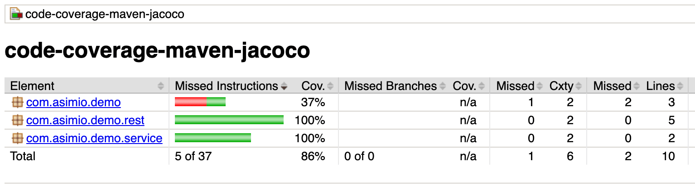

# Chapter 4: Unit Testing and Test Driven Development

**Name:** Daymian Snowden

**Assignment:** Midterm

---
## Chapter covers:
- Unit testing
- Test Driven Development (TDD) - Philosophy, Workflow, Pros/Cons
- Driver testing and prototyping
- TDD in Java: JUnit basics
- Test coverage and best practices
- Example of effective: Building a class using TDD
- Role of TDD in Industry
---
### Unit Testing and Recap

In Chapters 2 and 3, we built several classes to use as examples, including `Rectangle`, `Student`, and `BankAccount`.
If you think I am not going to reuse all that code moving forward, you're wrong!
And yet, how do we know our code actually works?
It might compile, it might even work most of the time, but how do we know that?
This is where Test Driven Development (TDD) comes into play.

Unit testing is the practice of testing individual components (units) of your code, in isolation.
In object-oriented programming, we usually refer to a "unit" as single method or a small group of related methods within a class.
Our goal is to verify that each unit works correctly, independently, before introducing it to the rest of our code.

Its kind of like building a car.
Would anyone want to test drive car when none of its parts have been used before?
You couldn't pay me to do that, and I jumped out of planes for a living.
Unit testing follows the same principle - we test each of our parts before testing the whole system.

**What makes a unit test good?**

While not technically rules, these guidelines set the stage for successful TDD.
Keep them in mind while we move forward!

- **Fast** - We are talking milliseconds, not seconds
- **Independent** - Doesn't depend on other tests or external systems - otherwise, how do know what we are testing?
- **Repeatable** - Produces the same result every time (even if that result is supposed to vary, it should be within an expected range)
- **Self-validating** - Either passes or fails clearly; it does not require manual checking after test(s) completion
- **Timely** - Written before or shortly after the code is written

**What unit tests are NOT:**
- Integration tests (testing how multiple components work together)
- System tests (testing the entire application end-to-end)
- Manual tests (having a human click around and check things)

Unit tests focus on one thing: does this specific method do what it's supposed to do when it supposed to do it?
A good unit test can even serve as a sort of template for design decisions.

### Test Driven Development (TDD) - Overview

Test Driven Development is not like traditional programming.
Instead of writing code and then testing it, we write our tests first.
After the tests fail, we proceed to write the minimum code required for compilation.

**The TDD Philosophy**

TDD is based on a simple idea: you can't write better code than you can test.
And well that seems straightforward, you'd be surprised at the mental jujitsu this can involve.
By writing tests first, we are forced to think about:
- What should this method do?
- Which inputs will it receive?
- Are there any outputs should it produce?
- What are there edge cases?
    - There are almost always edge cases, don't kid yourself.
- How should errors be handled?

For this to work, our code has to be testable.
If your code is modular, loosely coupled, and follows SOLID principles, these should come somewhat naturally.
When all our tests pass, we don't just know our code works -  we can prove it.
If we have to refactor later, we can run the tests again and ensure nothing is broken.
Oh, what is refactoring?
Anything we do to improve the internal structure of our code without changing what it does externally is considered a refactor.

**Before Refactor:**
```java
public double getArea() {
    double a = w * h;
    return a;
}
```
**After Refactor:**
```java
public double getArea() {
    return width * height;  // Clearer variable names
                            // Removed an unnecessary variable
}
```
The external behavior is the same despite having changed the internal structure, *a la refactor*.

**The TDD Workflow: Red-Green-Refactor**

TDD follows a three-step cycle that repeats for every new function:

1. **Red**: Write a test that fails (that's right)
    - Write a test for functionality that doesn't exist yet
    - Actually run it and physically watch it fail
        - Red means failure
    - This confirms the test is actually testing something
        - Otherwise, we could have just created a useless test that could be outright lying to us

2. **Green**: Write the bare minimal code to pass the test
    - Write just enough code to make the test pass
    - Don't worry about perfection
    - Documentation would be nice
        - You should do this at some point - putting it off will cause a massive headache later
    - Get to green (passing) as fast as you can

3. **Refactor**: Improve the code without changing behavior
    - Clean up the code
    - Remove duplication
    - Improve names and structure
    - Run tests again to ensure nothing broke

We repeat this cycle for every existing feature, and every new feature we add.


*Figure 1: The TDD Red-Green-Refactor cycle - https://medium.com/@tunkhine126/red-green-refactor-42b5b643b506*

**Example of the `Bank` cycle:**
```
Red   → Write test for deposit() method → Test fails (method doesn't exist)
Green → Create deposit() method with basic implementation → Test passes
Refactor → Clean up code, add validation, improve names → Tests still pass
Red   → Write test for withdraw() method → Test fails...
```

**Drawbacks and When NOT to Use TDD**

TDD isn't always the answer.
As you can see, this can quickly become a tedious process.
And yes, there are cases when TDD does not make sense from a developer's standpoint:

- **Exploring new APIs or technologies**: When you're learning, you need to experiment and fail
    - Writing tests for code you don't understand yet is going to be so much harder
    - Instead, build a simple prototype first - add tests once you understand what your code is doing

- **UI/UX design and prototyping**: Visual interfaces need human judgment
    - For better or worse, visual design is an art - a program can only tell us so much about aesthetics
    - We want quick mock up designs, so we can get feedback and iterate quickly
    - We can add tests later for the logic powering the UI

- **Throwaway code**: One-off scripts, quick experiments, POCs (proof of concepts)
    - If you're never going to maintain it, or even use it more than once, tests are unnecessary overhead

- **Very simple getters/setters**: Testing `return name;` is probably overkill
    - Focus tests on validation and correct logic, not trivial methods

- **High uncertainty**: When you don't know what you're building, yet
    - Constantly rewriting tests to meet changing requirements is a Sisyphean task
    - Better to prototype and workshop until requirements are stable

**Basically, the overhead is real - TDD is work:**
Yea, TDD takes more time upfront. There is no doubt.
It could usually result in twice as much code (production code + test code).
For small projects or when deadlines are tight, TDD can feel like running in the sand for no reason.

**The takeaway:** TDD is most valuable for:
- Core business logic that's complex and critical
- Code that will be maintained and used in the long-term
- Systems where bugs will expensive mistakes (financial, medical, security)
- Teams where multiple people work on the same codebase

**Wait, business logic?**
- Business logic is code that implements the application's rules and requirements, like invariants
- Getters and setters (data access), UI code (buttons, forms, displays), database code (saving/loading data), toString() methods (formatting) **are not** considered business logic

### Driver Testing and Prototyping

Before TDD became popular, developers used different approaches to verify their code worked.

**What is Driver Testing?**

Driver testing means writing a simple `main()` method (a "driver program") that runs your class to see if it works.
It's quick and dirty, but it gets the job done in most simple cases.

**Example driver test for our `BankAccount` class:**
```java
public class BankAccountDriver {
    public static void main(String[] args) {
        // Create account
        BankAccount account = new BankAccount("12345", 1000.0);
        
        // Test deposit
        account.deposit(500.0);
        System.out.println("Balance after deposit: " + account.getBalance());
        // Expected: 1500.0
        
        // Test withdrawal
        account.withdraw(200.0);
        System.out.println("Balance after withdrawal: " + account.getBalance());
        // Expected: 1300.0
        
        // Test invalid withdrawal
        try {
            account.withdraw(2000.0);
            System.out.println("ERROR: Should have thrown exception!");
        } catch (IllegalArgumentException e) {
            System.out.println("Correctly rejected overdraft");
        }
    }
}
```

**Characteristics of driver testing:**
- Quick to write, especially if you understand the code well
- Requires manual verification (you read the output and check if it's right)
- Not repeatable!
    - For every test, you have to run it and review the results
- Doesn't scale (writing driver programs for 50+ classes, I'd rather not)
- Gets deleted or effectively abandoned after use

**Prototyping vs TDD**

Prototyping is different than TDD. We might not know what tests we need because we are actively exploring and learning.
We might build a prototype to:
- Test an idea
- Learn how an API works
- Show stakeholders a new concept
- Gather feedback and refine implementation

Prototypes are meant to be thrown away (or heavily refactored to the point of no recognization).
Because of this, writing comprehensive tests for a prototype is basically a waste of time.

**The workflow:**
1. Build a quick prototype
2. Get feedback / learn what you need
3. Ditch the prototype
4. Build a version with TDD

Or alternatively:
1. Build a quick prototype
2. Get feedback / learn what you need
3. Keep the prototype but now add a litany of tests it is refined

**When Each Approach Makes Sense**

So we have talked about three different approaches to making sure your programs work correctly.
That's great, but when should we use them? Do we need to use all three?
Here's my hot take, take it or leave it:

**Use TDD when:**
- Building production code that will be maintained
- Working on a team with multiple coders on the same code base
- Dealing with complex business logic or algorithms
- Refactoring existing code
    - Using tests ensures you don't break other connected units
- You know what you're building and the expected requirements are stable

**Use driver testing when:**
- Learning a new library or framework
- Debugging a specific issue quickly
- One-off scripts or utilities
- You just want to see if something works right away - we might not have time for more rigorous tests

**Use prototyping when:**
- Requirements are unclear or evolving
- Exploring technical feasibility
- Need to demo something to stakeholders fast
- Learning by doing

**In practice, I often combine them:**
I'm not the most experienced programmer, so I typically start with a prototype to explore and learn.
Once I understand what I'm building, I switch to TDD for the actual implementation.
I don't, or haven't, often used driver testing - it's new to me.
This gives me the speed of prototyping with the safety of TDD.
TDD is a tool, not a religion.
Use it when it adds value, skip it when it's not worth it.

### JUnit Framework Basics

JUnit is the most popular testing framework for Java.
It comes standard or can be easily added to a variety of IDEs.
It provides annotations, assertion methods, and tooling to write and run unit tests.
We'll use JUnit 5 (also called JUnit Jupiter), the current version.
JUnit 4 works pretty good too!

**Setting Up JUnit**

When creating your Java project in your IDE, set up the project as a Maven project.
You can still use JUnit otherwise, but this quick step will make your life easier later. Trust me.

In a Maven project, add this dependency to your `pom.xml`:
```xml
<dependency>
    <groupId>org.junit.jupiter</groupId>
    <artifactId>junit-jupiter</artifactId>
    <version>5.9.0</version>
    <scope>test</scope>
</dependency>
```

In IntelliJ IDEA or Eclipse, JUnit can be included by default.
Your test files go in `src/test/java` (parallel to `src/main/java`).

**Basic JUnit Annotations**

JUnit uses annotations to mark test methods and control their lifecycle. Check them out:

- **@Test**: Marks a method as a test
```java
  @Test
  public void testDeposit() {
      // Test code here
  }
```

- **@BeforeEach**: Runs before each test method
```java
  @BeforeEach
  public void setUp() {
      // Initialize objects needed for tests
  }
```

- **@AfterEach**: Runs after each test method
```java
  @AfterEach
  public void tearDown() {
      // Clean up resources
  }
```

- **@BeforeAll**: Runs once before all tests in the class (**must be static**)
```java
  @BeforeAll
  public static void setUpClass() {
      // Expensive one-time setup
  }
```

- **@AfterAll**: Runs once after all tests in the class (**must be static**)
```java
  @AfterAll
  public static void tearDownClass() {
      // Final cleanup
  }
```

**Assertion Methods**

We use assertions to verify that our code produces expected results.
If an assertion fails, the test fails, and we are told which ones fail when running multiple.

There are lots of assertions, which can be found in `org.junit.jupiter.api.Assertions`.
However, the most commonly used assertions include:

- **assertEquals(expected, actual)**: Values must be equal
```java
  assertEquals(1500.0, account.getBalance());
```

- **assertTrue(condition)**: Condition must be true
```java
  assertTrue(account.getBalance() > 0);
```

- **assertFalse(condition)**: Condition must be false
```java
  assertFalse(account.getBalance() < 0);
```

- **assertNull(object)**: Object must be null
```java
  assertNull(account.getOwner());
```

- **assertNotNull(object)**: Object must not be null
```java
  assertNotNull(account.getAccountNumber());
```

- **assertThrows(ExceptionClass.class, executable)**: Code must throw expected exception
```java
  assertThrows(IllegalArgumentException.class, () -> {
      account.withdraw(-100);
  });
```

**Basic test structure (AAA Pattern):**
- Arrange - Stage the data
- Act - Do the operation
- Assert - Confirm the results are correct
```java
@Test
public void testWithdrawReducesBalance() {
    // Arrange - Set up test data
    BankAccount account = new BankAccount("12345", 1000.0);
    
    // Act - Perform the operation
    account.withdraw(300.0);
    
    // Assert - Verify the result
    assertEquals(700.0, account.getBalance());
}
```


*Figure 2: The AAA (Arrange-Act-Assert) pattern - https://www.globalapptesting.com/blog/unit-testing*

### Test Coverage and Best Practices

**What is Test Coverage?**

Test coverage measures how much of code is executed by tests.
It's usually expressed as a percentage of lines or branches covered.

**Example:**
```java
public double divide(double a, double b) {
    if (b == 0) {                    // Branch 1
        throw new ArithmeticException();
    }
    return a / b;                     // Branch 2
}

// Test with b != 0 covers Branch 2 but not Branch 1
// Test with b == 0 covers Branch 1
// Both tests together = 100% coverage
```

No, you don't have to do this manually, please don't.
There are tools like JaCoCo or IntelliJ's built-in coverage runner show you which lines are covered.
So you're covered on test coverage!


*Figure 3: Code coverage visualization generated with JaCoCo - https://tech.asimio.net/2019/04/23/Reporting-Code-Coverage-using-Maven-and-JaCoCo-plugin.html*

**How Much Testing is Enough?**

Here are some general guidelines, but like anything in coding, your mileage will vary:

- **Aim for 70-80% coverage** for most code
    - 100% is often not realistic, cost-effective, or allowed by other development constraints
    - Some code (getters, simple constructors) don't need tests - we would know immediately if they weren't working anyway

- **Focus on the critical paths first**
    - Business logic
    - Validation and error handling
    - Complex algorithms or multi-step functions
    - Anything involving serious work - lots of money, threats to national security, potential loss of life, etc.

- **Test boundaries and edge cases**
    - Minimum and maximum values
    - Empty collections
    - Null/empty/missing inputs
    - Zero, negative numbers
    - Off-by-one errors
    - Well not required, it can be good to test the average/common cases
        - Is a good starting point
        - Especially useful if an operation could become constrained - memory, stability, etc.

**Common Testing Mistakes to Avoid**

1. **Testing implementation instead of behavior**
    - Bad: Test that a list is an ArrayList - if this is wrong, we have bigger fish to fry
    - Good: Test that items can be added and retrieved to an ArrayList - otherwise, the list is just a static reference?

2. **Tests that depend on each other**
    - Each test should be independent
    - Order of test execution shouldn't matter

3. **Tests that depend on external systems**
    - Unit tests shouldn't need databases, networks, files, or multiple/too many methods
    - Use mocks or stubs - fake data that will substitute the real thing when implemented

4. **Not testing the edge cases**
    - Empty inputs, null values, boundary values
    - These are often where system vulnerabilities lie, even in professional code (hackers gotta hack, stealers gunna steal)

5. **Vague test names**
    - Bad: `testStudent()` - what are we testing exactly?
    - Good: `testSetGPA_WithValidValue_UpdatesGPA()` - Much better.

6. **Tests that test too much**
    - One assertion per test (generally)
    - If a test fails, you should know exactly what broke
    - This goes back to external systems too - when cars break down it's usually because a single part is breaking, not the whole thing

7. **Ignoring failing tests**
    - Fix or delete broken tests immediately
    - If it's a good unit test, it should be isolated enough to diagnose
        - Otherwise, consider reducing the scope of the test, or there is an unidentified dependency at play
    - Keeping broken tests is like leaving the dishes in the sink; they pile up quickly, and don't go away on their own

### Example: Testing the Student Class using JUnit

Remember our `Student` class from Chapter 3?
That's right, we're bringing that very meta example back.
Let's build it using TDD and write a comprehensive test suite.
We'll follow the Red-Green-Refactor cycle for each feature.
If you're following our development cycle, we generally would want to program these tests after our design and before the initial implementation.

**Setting Up the Test Class**
```java
import org.junit.jupiter.api.BeforeEach;
import org.junit.jupiter.api.Test;
import static org.junit.jupiter.api.Assertions.*;

import java.util.List;

public class StudentTest {
    private Student student;
    
    @BeforeEach
    public void setUp() {
        // Create a fresh student before each test
        student = new Student("Aisha Khan", 54321);
    }
    
    // Tests will go here
}
```

**Step 1: Write the Test First (Red Phase)**

Let's first make sure we can create a student with valid data:
```java
@Test
public void testConstructor_WithValidData_CreatesStudent() {
    // Arrange & Act - done in setUp()
    
    // Assert
    assertEquals("Aisha Khan", student.getName());
    assertEquals(54321, student.getStudentID());
    assertEquals(0.0, student.getGPA());  // Default GPA
}
```

Run this test → It fails! The `Student` class doesn't exist yet. This is a good thing in red phase.

**Step 2: Write Minimal Code to Pass (Green)**

Now create the bare minimum `Student` class:
```java
public class Student {
    private String name;
    private int studentID;
    private double gpa;
    
    public Student(String name, int studentID) {
        this.name = name;
        this.studentID = studentID;
        this.gpa = 0.0;
    }
    
    public String getName() {
        return name;
    }
    
    public int getStudentID() {
        return studentID;
    }
    
    public double getGPA() {
        return gpa;
    }
}
```

Run the test again → It passes! Now we can refine.

**Step 3: Refactor and Improve**

The code works but has no validation.
Let's add tests for invalid inputs:
```java
@Test
public void testConstructor_WithNullName_ThrowsException() {
    assertThrows(IllegalArgumentException.class, () -> {
        new Student(null, 12345);
    });
}

@Test
public void testConstructor_WithEmptyName_ThrowsException() {
    assertThrows(IllegalArgumentException.class, () -> {
        new Student("", 12345);
    });
}

@Test
public void testConstructor_WithNegativeID_ThrowsException() {
    assertThrows(IllegalArgumentException.class, () -> {
        new Student("Marcus Lee", -1);
    });
}

@Test
public void testConstructor_WithZeroID_ThrowsException() {
    assertThrows(IllegalArgumentException.class, () -> {
        new Student("Sofia Torres", 0);
    });
}
```

Run tests → They fail, as expected.

Now we add validation to the constructor:
```java
public Student(String name, int studentID) {
    if (name == null || name.trim().isEmpty()) {
        throw new IllegalArgumentException("Name cannot be null or empty");
    }
    if (studentID <= 0) {
        throw new IllegalArgumentException("Student ID must be positive");
    }
    
    this.name = name.trim();
    this.studentID = studentID;
    this.gpa = 0.0;
}
```

Run tests → They pass! Green light, go.

And so on and so forth, we continue the cycle for GPA:
```java
@Test
public void testSetGPA_WithValidValue_UpdatesGPA() {
    student.setGPA(3.5);
    assertEquals(3.5, student.getGPA());
}

@Test
public void testSetGPA_WithMinimumValue_UpdatesGPA() {
    student.setGPA(0.0);
    assertEquals(0.0, student.getGPA());
}

@Test
public void testSetGPA_WithMaximumValue_UpdatesGPA() {
    student.setGPA(4.0);
    assertEquals(4.0, student.getGPA());
}

@Test
public void testSetGPA_BelowMinimum_ThrowsException() {
    assertThrows(IllegalArgumentException.class, () -> {
        student.setGPA(-0.1);
    });
}

@Test
public void testSetGPA_AboveMaximum_ThrowsException() {
    assertThrows(IllegalArgumentException.class, () -> {
        student.setGPA(4.1);
    });
}

@Test
public void testSetGPA_WithNaN_ThrowsException() {
    assertThrows(IllegalArgumentException.class, () -> {
        student.setGPA(Double.NaN);
    });
}
```
Some programmers may choose to skip the red phase, and in some cases, that's probably alright.
However, just keep in mind that if you're test passes when you didn't expect it too, maybe comment out the minimal code and see what happens.

**Complete Implementation with Full Test Suite**

Here's an example test suite for the `Student` class, fully implemented and ready for additions:
```java
import org.junit.jupiter.api.BeforeEach;
import org.junit.jupiter.api.Test;
import static org.junit.jupiter.api.Assertions.*;

import java.util.List;

/**
 * Test suite for the Student class.
 * Tests constructor validation, GPA management, course enrollment, and Object method overrides.
 */
public class StudentTest {
    private Student student;
    
    /**
     * Sets up a fresh Student instance before each test.
     * This is for test independence - each test gets a clean slate.
     */
    @BeforeEach
    public void setUp() {
        student = new Student("Artyom Volkov", 11111);
    }
    
    // ==================== Constructor Tests ====================
    // These tests verify that the Student constructor properly validates inputs
    // and initializes the object in a valid state.
    
    /**
     * Verifies that a Student can be created with valid name and ID.
     * The GPA default is set to 0.0.
     */
    @Test
    public void testConstructor_WithValidData_CreatesStudent() {
        assertEquals("Artyom Volkov", student.getName());
        assertEquals(11111, student.getStudentID());
        assertEquals(0.0, student.getGPA());
    }
    
    /**
     * Verifies that passing null for name throws IllegalArgumentException.
     * This protects the invariant - null names.
     */
    @Test
    public void testConstructor_WithNullName_ThrowsException() {
        assertThrows(IllegalArgumentException.class, () -> {
            new Student(null, 12345);
        });
    }
    
    /**
     * Verifies that passing empty string for name throws IllegalArgumentException.
     * This protects the invariant - empty names.
     */
    @Test
    public void testConstructor_WithEmptyName_ThrowsException() {
        assertThrows(IllegalArgumentException.class, () -> {
            new Student("", 12345);
        });
    }
    
    /**
     * Verifies that passing whitespace-only string for name throws IllegalArgumentException.
     * This catches the edge case "   ", which looks non-empty but is effectively empty.
     */
    @Test
    public void testConstructor_WithWhitespaceName_ThrowsException() {
        assertThrows(IllegalArgumentException.class, () -> {
            new Student("   ", 12345);
        });
    }
    
    /**
     * Verifies that negative student IDs are rejected.
     * This protects the invariant - negative student IDs.
     */
    @Test
    public void testConstructor_WithNegativeID_ThrowsException() {
        assertThrows(IllegalArgumentException.class, () -> {
            new Student("Patrick Patel", -1);
        });
    }
    
    /**
     * Verifies that zero as a student ID is rejected.
     * Student IDs must be positive (> 0), zero is invalid.
     */
    @Test
    public void testConstructor_WithZeroID_ThrowsException() {
        assertThrows(IllegalArgumentException.class, () -> {
            new Student("Mr Kojima", 0);
        });
    }
    
    // ==================== GPA Tests ====================
    // These tests verify that GPA setter properly validates the range [0.0, 4.0]
    // and handles edge cases like NaN.
    
    /**
     * Verifies that a valid GPA (between 0.0 and 4.0) can be set.
     * We added a delta of 0.001, which adds a floating-point comparison safety net.
     */
    @Test
    public void testSetGPA_WithValidValue_UpdatesGPA() {
        student.setGPA(3.5);
        assertEquals(3.5, student.getGPA(), 0.001);
    }
    
    /**
     * Tests boundary condition: GPA at exactly 0.0 (minimum) should be allowed.
     * Can't have what you don't have, eh?
     */
    @Test
    public void testSetGPA_WithMinimum_UpdatesGPA() {
        student.setGPA(0.0);
        assertEquals(0.0, student.getGPA(), 0.001);
    }
    
    /**
     * Tests boundary condition: GPA at exactly 4.0 (maximum) is allowed, technically.
     */
    @Test
    public void testSetGPA_WithMaximum_UpdatesGPA() {
        student.setGPA(4.0);
        assertEquals(4.0, student.getGPA(), 0.001);
    }
    
    /**
     * Tests boundary condition: GPA below 0.0 should be rejected.
     * This protects the invariant - GPA >= 0.0.
     */
    @Test
    public void testSetGPA_BelowMinimum_ThrowsException() {
        assertThrows(IllegalArgumentException.class, () -> {
            student.setGPA(-0.1);
        });
    }
    
    /**
     * Tests boundary condition: GPA above 4.0 should be rejected.
     * This protects the invariant - GPA <= 4.0.
     */
    @Test
    public void testSetGPA_AboveMaximum_ThrowsException() {
        assertThrows(IllegalArgumentException.class, () -> {
            student.setGPA(4.1);
        });
    }
    
    /**
     * Tests edge case: NaN (Not a Number)
     * NaN can result from invalid floating-point operations and breaks calculations.
     */
    @Test
    public void testSetGPA_WithNaN_ThrowsException() {
        assertThrows(IllegalArgumentException.class, () -> {
            student.setGPA(Double.NaN);
        });
    }
    
    // ==================== Course Enrollment Tests ====================
    // These tests verify that students can enroll in and drop courses correctly,
    // with proper validation and duplicate prevention.
    
    /**
     * Verifies that enrolling in a course adds it to the student's course list.
     */
    @Test
    public void testEnrollInCourse_WithValidCourse_AddsToList() {
        student.enrollInCourse("CS 5004");
        List<String> courses = student.getEnrolledCourses();
        assertTrue(courses.contains("CS 5004"));
        assertEquals(1, courses.size());
    }
    
    /**
     * Verifies that enrolling in the same course twice won't create duplicates.
     * Students should only be enrolled once per course.
     */
    @Test
    public void testEnrollInCourse_DuplicateCourse_DoesNotAddTwice() {
        student.enrollInCourse("CS 5004");
        student.enrollInCourse("CS 5004");
        assertEquals(1, student.getEnrolledCourses().size());
    }
    
    /**
     * Verifies that enrolling with null course name throws IllegalArgumentException.
     * It is really easy to forget to use our exceptions, but they are important!
     */
    @Test
    public void testEnrollInCourse_WithNullCourse_ThrowsException() {
        assertThrows(IllegalArgumentException.class, () -> {
            student.enrollInCourse(null);
        });
    }
    
    /**
     * Verifies that enrolling with empty course name throws IllegalArgumentException.
     */
    @Test
    public void testEnrollInCourse_WithEmptyCourse_ThrowsException() {
        assertThrows(IllegalArgumentException.class, () -> {
            student.enrollInCourse("");
        });
    }
    
    /**
     * Verifies that dropping a course the student is enrolled in:
     * 1. Returns true (indicating success)
     * 2. Removes the course from the enrollment list
     */
    @Test
    public void testDropCourse_EnrolledCourse_RemovesAndReturnsTrue() {
        student.enrollInCourse("CS 5004");
        boolean dropped = student.dropCourse("CS 5004");
        
        assertTrue(dropped);
        assertFalse(student.getEnrolledCourses().contains("CS 5004"));
    }
    
    /**
     * Verifies that dropping a course the student is NOT enrolled in returns false.
     * This is not an error condition, but can be used to show that no change were made.
     */
    @Test
    public void testDropCourse_NotEnrolledCourse_ReturnsFalse() {
        boolean dropped = student.dropCourse("CS 9999");
        assertFalse(dropped);
    }
    
    /**
     * Verifies that dropping null returns false gracefully instead of throwing.
     * This is defensive programming - we are handling invalid input.
     */
    @Test
    public void testDropCourse_WithNull_ReturnsFalse() {
        boolean dropped = student.dropCourse(null);
        assertFalse(dropped);
    }
    
    // ==================== Defensive Programming Tests ====================
    // These tests verify that the Student class protects its internal state
    // from external modification.
    
    /**
     * Verifies that the list returned by getEnrolledCourses() is unmodifiable.
     * This is defensive programming too - we are preventing external code from changing
     * the student's internal course list.
     */
    @Test
    public void testGetEnrolledCourses_ReturnsUnmodifiableList() {
        student.enrollInCourse("CS 5004");
        List<String> courses = student.getEnrolledCourses();
        
        assertThrows(UnsupportedOperationException.class, () -> {
            courses.add("CS 9999");
        });
    }
    
    // ==================== Object Method Tests ====================
    // These tests verify that toString(), equals(), and hashCode() are properly overridden
    // according to their contracts.
    
    /**
     * Verifies that toString() includes key student information.
     * This makes debugging and logging much easier.
     */
    @Test
    public void testToString_ContainsStudentInfo() {
        student.setGPA(3.75);
        student.enrollInCourse("CS 5004");
        String result = student.toString();
        
        assertTrue(result.contains("11111"));
        assertTrue(result.contains("Artyom Volkov"));
        assertTrue(result.contains("3.75"));
    }
    
    /**
     * Verifies that equals() returns true for students with the same ID.
     * Student ID is the unique identifier - two students with the same ID
     * are considered equal, even if other fields are different.
     */
    @Test
    public void testEquals_SameID_ReturnsTrue() {
        Student other = new Student("Different Name", 11111);
        assertTrue(student.equals(other));
    }
    
    /**
     * Verifies that equals() returns false for students with different IDs.
     */
    @Test
    public void testEquals_DifferentID_ReturnsFalse() {
        Student other = new Student("Artyom Volkov", 22222);
        assertFalse(student.equals(other));
    }
    
    /**
     * Verifies the hashCode contract: if two objects are equal (same ID),
     * they must have the same hash code.
     * This is critical for using Students in HashSet or as HashMap keys.
     * Note that we also had to use equals().
     */
    @Test
    public void testHashCode_SameID_SameHashCode() {
        Student other = new Student("Different Name", 11111);
        assertEquals(student.hashCode(), other.hashCode());
    }
}
```

**What This Test Suite Covers:**
- Valid construction
- Invalid inputs (null, empty, negative, zero)
- Boundary values (0.0 GPA, 4.0 GPA)
- Edge cases (NaN, duplicate enrollments)
- Defensive programming! (unmodifiable lists)
- Object methods (toString, equals, hashCode)

### The Role of Testing in Industry

**Why Companies Use TDD**

Modern software companies treat tests as **not optional**.
Here's why:

1. **Prevents regressions**: Tests catch when new features break old functionality
2. **Enables refactoring**: Developers can improve code without stepping on each other's toes and code
3. **Documents behavior**: Tests show how code is meant to be used ahead of implementation
4. **Speeds up debugging**: Failed tests tell you exactly where and what is going wrong
5. **Reduces maintenance costs**: Bugs caught early are significantly cheaper to fix than bugs in production (nobody likes an update, especially a required one)

**Testing in CI/CD Pipelines**

In professional development, tests are not just fire and forget.
They run continuously through Continuous Integration/Continuous Deployment (CI/CD) pipelines.

**Typical workflow:**
1. Developer writes code and tests locally
2. They then push the code to version control (Git)
3. The CI server (Jenkins, GitHub Actions, GitLab CI) automatically:
    - Checks out the code
    - Runs all tests
    - Reports success or failure
4. If tests pass → Code can be merged/deployed
5. If tests fail → Code is rejected, developer must fix before changes can be made


*Figure 4: Continuous Integration pipeline example - https://www.cyberark.com/what-is/ci-cd-pipeline/*

Tests usually run:
- On every commit
- On every pull request
- Before every deployment
- On a schedule/routine (not always though)

This catches problems immediately, not weeks later.

**The bottom line:** Tests are rarely a one-time thing.
They're continuously executed throughout the software lifecycle.
In fact, they are an unavoidable part of software development.
This is why TDD matters, even if it takes more work for developers.

---

### Academic Integrity Statement
I understand that my learning is dependent on individual effort and struggle,
and I acknowledge that this assignment is a 100% original work and that I received no other assistance other than what is listed here.

**Acknowledgements and assistance received:**
- Course Content, primarily modules and lecture content
- JUnit 5 User Guide - https://junit.org/junit5/docs/current/user-guide/
- Test Driven Development: By Example by Kent Beck - https://www.oreilly.com/library/view/test-driven-development/0321146530/
- JUnit Tutorial for Beginners - https://www.guru99.com/junit-tutorial.html
- Martin Fowler on Test-Driven Development - https://martinfowler.com/bliki/TestDrivenDevelopment.html
- Refactoring: Improving the Design of Existing Code - https://martinfowler.com/books/refactoring.html
- Code Refactoring Best Practices - https://refactoring.guru/refactoring
- Effective Unit Testing - https://www.baeldung.com/java-unit-testing-best-practices
- AAA Pattern (Arrange-Act-Assert) - https://medium.com/@pjbgf/title-testing-code-ocd-and-the-aaa-pattern-df453975ab80
- Understanding Test Doubles (Mocks, Stubs, Fakes) - https://martinfowler.com/bliki/TestDouble.html
- JaCoCo Java Code Coverage Library - https://www.jacoco.org/jacoco/
- Understanding Code Coverage - https://www.atlassian.com/continuous-delivery/software-testing/code-coverage
- Maven in 5 Minutes - https://maven.apache.org/guides/getting-started/maven-in-five-minutes.html
- JUnit 5 vs JUnit 4 - https://www.baeldung.com/junit-5-migration
- Introduction to CI/CD - https://www.redhat.com/en/topics/devops/what-is-ci-cd

I did not use generative AI in any form to create this content and the final content was not adapted from generative AI created content.

I did not view content from anyone else's submission including submissions from previous semesters nor am I submitting someone else's previous work in part or in whole.

I am the only creator for this content. All sections are my work and no one else's with the exception being any starter content provided by the instructor.
If asked to explain any part of this content, I will be able to.

By putting your name and date here, you acknowledge that all of the above is true and you acknowledge that lying on this form is a violation of academic integrity and will result in no credit on this assignment and possible further repercussions as determined by the Khoury Academic Integrity Committee.

#### Signed: Daymian Snowden
#### Date: 10/12/2025

---