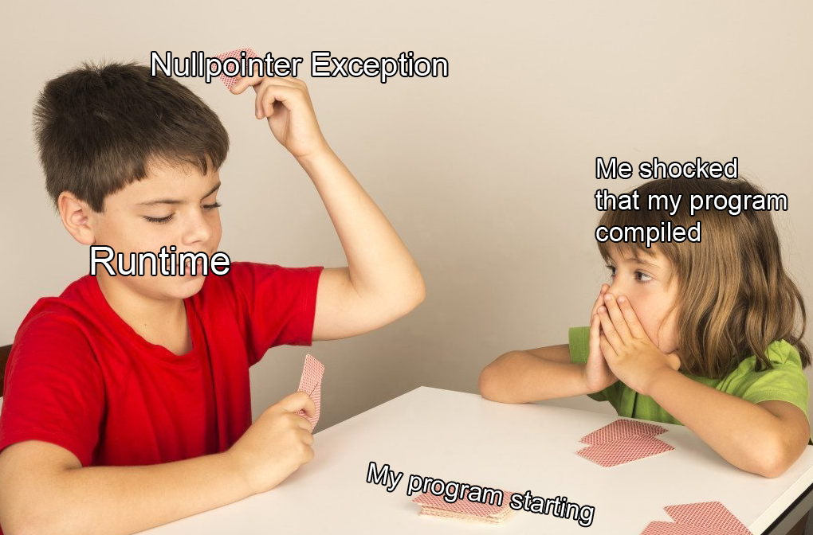
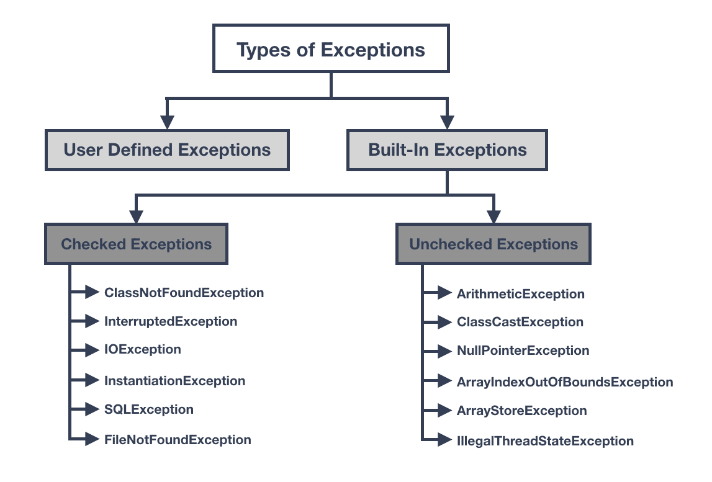
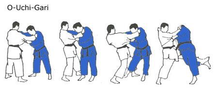

# Chapter 5: Exception Handling

**Name:** Daymian Snowden

**Assignment:** Midterm

---
## Chapter covers:
- What are exceptions?
- Types of errors in programming
- Exception hierarchy in Java
- Checked vs Unchecked exceptions
- Exception handling syntax (try-catch-finally)
- Throwing exceptions
- Creating custom exceptions
- Flow control during exception handling
- Best practices and common mistakes
- Example: Student enrollment with multiple exception types
---

### Exception Handling and Recap

In the previous chapters, we built classes the `Student` and `BankAccount` and added validation to protect their invariants.
Whenever validation fails, we've been throwing `IllegalArgumentException` - but what is that?
I have been holding off on an excellent discussion, so let's dig more into it.
This chapter covers exceptions: what they are, how they work, and how to handle them properly in Java.

### What Are Exceptions?

An exception is an event that disrupts the normal flow of program execution - something that happens in certain cases.
When we try to divide by zero, accessing a null reference, or try opening a non-existent file - Java creates an exception object and "throws" it at us.

**Simple example:**
```java
int result = 10 / 0;
// ArithmeticException: / by zero
```

When this line executes, Java can't complete the division.
Instead of just crashing, it throws the `ArithmeticException`.
If we don't catch and fix this exception, the program will terminate and print a stack trace.

**Exceptions vs Errors**

Java uses exceptions and errors to categorize problems:
- **Exceptions**: Problems our program can reasonably recover from (file not found, invalid input, network timeout)
- **Errors**: Serious problems our program typically cannot recover from (out of memory, stack overflow, system failures)

We can handle exceptions.
However, we generally don't try to handle errors.
If the JVM runs out of memory, there's not much we can do - other than change our design and code.

**Why Exception Handling Matters**

Without proper exception handling, programs will crash if we look at them too hard.
With exception handling, we can:
- Recover from errors
- Provide error messages
- Clean up resources (close files, database connections, etc.)
- Keep the program running, even if not all the individual operations work
- Separate our error-handling code from the rest of our code

Imagine a popular online gaming server, like World of Warcraft - it would be madness if one user's request throws an exception and causes an entire server to crash.
Instead, we handle the exception, send an error message to that user, and keep allowing other requests to process.

### Types of Errors in Programming

There are three (count 'em) main categories of errors we'll encounter.

**Syntax Errors (Compile-Time Errors)**

These are mistakes in our Java syntax that prevent the code from compiling.
The compiler will catch these problems before our program ever runs.
```java
// Missing semicolon
int x = 5

// Mismatched parentheses
if (x > 0 {
    System.out.println("Positive");
}

// Using undefined variable
System.out.println(y);  // y was never declared
```

These are the easiest to fix - the compiler tells us exactly what's wrong and where.
Our IDE will probably highlight them before we even start to compile!

**Runtime Errors**

These occur while the program is running.
The code is able to compile, but something goes wrong during execution.
This is where exceptions come in to play.
```java
String text = null;
System.out.println(text.length());  // NullPointerException at runtime

int[] numbers = {1, 2, 3};
System.out.println(numbers[5]);  // ArrayIndexOutOfBoundsException

int result = 10 / 0;  // ArithmeticException
```

The code is syntactically correct, but the operations cannot be completed.
Runtime errors are exactly what exception handling is designed to fix.

  
*Figure 1: It happens - https://www.reddit.com/r/ProgrammerHumor/comments/hnf5ca/javalangnullpointerexception_at_programmerhumor/*


**Logic Errors**

These are the trickiest - our code compiles and runs without throwing exceptions, but it produces incorrect results.
(Keep on testing, keep on testing and testing...)
```java
// Intended to calculate average, but we forgot to actually divide
public double getAverage(int[] numbers) {
    int sum = 0;
    for (int num : numbers) {
        sum += num;
    }
    return sum;  // Should be: return sum / numbers.length;
}

// Off-by-one error
for (int i = 0; i <= array.length; i++) {  // Should be i < array.length
    // ...
}
```

Logic errors won't throw exceptions - they just give us wrong answers.
Again, just keep testing.

### Exception Hierarchy in Java

Java organizes all exceptions and errors in a class hierarchy.
Understanding this hierarchy helps us know which exceptions to catch and when.

  
*Figure 2: Java exception hierarchy - https://www.manishsanger.com/java-exception-hierarchy/*


**The Throwable Class**

At the top of the hierarchy is `Throwable` - the parent of all exceptions and errors.
We can only throw (and catch) objects that extend `Throwable`.

**Error vs Exception**

- **Error**: Serious system-level problems (don't try to catch these)
    - `OutOfMemoryError` - JVM ran out of memory
    - `StackOverflowError` - infinite recursion filled the call stack
    - `VirtualMachineError` - JVM itself broke

- **Exception**: Problems our code can handle
    - `IOException` - file/network operations failed
    - `SQLException` - database operation failed
    - `RuntimeException` - programming mistakes (null pointers, invalid arguments)

**The Exception Family Tree**

All exceptions inherit from `Exception`, which has two main branches:

1. **Checked exceptions** (direct children of `Exception`)
    - Must be explicitly handled or declared
    - Examples: `IOException`, `SQLException`, `FileNotFoundException`

2. **Unchecked exceptions** (children of `RuntimeException`)
    - Optional to handle
    - Usually they indicate programming bugs
    - Examples: `NullPointerException`, `IllegalArgumentException`, `ArrayIndexOutOfBoundsException`

### Checked vs Unchecked Exceptions

This is one of Java's most important (and also controversial) design decisions.


*Figure 3: Checked vs Unchecked Exceptions - https://rollbar.com/blog/how-to-handle-checked-unchecked-exceptions-in-java/*

**Checked Exceptions (We Must Handle)**

Checked exceptions are exceptions the compiler forces us to handle.
If a method can throw a checked exception, we have to either:
1. Catch it with try-catch, or
2. Declare it with `throws` in the method signature
```java
// This won't compile - IOException is checked
public void readFile(String filename) {
    FileReader reader = new FileReader(filename);  // Compile error
    // ...
}

// Option 1: Catch it
public void readFile(String filename) {
    try {
        FileReader reader = new FileReader(filename);
        // ...
    } catch (FileNotFoundException e) {
        System.err.println("File not found: " + filename);
    }
}

// Option 2: Declare it
public void readFile(String filename) throws FileNotFoundException {
    FileReader reader = new FileReader(filename);
    // ...
}
```

**Common checked exceptions include, but are never limited to:**
- `IOException` - file/network problems
- `SQLException` - database problems
- `ClassNotFoundException` - can't find a class to load
- `InterruptedException` - thread was interrupted

**How to use checked exceptions:**
- For recoverable errors the caller should know about
- When the caller might want to handle the error differently
- For errors that are part of the method's contract

**Unchecked Exceptions (These are technically optional to handle)**

Unchecked exceptions extend `RuntimeException`.
So, the compiler doesn't force us to handle them.
However, they typically represent programming mistakes that could be prevented.
```java
// These compile fine without try-catch
String text = null;
text.length();  // NullPointerException - but compiles

int[] arr = new int[5];
arr[10] = 5;  // ArrayIndexOutOfBoundsException - but compiles

student.setGPA(-1.0);  // IllegalArgumentException - but compiles
```

**Common unchecked exceptions:**
- `NullPointerException` - tried to use a null reference
- `IllegalArgumentException` - invalid argument passed to method
- `ArrayIndexOutOfBoundsException` - array index out of range
- `ArithmeticException` - math error like divide by zero
- `ClassCastException` - invalid type cast

**How to use unchecked exceptions:**
- For programming bugs that should be fixed in code
- For precondition violations (invalid arguments)
- When the caller can't reasonably recover
- When handling would clutter our method calls

**Our Student class uses unchecked exceptions! Check it out:**
```java
public void setGPA(double gpa) {
    if (gpa < 0.0 || gpa > 4.0) {
        throw new IllegalArgumentException("GPA must be between 0.0 and 4.0");
    }
    // ...
}

// Caller doesn't have to catch it (but it can if and when desired)
student.setGPA(5.0);  // Compiles fine
```

### Exception Handling Syntax

Now let's look at how to actually handle exceptions in Java.

**The try-catch Block**

We have mentioning trying a bit, so let's talk more about it.
The basic pattern is this: **try** to do something, **catch** exceptions if they occur.
```java
try {
    // Code that might throw an exception
    int result = 10 / 0;
    System.out.println("This line never executes");
} catch (ArithmeticException e) {
    // Code to handle the exception
    System.out.println("Cannot divide by zero!");
}
System.out.println("Program continues...");
```

**What just happened:**
1. The code in the try block executes normally
2. If an exception is thrown, the execution immediately jumps to the catch block
3. The catch block handles the exception
4. Execution continues after the try-catch block

**Let's show this using our `BankAccount` class:**
```java
BankAccount account = new BankAccount("12345", 1000.0);

try {
    account.withdraw(2000.0);  // Throws IllegalArgumentException
    System.out.println("Withdrawal successful");  // Never executes
} catch (IllegalArgumentException e) {
    System.out.println("Error: " + e.getMessage());
    // Output: Error: Insufficient funds (There's always next week)
}

System.out.println("Current balance: " + account.getBalance());
```

**Multiple Catch Blocks**

We can catch different exception types and handle them differently within the same block too:
```java
try {
    String text = null;
    int length = text.length();  // NullPointerException
    
    int[] numbers = {1, 2, 3};
    System.out.println(numbers[10]);  // ArrayIndexOutOfBoundsException
    
} catch (NullPointerException e) {
    System.out.println("Null reference encountered");
} catch (ArrayIndexOutOfBoundsException e) {
    System.out.println("Array index out of bounds");
} catch (Exception e) {
    System.out.println("Some other exception: " + e.getMessage());
}
```
It's been a while since we brought up rules? Too long.

**Rules for multiple catches:**
- Catches are checked in order from top to bottom
- Only the first matching catch executes
    - Subsequent catches **will not**
- More specific exceptions have to come before more general ones, or compilation errors will abound
```java
// This is wrong - won't compile
try {
    // ...
} catch (Exception e) {  // Too general - catches everything
    // ...
} catch (IllegalArgumentException e) {  // Compile error: already caught above
    // ...
}

// This is correct
try {
    // ...
} catch (IllegalArgumentException e) {  // Specific first
    // ...
} catch (Exception e) {  // General last
    // ...
}
```

**The finally Block**

Ahh, finally. The `finally` block always executes, whether an exception occurred or not.
This is perfect for cleanup code, like closing files or releasing resources.
```java
FileReader reader = null;
try {
    reader = new FileReader("data.txt");
    // Read file...
} catch (FileNotFoundException e) {
    System.out.println("File not found");
} finally {
    // This always runs, even if exception was thrown
    if (reader != null) {
        try {
            reader.close();
        } catch (IOException e) {
            System.out.println("Error closing file");
        }
    }
}
```

**`finally` also executes with return statements:**
```java
public int divide(int a, int b) {
    try {
        return a / b;
    } catch (ArithmeticException e) {
        return -1;
    } finally {
        System.out.println("This prints before the return!");
    }
}
```

**Try-with-Resources**

This is a cleaner way to handle resources that need closing, in modern versions of Java.
Resources that are declared in the try parentheses are automatically closed.
```java
// Old way - syntax is mighty verbose
BufferedReader reader = null;
try {
    reader = new BufferedReader(new FileReader("data.txt"));
    String line = reader.readLine();
} catch (IOException e) {
    e.printStackTrace();
} finally {
    if (reader != null) {
        try {
            reader.close();
        } catch (IOException e) {
            e.printStackTrace();
        }
    }
}

// New way - try-with-resources
try (BufferedReader reader = new BufferedReader(new FileReader("data.txt"))) {
    String line = reader.readLine();
} catch (IOException e) {
    e.printStackTrace();
}
// reader.close() is called automatically!
```

**Example with multiple resources:**
```java
try (
    FileInputStream input = new FileInputStream("input.txt");
    FileOutputStream output = new FileOutputStream("output.txt")
) {
    // Use both resources
    // Both are automatically closed in reverse order
} catch (IOException e) {
    e.printStackTrace();
}
```

Any class that implements `AutoCloseable` or `Closeable` can be used with try-with-resources.
Make sure to keep this useful feature in mind!

### Throwing Exceptions

Sometimes our code needs to throw exceptions rather than catch them.

Kiya! Drop ouchi gari, anyone? No?

  
*Figure 4: A personal favorite... - https://cmac-judo.com/gokyo-no-waza/nage-waza-throwing-yechniqu/dai-ikkyo---yellow-belt/ouchi-gari.html*

**The `throw` Keyword**

We use `throw` to explicitly throw an exception object.
```java
public void setAge(int age) {
    if (age < 0) {
        throw new IllegalArgumentException("Age cannot be negative: " + age);
    }
    if (age > 150) {
        throw new IllegalArgumentException("Age unrealistic: " + age);
    }
    this.age = age;
}
```

**What just happened:**
1. Create an exception object: `new IllegalArgumentException("message")`
2. Throw it: `throw exception_object`
3. Method execution stops immediately
4. Exception propagates up the call stack until it is "caught"

**The `throws` Keyword**

Use `throws` in a method signature to declare that the method might throw an exception.
This is required for checked exceptions.
```java
// Declares that this method might throw FileNotFoundException
public void readFile(String filename) throws FileNotFoundException {
    FileReader reader = new FileReader(filename);
    // ...
}

// Multiple exceptions
public void processData(String filename) 
        throws FileNotFoundException, IOException {
    // ...
}

// Caller must handle or declare
public void loadData() {
    try {
        readFile("data.txt");  // Might throw FileNotFoundException
    } catch (FileNotFoundException e) {
        System.out.println("File not found");
    }
}
```

**When to throw and when to catch:**

**Throw when:**
- We detect an error but don't know how to handle it
- The caller needs to know about the problem
- We want to enforce preconditions/invariants

**Catch when:**
- We know how to recover from the error
- We can provide a meaningful fallback
- We need to clean up resources
- We want to prevent the exception from propagating

**Example using our Student class:**
```java
public class Student {
    private double gpa;
    
    // Throws exception - caller decides how to handle
    public void setGPA(double gpa) {
        if (gpa < 0.0 || gpa > 4.0) {
            throw new IllegalArgumentException(
                "GPA must be between 0.0 and 4.0, got: " + gpa
            );
        }
        this.gpa = gpa;
    }
}

// Caller catches and handles
public void updateStudentGPA(Student student, double newGPA) {
    try {
        student.setGPA(newGPA);
        System.out.println("GPA updated successfully");
    } catch (IllegalArgumentException e) {
        System.out.println("Invalid GPA: " + e.getMessage());
        // Could follow-up with a user prompt to re-enter, use a default value, etc.
    }
}
```

### Creating Custom Exceptions

Sometimes the built-in exceptions don't convey enough information.
Thankfully, we can create custom exceptions.
These allow us to create domain-specific errors and narrow down those bugs.

**Extending Exception Class**

Creating a custom exception is pretty simple - we extend `Exception` (for checked) or `RuntimeException` (for unchecked).
```java
// Custom unchecked exception for our Student class
public class InvalidGPAException extends RuntimeException {
    private double attemptedGPA;
    
    public InvalidGPAException(String message, double attemptedGPA) {
        super(message);
        this.attemptedGPA = attemptedGPA;
    }
    
    public double getAttemptedGPA() {
        return attemptedGPA;
    }
}
```

**Why Create Custom Exceptions?**

1. **More specific error information:**
```java
// Generic
throw new IllegalArgumentException("Invalid GPA: 5.0");

// Custom - carries additional data
throw new InvalidGPAException("GPA out of range", 5.0);
```

2. **Catch specific types:**
```java
try {
    student.setGPA(newGPA);
} catch (InvalidGPAException e) {
    // Handle GPA errors specifically
    System.out.println("Invalid GPA: " + e.getAttemptedGPA());
} catch (IllegalArgumentException e) {
    // Handles all other validation errors
}
```

3. **Domain-specific error handling:**
```java
// Custom exceptions for banking
public class InsufficientFundsException extends Exception {
    private double balance;
    private double requestedAmount;
    
    public InsufficientFundsException(double balance, double requested) {
        super("Insufficient funds: balance=" + balance + ", requested=" + requested);
        this.balance = balance;
        this.requestedAmount = requested;
    }
    
    public double getShortfall() {
        return requestedAmount - balance;
    }
}
```

**Using our custom exception in Student:**
```java
public class Student {
    private static final double MIN_GPA = 0.0;
    private static final double MAX_GPA = 4.0;
    private double gpa;
    
    public void setGPA(double gpa) throws InvalidGPAException {
        if (gpa < MIN_GPA || gpa > MAX_GPA) {
            throw new InvalidGPAException(
                "GPA must be between " + MIN_GPA + " and " + MAX_GPA,
                gpa
            );
        }
        this.gpa = gpa;
    }
}

// Using it
try {
    student.setGPA(5.0);
} catch (InvalidGPAException e) {
    System.err.println("Error: " + e.getMessage());
    System.err.println("We tried to set GPA to: " + e.getAttemptedGPA());
    // We could log this, send an alert, prompt for correction, etc.
}
```

**Checked vs Unchecked Custom Exceptions:**

This is an important distinction! Make sure we are extending the correct exception.
```java
// Unchecked (extends RuntimeException) - for programming errors
public class InvalidGPAException extends RuntimeException {
    // ...
}

// Checked (extends Exception) - for recoverable errors
public class StudentNotFoundException extends Exception {
    // ...
}
```

Generally, we should make custom exceptions unchecked unless there's a reason the caller must handle them.

### Flow Control During Exception Handling

Understanding exactly how exceptions affect program flow is a big part of successful exception handling.

**Normal Execution Flow (No Exception)**
```java
public void processStudent() {
    System.out.println("1. Start");
    
    try {
        System.out.println("2. Before setGPA");
        student.setGPA(3.5);  // Success
        System.out.println("3. After setGPA");
    } catch (InvalidGPAException e) {
        System.out.println("4. In catch block");  // Skipped
    } finally {
        System.out.println("5. In finally block");
    }
    
    System.out.println("6. After try-catch");
}

// Output:
// 1. Start
// 2. Before setGPA
// 3. After setGPA
// 5. In finally block
// 6. After try-catch
```

**Exception Thrown Flow**
```java
public void processStudent() {
    System.out.println("1. Start");
    
    try {
        System.out.println("2. Before setGPA");
        student.setGPA(5.0);  // Exception thrown here
        System.out.println("3. After setGPA");  // Never executes
    } catch (InvalidGPAException e) {
        System.out.println("4. In catch block");
    } finally {
        System.out.println("5. In finally block");
    }
    
    System.out.println("6. After try-catch");
}

// Output:
// 1. Start
// 2. Before setGPA
// 4. In catch block
// 5. In finally block
// 6. After try-catch
```

**Key points to remember:**
- Once an exception is thrown, the try block stops immediately
- Control jumps to the first matching catch block
- Finally block executes after try or catch
- Code after try-catch executes only if exception was caught

**Finally Block Execution Order**

We mentioned this before, but let's reiterate it - The finally block **always** executes, even with return statements:
```java
public String test() {
    try {
        System.out.println("In try");
        return "from try";
    } catch (Exception e) {
        System.out.println("In catch");
        return "from catch";
    } finally {
        System.out.println("In finally");
        // This executes before the return!
    }
}

// Output:
// In try
// In finally
// Returns: "from try"
```

**Tricky scenario - return in finally:**
```java
public int confusing() {
    try {
        return 1;
    } finally {
        return 2;  // Bad practice - overrides try's return!
    }
}
// Returns 2 - finally's return wins, despite our initial return 1
```

**Never put return statements in finally**
- They override returns from try/catch blocks
- This will almost certainly cause errors, eventually
- Causes unnecessary confusion in the best case

**Exception Propagation**

If an exception isn't caught, it will propagate up the call stack:
```java
public void method1() {
    method2();  // Exception propagates here
}

public void method2() {
    method3();  // Exception propagates here
}

public void method3() {
    student.setGPA(5.0);  // Exception thrown here
}

// If never caught, program terminates with stack trace showing:
// at method3()
// at method2()
// at method1()
```

### Best Practices and Common Mistakes (Do and Don't)

**Do these things:**

**1. Catch specific exceptions**
```java
// Good - specific
try {
    student.setGPA(newGPA);
} catch (InvalidGPAException e) {
    // Handle GPA errors
}

// Bad - too general
try {
    student.setGPA(newGPA);
} catch (Exception e) {
    // Catches everything - makes debugging hard
}
```

**2. Provide meaningful error messages**
```java
// Good
throw new InvalidGPAException("GPA must be between 0.0 and 4.0, got: " + gpa, gpa);

// Bad
throw new InvalidGPAException("Error");
```

**3. Clean up resources in finally (or use try-with-resources)**
```java
// Good
try (FileReader reader = new FileReader("file.txt")) {
    // Automatically closed
}

// Also good
FileReader reader = null;
try {
    reader = new FileReader("file.txt");
} finally {
    if (reader != null) {
        reader.close();
    }
}
```

**4. Log exceptions with stack traces**
```java
try {
    // ...
} catch (Exception e) {
    e.printStackTrace();  // Shows full stack trace
    // Or use a logging framework
}
```

**Don't do these things**

**1. Empty catch blocks**
```java
// Terrible - silently swallows errors
try {
    student.setGPA(5.0);
} catch (InvalidGPAException e) {
    // Nothing here - error is invisible!
}

// At minimum, log it
try {
    student.setGPA(5.0);
} catch (InvalidGPAException e) {
    e.printStackTrace();
}
```

**2. Catching Exception or Throwable**
```java
// Bad - catches too much
try {
    // ...
} catch (Throwable t) {  // Catches everything including Errors
    // ...
}

// Better
try {
    // ...
} catch (InvalidGPAException e) {
    // Handle GPA errors
} catch (IllegalArgumentException e) {
    // Handle other argument errors
}
```

**3. Using exceptions for flow control**
```java
// Bad - exceptions are expensive
public boolean isValidGPA(double gpa) {
    try {
        setGPA(gpa);
        return true;
    } catch (InvalidGPAException e) {
        return false;
    }
}

// Good - use regular logic
public boolean isValidGPA(double gpa) {
    return gpa >= 0.0 && gpa <= 4.0;
}
```

**4. Catching and rethrowing without adding value**
```java
// Pointless
public void updateGPA(double gpa) throws InvalidGPAException {
    try {
        student.setGPA(gpa);
    } catch (InvalidGPAException e) {
        throw e;  // Why catch if just rethrowing?
    }
}

// Better - don't catch at all
public void updateGPA(double gpa) throws InvalidGPAException {
    student.setGPA(gpa);
}
```

**5. Overly broad throws declarations**
```java
// Bad - lazy
public void processData() throws Exception {
    // What exceptions can this actually throw? Uhhhhhh
}

// Good - specific
public void processData() throws IOException, SQLException {
    // Caller knows exactly what to handle
}
```
### Student Enrollment with Exception Handling

Let's build an example that demonstrates proper exception handling.
We'll use our `Student` class and add an enrollment system.

**Custom Exception for GPA Validation:**
```java
// Custom exception that carries the invalid GPA value
public class InvalidGPAException extends RuntimeException {
    private double attemptedGPA;
    
    public InvalidGPAException(String message, double attemptedGPA) {
        super(message);
        this.attemptedGPA = attemptedGPA;
    }
    
    public double getAttemptedGPA() {
        return attemptedGPA;
    }
}
```

**Updated Student Class with Custom Exception:**
```java
import java.util.ArrayList;
import java.util.List;

public class Student {
    private String name;
    private int studentID;
    private double gpa;
    private List<String> enrolledCourses;
    private static final int MAX_COURSES = 6;
    
    public Student(String name, int studentID) {
        if (name == null || name.trim().isEmpty()) {
            throw new IllegalArgumentException("Name cannot be null or empty");
        }
        if (studentID <= 0) {
            throw new IllegalArgumentException("Student ID must be positive");
        }
        
        this.name = name.trim();
        this.studentID = studentID;
        this.gpa = 0.0;
        this.enrolledCourses = new ArrayList<>();
    }
    
    // Now throws custom exception instead of IllegalArgumentException
    public void setGPA(double gpa) throws InvalidGPAException {
        if (gpa < 0.0 || gpa > 4.0) {
            throw new InvalidGPAException(
                "GPA must be between 0.0 and 4.0, got: " + gpa,
                gpa
            );
        }
        if (Double.isNaN(gpa)) {
            throw new InvalidGPAException("GPA cannot be NaN", gpa);
        }
        this.gpa = gpa;
    }
    
    public void enrollInCourse(String courseName) {
        if (courseName == null || courseName.trim().isEmpty()) {
            throw new IllegalArgumentException("Course name cannot be null or empty");
        }
        
        String normalizedName = courseName.trim();
        
        // Check for duplicate enrollment
        if (enrolledCourses.contains(normalizedName)) {
            throw new IllegalStateException(
                "Student already enrolled in: " + normalizedName
            );
        }
        
        // Check course limit
        if (enrolledCourses.size() >= MAX_COURSES) {
            throw new IllegalStateException(
                "Cannot enroll: maximum " + MAX_COURSES + " courses allowed"
            );
        }
        
        enrolledCourses.add(normalizedName);
    }
    
    public boolean dropCourse(String courseName) {
        if (courseName == null) {
            return false;
        }
        return enrolledCourses.remove(courseName.trim());
    }
    
    // Getters
    public String getName() { return name; }
    public int getStudentID() { return studentID; }
    public double getGPA() { return gpa; }
    public List<String> getEnrolledCourses() {
        return new ArrayList<>(enrolledCourses);
    }
}
```

**Reviewing Different Exception Scenarios:**
```java
public class StudentEnrollmentDemo {
    public static void main(String[] args) {
        
        // Scenario 1: Valid enrollment - everything works
        System.out.println("=== Scenario 1: Valid Enrollment ===");
        try {
            Student student = new Student("Aisha Khan", 12345);
            student.setGPA(3.5);
            student.enrollInCourse("CS 5004");
            student.enrollInCourse("CS 5008");
            
            System.out.println("Student: " + student.getName());
            System.out.println("GPA: " + student.getGPA());
            System.out.println("Courses: " + student.getEnrolledCourses());
            
        } catch (InvalidGPAException e) {
            System.err.println("GPA Error: " + e.getMessage());
            System.err.println("Attempted GPA: " + e.getAttemptedGPA());
        } catch (IllegalStateException e) {
            System.err.println("Enrollment Error: " + e.getMessage());
        }
        
        // Scenario 2: Invalid GPA
        System.out.println("\n=== Scenario 2: Invalid GPA ===");
        try {
            Student student = new Student("Marcus Lee", 12346);
            student.setGPA(5.0);  // Too high!
            student.enrollInCourse("CS 5004");
            
        } catch (InvalidGPAException e) {
            System.err.println("GPA Error: " + e.getMessage());
            System.err.println("We tried to set: " + e.getAttemptedGPA());
            // In real system: prompt user to re-enter, log error, etc.
        }
        
        // Scenario 3: Duplicate enrollment
        System.out.println("\n=== Scenario 3: Duplicate Enrollment ===");
        try {
            Student student = new Student("Sofia Torres", 12347);
            student.setGPA(3.2);
            student.enrollInCourse("CS 5004");
            student.enrollInCourse("CS 5004");  // Duplicate!
            
        } catch (IllegalStateException e) {
            System.err.println("Error: " + e.getMessage());
            // Not a critical error - just inform user
        }
        
        // Scenario 4: Too many courses
        System.out.println("\n=== Scenario 4: Course Limit ===");
        try {
            Student student = new Student("James Wilson", 12348);
            student.setGPA(3.8);
            
            // Enroll in maximum courses
            for (int i = 1; i <= 7; i++) {
                student.enrollInCourse("CS 500" + i);
            }
            
        } catch (IllegalStateException e) {
            System.err.println("Error: " + e.getMessage());
            // Could suggest dropping a course, show current enrollments, etc.
        }
        
        // Scenario 5: Multiple operations with error recovery
        System.out.println("\n=== Scenario 5: Error Recovery ===");
        Student student = new Student("Elena Rodriguez", 12349);
        
        // Set GPA with error handling
        double[] gpasToTry = {5.0, -1.0, 3.7};  // First two invalid, third valid
        for (double gpa : gpasToTry) {
            try {
                student.setGPA(gpa);
                System.out.println("GPA set to: " + gpa);
                break;  // Success - stop trying
            } catch (InvalidGPAException e) {
                System.err.println("Failed with " + gpa + ": " + e.getMessage());
                // Try next value
            }
        }
        
        // Enroll in courses with error handling
        String[] courses = {"CS 5004", "CS 5004", "CS 5008"};  // Has duplicate
        for (String course : courses) {
            try {
                student.enrollInCourse(course);
                System.out.println("Enrolled in: " + course);
            } catch (IllegalStateException e) {
                System.err.println("Skipping " + course + ": " + e.getMessage());
                // Continue with other courses
            }
        }
        
        System.out.println("Final enrollment: " + student.getEnrolledCourses());
    }
}
```

**Here's what the output from running this demo looks like:**
```
=== Scenario 1: Valid Enrollment ===
Student: Aisha Khan
GPA: 3.5
Courses: [CS 5004, CS 5008]

=== Scenario 2: Invalid GPA ===
GPA Error: GPA must be between 0.0 and 4.0, got: 5.0
We tried to set: 5.0

=== Scenario 3: Duplicate Enrollment ===
Error: Student already enrolled in: CS 5004

=== Scenario 4: Course Limit ===
Error: Cannot enroll: maximum 6 courses allowed

=== Scenario 5: Error Recovery ===
Failed with 5.0: GPA must be between 0.0 and 4.0, got: 5.0
Failed with -1.0: GPA must be between 0.0 and 4.0, got: -1.0
GPA set to: 3.7
Enrolled in: CS 5004
Skipping CS 5004: Student already enrolled in: CS 5004
Enrolled in: CS 5008
Final enrollment: [CS 5004, CS 5008]
```

**This example shows:**

- **Custom exceptions** - InvalidGPAException with additional data
- **Multiple exception types** - InvalidGPAException, IllegalStateException, IllegalArgumentException
- **Graceful error recovery** - program continues when individual operations fail
- **Error messages** - actually useful and informative messages that help developers debug and informs users
- **Real-world patterns** - we try multiple values until one works, continuing despite failures
- **Proper use of try-catch** - a fairly simple implementation that does not complicate the code

Next up, we will talk about inheritance in Java! It is a potent but dangerous ally...

---

### Academic Integrity Statement
I understand that my learning is dependent on individual effort and struggle,
and I acknowledge that this assignment is a 100% original work and that I received no other assistance other than what is listed here.

**Acknowledgements and assistance received:**
- Course Content, primarily modules and lecture content
- Java Exception Handling - https://docs.oracle.com/javase/tutorial/essential/exceptions/
- Exception Handling Best Practices - https://www.baeldung.com/java-exceptions
- Checked vs Unchecked Exceptions - https://www.geeksforgeeks.org/checked-vs-unchecked-exceptions-in-java/
- Try-with-resources - https://docs.oracle.com/javase/tutorial/essential/exceptions/tryResourceClose.html
- Creating Custom Exceptions - https://www.baeldung.com/java-new-custom-exception
- Java Exception Hierarchy - https://www.javatpoint.com/exception-handling-in-java
- Exception Handling in Java: A Complete Guide - https://www.oracle.com/technical-resources/articles/java/javadoc-tool.html
- Best Practices for Exception Handling - https://stackify.com/best-practices-exceptions-java/
- Understanding Java Exceptions - https://www.journaldev.com/1696/exception-handling-in-java
- Java Exception Handling Tutorial - https://www.vogella.com/tutorials/JavaExceptionHandling/article.html
- Rollbar Exception Handling Guide - https://rollbar.com/guides/java/how-to-throw-exceptions-in-java/
- AutoCloseable Interface Documentation - https://docs.oracle.com/javase/8/docs/api/java/lang/AutoCloseable.html

I did not use generative AI in any form to create this content and the final content was not adapted from generative AI created content.

I did not view content from anyone else's submission including submissions from previous semesters nor am I submitting someone else's previous work in part or in whole.

I am the only creator for this content. All sections are my work and no one else's with the exception being any starter content provided by the instructor.
If asked to explain any part of this content, I will be able to.

By putting my name and date here, I acknowledge that all of the above is true and I acknowledge that lying on this form is a violation of academic integrity and will result in no credit on this assignment and possible further repercussions as determined by the Khoury Academic Integrity Committee.

#### Signed: Daymian Snowden
#### Date: 10/18/2025

---