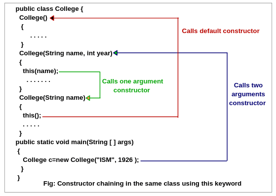
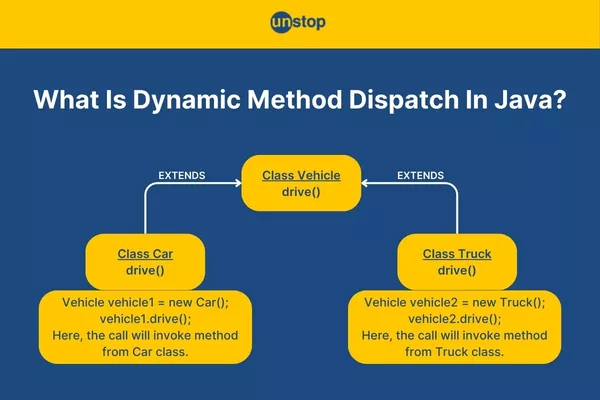
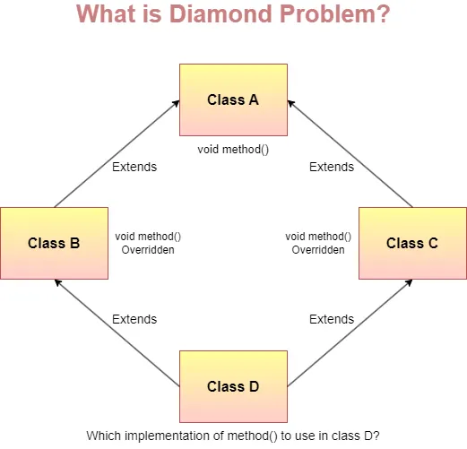

# Chapter 6: Inheritance and the Dangers of Inheritance

**Name:** Daymian Snowden

**Assignment:** Midterm

---
## Chapter covers:
- Inheritance basics and review
- Building classes with inheritance
- Constructor chaining: `super()` and `this()`
- Abstract vs Concrete classes
- Dynamic dispatch and polymorphism
- Composition vs Inheritance
- The dangers of inheritance
- Using inheritance responsibly
- University System Example
---

### Inheritance and Recap

In previous chapters, we built rather independent classes, like `Student`, `Rectangle`, and `BankAccount`.
Each class completely contained all its own fields and methods.
Realistically though, we usually have classes that share common characteristics.
Do we really need to rewrite the same code over and over? No!

This is where inheritance comes into play.
We have talked about inheritance before, so I really hope this comes as no surprise.
Inheritance allows us to create new classes based on existing ones, reusing and extending their functionality.
It's one of the four pillars of OOD... Pop quiz! What are the others?
They are encapsulation, abstraction, and polymorphism, our deities of OOD.

We mentioned inheritance as establishing an **"is-a" relationship**.
A dog *is an* animal. A student *is a* person. A rectangle *is a* shape.
When we use inheritance in Java, we're formalizing these natural relationships.
Dr. Alan Kay would be proud.

**Why use inheritance?**
- **Code reuse** - Write common functionality using the parent class
- **Logical organization** - Models real-world relationships
- **Polymorphism** - Treat objects of different types uniformly
- **Extensibility** - Add new types without modifying existing code

But here's the thing - inheritance is powerful, but it's also dangerous.
When used irresponsibly, we can create fragile, tightly-coupled code that becomes a nightmare to maintain.
This chapter covers both how to use inheritance effectively *and* when to avoid it.

### Building Classes with Inheritance

Let's start with the basics.
In Java, we use the `extends` keyword to create a class that inherits from another class.
We have actually been using it quite a bit, and I apologize if this has been confusing!
So let's formally cover it.

**The `extends` Keyword**

Here's a simple example using our familiar animal concept:
```java
// Parent class (also called superclass or base class)
public class Animal {
    protected String name;
    protected int age;
    
    public Animal(String name, int age) {
        this.name = name;
        this.age = age;
    }
    
    public void eat() {
        System.out.println(name + " is eating");
    }
    
    public void sleep() {
        System.out.println(name + " is sleeping");
    }
    
    public void makeSound() {
        System.out.println(name + " makes a sound");
    }
}

// Child class (also called subclass or derived class)
public class Dog extends Animal {
    private String breed;
    
    public Dog(String name, int age, String breed) {
        super(name, age);  // Call parent constructor
        this.breed = breed;
    }
    
    // Override parent's method
    @Override
    public void makeSound() {
        System.out.println(name + " barks!");
    }
    
    // Add new method specific to Dog
    public void fetch() {
        System.out.println(name + " is fetching the ball");
    }
}

// Usage
Dog myDog = new Dog("Max", 3, "Golden Retriever");
myDog.eat();       // Inherited from Animal
myDog.sleep();     // Inherited from Animal
myDog.makeSound(); // Overridden in Dog - prints "Max barks!"
myDog.fetch();     // Dog-specific method
```

**What Exactly Gets Inherited?**

When a class extends another class using `extends`, it inherits:
- **Public and protected fields**
    - Can be accessed directly in the child class
- **Public and protected methods**
    - Can be called or overridden
- **Nested classes**
    - Inner classes defined in the parent

**Not Everything Is Inherited...**

These remain exclusive to the parent class:
- **Constructors**
    - Each class must define its own constructors
    - However, they can call parent constructors
- **Private members**
    - These are hidden from the child class
    - They do still exist in the object
- **Static members**
    - These belong to the class, not instances
    - They are accessible, but they are not truly "inherited"

**Access Modifiers and Inheritance**

Remember our access modifiers from Chapter 3?
As you can probably guess, they are critical for setting up inheritance hierarchies:
- `private` - Not accessible in child classes
- `protected` - Accessible in child classes (this is why we used it for `name` and `age`)
- `public` - Accessible everywhere
- Package-private (no modifier) - Accessible in child classes *if they're in the same package*
```java
public class Animal {
    private String bloodType;      // Not accessible in Dog
    protected String name;         // Accessible in Dog
    public int age;                // Accessible in Dog
    
    public String getBloodType() {
        return bloodType;
    }
}

public class Dog extends Animal {
    public void printInfo() {
        // System.out.println(bloodType);  // Compile error - private
        System.out.println(name);           // Works - protected
        System.out.println(age);            // Works - public
        System.out.println(getBloodType()); // Works - using public method
    }
}
```

**The Parent-Child Relationship**

In our example:
- `Animal` is the **parent class** (superclass, base class)
- `Dog` is the **child class** (subclass, derived class)
- Dog **extends** Animal
- Dog **is an** Animal
    - But Animal is not necessarily a Dog!

We can create an inheritance chain:
```java
public class Animal {
    // General animal behavior
}

public class Dog extends Animal {
    // Dog-specific behavior
}

public class Puppy extends Dog {
    // Puppy-specific behavior (very different than ol' Yeller)
}

// Puppy is-a Dog
// Puppy is-a Animal
// Dog is-a Animal
```

### Constructor Chaining: super() and this()

  
*Figure 1: Constructor Chaining Example - https://www.scientecheasy.com/2020/06/java-constructor-chaining.html/*

Constructors are not inherited, but child classes can (and actually must) call parent constructors.
This is where `super()` and `this()` come into play.

**The `super()` Keyword**

`super()` calls the parent class's constructor.
It **must** be the first statement in the child constructor.
```java
public class Animal {
    protected String name;
    protected int age;
    
    // Parent constructor
    public Animal(String name, int age) {
        if (age < 0) {
            throw new IllegalArgumentException("Age cannot be negative");
        }
        this.name = name;
        this.age = age;
    }
}

public class Dog extends Animal {
    private String breed;
    
    // Child constructor
    public Dog(String name, int age, String breed) {
        super(name, age);   // Must be first statement
                            // Calls the Animal constructor
        
        if (breed == null || breed.isEmpty()) {
            throw new IllegalArgumentException("Breed cannot be null or empty");
        }
        this.breed = breed;
    }
}
```

**What happens if we don't call `super()`?**

Java automatically inserts `super()` (no arguments) if we don't explicitly call a parent constructor.
However! This only works if the parent has a no-argument constructor.
```java
public class Animal {
    protected String name;
    
    public Animal() {
        this.name = "Unknown";
    }
}

public class Dog extends Animal {
    private String breed;
    
    public Dog(String breed) {
        // Java automatically adds: super();
        this.breed = breed;
    }
}
```

But if the parent *doesn't* have a no-argument constructor?
Well, we will get a compile error:
```java
public class Animal {
    protected String name;
    
    // Only parameterized constructor - no default constructor
    public Animal(String name) {
        this.name = name;
    }
}

public class Dog extends Animal {
    private String breed;
    
    public Dog(String breed) {
        // Compile error - Java tries to call super() but it doesn't exist
        this.breed = breed;
    }
}

// Fix: explicitly call parent constructor
public class Dog extends Animal {
    private String breed;
    
    public Dog(String name, String breed) {
        super(name);  // Now it works
        this.breed = breed;
    }
}
```

**Constructor Chaining with `this()`**

Remember `this` from Chapter 2?
We can use `this()` to call another constructor in the same class.
This same practice works with inheritance too!
```java
public class Dog extends Animal {
    private String breed;
    private boolean trained;
    
    // Main constructor
    public Dog(String name, int age, String breed, boolean trained) {
        super(name, age);
        this.breed = breed;
        this.trained = trained;
    }
    
    // Convenience constructor - assumes untrained
    public Dog(String name, int age, String breed) {
        this(name, age, breed, false);  // Calls the other Dog constructor
    }
    
    // Another convenience constructor - assumes generic breed
    public Dog(String name, int age) {
        this(name, age, "Mixed Breed");  // Calls the three-parameter constructor
    }
}

// Usage - all valid
Dog dog1 = new Dog("Max", 3, "Golden Retriever", true);
Dog dog2 = new Dog("Buddy", 2, "Labrador");  // trained = false
Dog dog3 = new Dog("Charlie", 4);            // breed = "Mixed Breed", trained = false
```

**The Rules of Constructor Chaining**

Yea, yea, let's review the rules:
- Either `super()` or `this()` must be the first statement in a constructor when used
- We cannot use both `super()` and `this()` in the same constructor
- If we use `this()`, that constructor must eventually call `super()`
    - This can be done either explicitly or implicitly

**Example: Three-Level Constructor Chain**
```java
public class Animal {
    protected String name;
    protected int age;
    
    public Animal(String name, int age) {
        System.out.println("Animal constructor called");
        this.name = name;
        this.age = age;
    }
}

public class Dog extends Animal {
    private String breed;
    
    public Dog(String name, int age, String breed) {
        super(name, age);  // Calls Animal constructor
        System.out.println("Dog constructor called");
        this.breed = breed;
    }
}

public class Puppy extends Dog {
    private boolean isPlayful;
    
    public Puppy(String name, int age, String breed) {
        super(name, age, breed);  // Calls Dog constructor (which calls Animal constructor)
        System.out.println("Puppy constructor called");
        this.isPlayful = true;  // Puppies are always playful
    }
}

// Usage
Puppy myPuppy = new Puppy("Spot", 1, "Beagle");

// Output:
// Animal constructor called
// Dog constructor called
// Puppy constructor called
```

Notice the order: constructors execute from the *top down* within the hierarchy.
The parent is fully constructed before the child adds its own initialization, and so on and so forth down the chain.

### Abstract vs Concrete Classes

Sometimes we want to define a class that's effectively incomplete, on purpose.
What do I mean by this?
Typically, a class is used to establish methods.
However, we can use an abstract class that establishes what methods should exist, but doesn't implement them all.
An abstract class is an abstraction, which we love in OOD.
Let's talk more about abstract classes and why we would use them.

**What Are Abstract Classes?**

An abstract class is a class that:
- Cannot be instantiated directly
    - We can't do `new AbstractClass()`
- May contain abstract methods
    - Methods without implementations
- May contain concrete methods
    - "Normal" methods with implementations
- May contain fields, constructors, and any component contained in a normal class

An abstract class is like a partial blueprint.
It defines the structure, but leaves out some details that are filled in by child classes.
```java
// Abstract class
// Notice that we have to define it using the abstract keyword
public abstract class Shape {
    protected String color;
    
    // Regular constructor
    public Shape(String color) {
        this.color = color;
    }
    
    // Concrete method - has implementation
    public String getColor() {
        return color;
    }
    
    // Abstract method
    // There is no implementation!
    // It instead ends with semicolon
    public abstract double getArea();
    
    // Another abstract method
    public abstract double getPerimeter();
    
    // Concrete method that uses abstract methods
    public void printInfo() {
        System.out.println("Color: " + color);
        System.out.println("Area: " + getArea());
        System.out.println("Perimeter: " + getPerimeter());
    }
}

// The following code would not compile - we can't instantiate abstract class
// Shape shape = new Shape("red");  // Compile error
```

**Concrete Classes - Implementing Abstract Methods**

A **concrete class** is a normal class that can be instantiated.
When a concrete class extends an abstract class, it **must** implement all of its abstract methods.

Let's bring back the `Rectangle` class:
```java
public class Rectangle extends Shape {
    // Note the extension here
    private double width;
    private double height;
    
    public Rectangle(String color, double width, double height) {
        super(color);  // Call Shape's constructor
        
        if (width <= 0 || height <= 0) {
            throw new IllegalArgumentException("Dimensions must be positive");
        }
        this.width = width;
        this.height = height;
    }
    
    // Must implement abstract method from Shape
    @Override
    // We use override here
    public double getArea() {
        return width * height;
    }
    
    // Must implement abstract method from Shape
    @Override
    // And here again
    public double getPerimeter() {
        return 2 * (width + height);
    }
    
    // Rectangle-specific methods
    public double getWidth() {
        return width;
    }
    
    public double getHeight() {
        return height;
    }
}

public class Circle extends Shape {
    private double radius;
    
    public Circle(String color, double radius) {
        super(color);
        
        if (radius <= 0) {
            throw new IllegalArgumentException("Radius must be positive");
        }
        this.radius = radius;
    }
    
    @Override
    public double getArea() {
        return Math.PI * radius * radius;
    }
    
    @Override
    public double getPerimeter() {
        return 2 * Math.PI * radius;
    }
    
    public double getRadius() {
        return radius;
    }
}

// Now we can instantiate concrete classes
Rectangle rect = new Rectangle("blue", 5.0, 3.0);
Circle circle = new Circle("red", 7.0);

rect.printInfo();    // Uses Shape's concrete method
circle.printInfo();  // Uses Shape's concrete method

// Output for rect:
// Color: blue
// Area: 15.0
// Perimeter: 16.0
```

**When and Why Use Abstract Classes?**

Abstract classes are useful when:
- Multiple classes share common functionality, but each needs to implement certain methods differently
- We want our child classes to implement specific methods, potentially distinct from one another
- We want to provide some default behavior that all children can use, but don't have to
- We want to prevent direct instantiation of the parent class, which may serve only as a template

In our `Shape` example:
- Every shape has a color - a common functionality
- Every shape needs area and perimeter calculations
    - But! They differ by shape type
- It doesn't make sense to have a generic "Shape"
    - Shapes are specific (Rectangle, Circle, etc.)

**Abstract Classes Can Extend Abstract Classes**

An abstract class can extend another abstract class, without implementing its abstract methods:
```java
public abstract class Animal {
    public abstract void makeSound();
    public abstract void move();
}

public abstract class Mammal extends Animal {
    // Mammal doesn't implement makeSound() or move()
    // Adds its own abstract method
    public abstract void nurse();
}

public class Dog extends Mammal {
    // Dog must implement ALL abstract methods from both Animal and Mammal
    @Override
    public void makeSound() {
        System.out.println("Bark!");
    }
    
    @Override
    public void move() {
        System.out.println("Running on four legs");
    }
    
    @Override
    public void nurse() {
        System.out.println("Nursing puppies");
    }
}
```

### Dynamic Dispatch and Polymorphism

Here's where inheritance gets really powerful.
**Dynamic dispatch** is Java's mechanism for determining which method to call at runtime.
It is based on the actual object type, not the reference type.

This distinction enables **polymorphism** - the ability to treat objects of different types uniformly.

**Compile-Time Type vs Runtime Type**

In Java, every variable has two types:
- **Compile-time type** (also called static type) - The type declared in the code
- **Runtime type** (also called dynamic type) - The actual type of the object the variable refers to
```java
// Compile-time type is Animal
// Runtime type is Dog
Animal myAnimal = new Dog("Max", 3, "Golden Retriever");
```

**How Java Picks Which Method to Call**

When we call a method on an object, Java uses the *runtime type* to determine which version of the method to execute.
This happens at runtime - hence why we call it "dynamic" dispatch.
```java
public class Animal {
    public void makeSound() {
        System.out.println("Some generic animal sound");
    }
    
    public void eat() {
        System.out.println("Animal is eating");
    }
}

public class Dog extends Animal {
    @Override
    public void makeSound() {
        System.out.println("Woof!");
    }
    
    // Dog doesn't override eat(), so it uses Animal's version
}

public class Cat extends Animal {
    @Override
    public void makeSound() {
        System.out.println("Meow!");
    }
    
    @Override
    public void eat() {
        System.out.println("Cat delicately nibbles its food");
    }
}

// Using polymorphism
Animal animal1 = new Dog("Max", 3, "Labrador");
Animal animal2 = new Cat("Whiskers", 2, "Tabby");

animal1.makeSound();  // Prints: Woof!
animal2.makeSound();  // Prints: Meow!

animal1.eat();  // Prints: Animal is eating (uses Animal's method)
animal2.eat();  // Prints: Cat delicately nibbles its food (uses Cat's override)
```

**Yes, yes... wait, what just happened?**
1. Both `animal1` and `animal2` have compile-time type `Animal`
2. But `animal1` has runtime type `Dog`, and `animal2` has runtime type `Cat`
3. When we call `makeSound()`, Java looks at the runtime type and calls the appropriate version
4. This is **dynamic dispatch** doing what it does

  
*Figure 2: Dynamic Dispatch - https://unstop.com/blog/dynamic-method-dispatch-in-java*

**Polymorphism in Action: Shape Example**

Let's see a more practical example with our shapes:
```java
public class ShapeDemo {
    public static void main(String[] args) {
        // Array of Shape references holding different shape types
        Shape[] shapes = new Shape[3];
        shapes[0] = new Rectangle("blue", 5.0, 3.0);
        shapes[1] = new Circle("red", 7.0);
        shapes[2] = new Rectangle("green", 4.0, 4.0);
        
        // Process all shapes uniformly
        double totalArea = 0;
        for (Shape shape : shapes) {
            shape.printInfo();  // Calls correct getArea() and getPerimeter() for each shape
            totalArea += shape.getArea();  // Dynamic dispatch picks the right implementation
            System.out.println("---");
        }
        
        System.out.println("Total area of all shapes: " + totalArea);
    }
}
```

When we write code that works with `Shape`, it automatically handles `Rectangle`, `Circle`, or any other shape type we create later.
What does this do for us?

**We don't need to modify this code when we add new shape types.**
This is huge and when used correctly, can cut development time down by a lot!

**"Da Rulez" of Dynamic Dispatch**
- Method calls are resolved at runtime based on the object's actual type
- Only works with **instance methods**
    - This does not work with static methods or fields
- The method must be `public` or `protected`
    - It cannot be `private`
- If a method isn't overridden in the child class, then the parent's version is used

**What About Fields?**

Fields are *not* subject to dynamic dispatch.
Instead, field access is resolved at compile-time based on the reference type:
```java
public class Animal {
    public String type = "Animal";
}

public class Dog extends Animal {
    public String type = "Dog";  // Hides parent's field (bad practice!)
}

Animal animal = new Dog("Max", 3, "Labrador");
System.out.println(animal.type);  // Prints: Animal (uses compile-time type)

Dog dog = (Dog) animal;
System.out.println(dog.type);  // Prints: Dog
```

Got that?
Fields resolve at compile-time based on the reference type, while methods resolve at runtime based on the object type.
This is just another reason why we always make fields `private` and access them through methods.

### Composition vs Inheritance

We've spent a lot of time on inheritance, but it's not always the right choice.
Sometimes **composition** (has-a relationships) is better than **inheritance** (is-a relationships).

**"Has-a" vs "is-a" Relationships**

Let's revisit these concepts from Chapter 2:
- **Inheritance (is-a)**: A Dog *is an* Animal
- **Composition (has-a)**: A Car *has an* Engine
```java
// Inheritance: Dog is-an Animal
public class Dog extends Animal {
    // Dog inherits Animal's properties and methods
}

// Composition: Car has-an Engine
public class Car {
    private Engine engine;  // Car contains an Engine
    
    public Car() {
        this.engine = new Engine();
    }
    
    public void start() {
        engine.ignite();  // Delegates to the Engine
    }
}
```

**When to Favor Composition Over Inheritance**

A famous principle noted the following: **"Favor composition over inheritance"**

Generally speaking, we use composition when:
- The relationship is more about capability rather than identity
- We need the flexibility to change behavior at runtime
- We want to avoid tight coupling (more on this later)
- Multiple inheritance would be useful
    - Java doesn't support this natively
    - Composition allows for "has-a" relationship for multiple things

**Example: The Stack Problem**

Here's a classic example of inheritance gone wrong:
```java
// Bad: Stack extends ArrayList
public class Stack<T> extends ArrayList<T> {
    public void push(T item) {
        add(item);
    }
    
    public T pop() {
        return remove(size() - 1);
    }
    
    public T peek() {
        return get(size() - 1);
    }
}

// Problem: Stack inherits ALL of ArrayList's methods
Stack<String> stack = new Stack<>();
stack.push("A");
stack.push("B");
stack.add(0, "C");  // We can insert in the middle - breaks stack behavior
stack.remove(1);    // We can remove from middle - breaks stack behavior
```

The problem: A Stack *is not* an ArrayList.
In fact, a Stack *has* a specific behavior it follows for data - Last-in-First-out (LIFO).
When we inherit from an ArrayList, we are inheriting methods that violate this behavior.

**Better: Composition Solution**
```java
// Good: Stack uses composition
public class Stack<T> {
    private ArrayList<T> items;  // Has-a relationship
    
    public Stack() {
        items = new ArrayList<>();
    }
    
    public void push(T item) {
        items.add(item);
    }
    
    public T pop() {
        if (items.isEmpty()) {
            throw new IllegalStateException("Stack is empty");
        }
        return items.remove(items.size() - 1);
    }
    
    public T peek() {
        if (items.isEmpty()) {
            throw new IllegalStateException("Stack is empty");
        }
        return items.get(items.size() - 1);
    }
    
    public boolean isEmpty() {
        return items.isEmpty();
    }
    
    public int size() {
        return items.size();
    }
}

// Now users can only call Stack methods - proper encapsulation
Stack<String> stack = new Stack<>();
stack.push("A");
stack.push("B");
// stack.add(0, "C");  // Compile error - this method doesn't exist here
// stack.remove(1);    // Compile error - this method doesn't exist here
```

That's much better.
The Stack controls exactly how the ArrayList is used.

**Flexibility of Composition**

Composition provides flexibility that inheritance doesn't:
```java
// With composition, we can easily swap implementations
public class Car {
    private Engine engine;
    
    public Car(Engine engine) {
        this.engine = engine;  // Can inject different engine types
    }
    
    public void upgradeEngine(Engine newEngine) {
        this.engine = newEngine;  // Can change at runtime
    }
}

// Different engine types
Engine v6Engine = new V6Engine();
Engine electricEngine = new ElectricEngine();

Car car = new Car(v6Engine);
// Later...
car.upgradeEngine(electricEngine);  // Flexible!
```

With inheritance, we're stuck with the one parent class.
With composition, we can have multiple components and swap them as needed.

**When Inheritance Is Appropriate**

Inheritance *is* the right choice when:
- The relationship is genuinely "is-a"
- The child class wants to be treated as the parent type (polymorphism)
- The parent class is designed for inheritance (more on this later)
- The hierarchy is shallow (2-3 levels max)

Good examples of inheritance:
- `Dog extends Animal` - A dog genuinely is an animal
- `Student extends Person` - A student genuinely is a person
- `Rectangle extends Shape` - A rectangle genuinely is a shape

Bad examples that should use composition:
- `Stack extends ArrayList` - A stack has-a list, but is not-a list
- `Car extends Engine` - A car has-an engine, but is not-an engine

### The Dangers of Inheritance

Now for maybe the most important part: what can go wrong with inheritance?
Inheritance is powerful, but it's also one of the most misused features of object-oriented programming.

**Danger 1: The Fragile Base Class Problem**

The fragile base class problem occurs when changes to a parent class unexpectedly break child classes.

**Example: A Violation of Trust**
```java
// Version 1: Parent class
public class Counter {
    private int count = 0;
    
    public void increment() {
        count++;
    }
    
    public void add(int value) {
        for (int i = 0; i < value; i++) {
            increment();  // Calls increment() internally
        }
    }
    
    public int getCount() {
        return count;
    }
}

// Child class tracks how many times methods are called
public class InstrumentedCounter extends Counter {
    private int methodCallCount = 0;
    
    @Override
    public void increment() {
        methodCallCount++;
        super.increment();
    }
    
    @Override
    public void add(int value) {
        methodCallCount++;
        super.add(value);  // This calls parent's add(), which calls increment()
    }
    
    public int getMethodCallCount() {
        return methodCallCount;
    }
}

// Usage
InstrumentedCounter counter = new InstrumentedCounter();
counter.add(3);

System.out.println("Count: " + counter.getCount());  // Prints: 3 (correct)
System.out.println("Method calls: " + counter.getMethodCallCount());  // Prints: 4 (wrong!)
// Expected 1 call to add(), but got 1 call to add() + 3 calls to increment()
```

Wait, what went wrong?
The `InstrumentedCounter` makes assumptions about how the parent's `add()` method works.
When `add()` calls `increment()`, it also triggers the overridden version, causing double-counting.

**Now imagine the parent class changes:**
```java
// Version 2: Parent class "optimized"
public class Counter {
    private int count = 0;
    
    public void increment() {
        count++;
    }
    
    public void add(int value) {
        count += value;  // Direct addition - no longer calls increment()
    }
    
    public int getCount() {
        return count;
    }
}

// Child class code unchanged
public class InstrumentedCounter extends Counter {
    // Same as before...
}

// Usage
InstrumentedCounter counter = new InstrumentedCounter();
counter.add(3);

System.out.println("Method calls: " + counter.getMethodCallCount());  // Now prints: 1
// The "bug" is fixed...
// But for the wrong reason!
```

This is the fragile base class problem in action.
When the child class depends on implementation details of the parent, any changes to the parent can break the child in unpredictable ways.

**Danger 2: Deep Inheritance Hierarchies**

Once inheritance hierarchies reach more than 3-4 levels, they quickly become difficult to understand and maintain.

**Example: The Nightmare Hierarchy**
```java
// Level 1
public class LivingThing {
    public void metabolize() { /* ... */ }
}

// Level 2
public class Animal extends LivingThing {
    public void eat() { /* ... */ }
    public void breathe() { /* ... */ }
}

// Level 3
public class Mammal extends Animal {
    public void produceMilk() { /* ... */ }
    public void regulateBodyTemp() { /* ... */ }
}

// Level 4
public class Carnivore extends Mammal {
    public void hunt() { /* ... */ }
}

// Level 5
public class Dog extends Carnivore {
    public void bark() { /* ... */ }
}

// Level 6
public class Puppy extends Dog {
    public void play() { /* ... */ }
}
```

Problems with this hierarchy:
- To fully understand `Puppy`, we must also understand all class levels
- A change at the `Animal` level will affect 4 child classes
- It's unclear which methods come from where
- Adding new animals becomes a nightmare
    - Where would we add omnivores?

**Better approach: Shallow hierarchy & Composition**
```java
// Keep it shallow
public abstract class Animal {
    protected String name;
    private DietBehavior dietBehavior;  // Composition for flexibility
    
    public abstract void makeSound();
}

public class Dog extends Animal {
    @Override
    public void makeSound() {
        System.out.println("Bark!");
    }
}

// Much simpler, more flexible
```

**Danger 3: Tight Coupling**

We've mentioned this at least a couple of times, but hey now - don't worry, I got you covered.
Inheritance creates the tightest form of coupling in OOP.
This is because the child class depends heavily upon the parent's implementation.
```java
public class BankAccount {
    protected double balance;
    // Ha, double balance, I wish...
    
    public void deposit(double amount) {
        balance += amount;
        logTransaction("Deposit: " + amount);
    }
    
    protected void logTransaction(String message) {
        System.out.println(message);
    }
}

public class SavingsAccount extends BankAccount {
    @Override
    public void deposit(double amount) {
        balance += amount;  // Directly modifies parent's field
        balance += amount * 0.02;  // Add 2% interest
        logTransaction("Savings deposit: " + amount);  // Uses parent's method
    }
}
```

`SavingsAccount` is tightly coupled to `BankAccount`:
- Depends on `balance` being `protected` and accessible
- Depends on `logTransaction()` existing and being `protected`
- Depends on `deposit()` not having any side effects we don't know about

If `BankAccount` changes its internals, `SavingsAccount` might break.
Generally speaking, it would be nice if all our code functioned independently, but we live in a world of connected objects.

**Danger 4: The Diamond Problem (AKA Why Java Doesn't Allow Multiple Inheritance)**

  
*Figure 3: The Diamond Problem - https://bhawana-gaur.medium.com/how-does-java-provide-support-for-multiple-inheritance-indirectly-4588241126fb*

Imagine if Java allowed a class to extend multiple parents:
```java
// Hypothetical - this doesn't work in Java
public class Student {
    public void study() {
        System.out.println("Student studying");
    }
}

public class Employee {
    public void work() {
        System.out.println("Employee working");
    }
}

// What if we could do this?
public class WorkingStudent extends Student, Employee {
    // Inherits study() and work()
}
```

That seems fine... But what if we did this:
```java
public class Person {
    public void print() {
        System.out.println("I am a person");
    }
}

public class Student extends Person {
    @Override
    public void print() {
        System.out.println("I am a student");
    }
}

public class Employee extends Person {
    @Override
    public void print() {
        System.out.println("I am an employee");
    }
}

// The diamond problem
public class WorkingStudent extends Student, Employee {
    // Which print() method do we inherit?
    // Student's? Employee's? Both?
}
```

This is the diamond problem: when a class inherits from two classes that share a common ancestor.
Java avoids this entirely by not allowing multiple inheritance of classes.
(Interfaces handle this differently! Wait for Chapter 7, it's going to be a hot release.)

### Using Inheritance Responsibly

So how do we use inheritance without falling into these traps?
Here are some best practices.

**Practice 1: Favor Composition Over Inheritance**

This is the golden rule, our northern star.
Unless we have a clear "is-a" relationship and need polymorphism, use composition.
```java
// Instead of: ElectricCar extends Car
public class ElectricCar {
    private Car carFeatures;     // Has-a car's features
    private Battery battery;     // Has-a battery
    private ElectricMotor motor; // Has-an electric motor
    
    // Much more flexible
}
```

**Practice 2: Keep Hierarchies Shallow**

Limit inheritance to 2-3 levels maximum.
If we need more levels, we're probably not using composition properly.
```java
// Good: 2 levels
Animal → Dog

// Acceptable: 3 levels
Animal → Mammal → Dog

// Bad: 4+ levels
LivingThing → Animal → Mammal → Carnivore → Dog → Puppy
```

**Practice 3: Design for Inheritance (or Avoid It Entirely)**

Either explicitly design a class to be extended (and document how), or make it `final` to prevent extension.
```java
// Option 1: Design for inheritance
public class Shape {
    // Clearly documented what child classes should override
    // Protected methods designed for extension
    // Careful about calling overridable methods from constructors
}

// Option 2: Prohibit inheritance
public final class Rectangle {
    // Cannot be extended - implementation is sealed
}
```

**Practice 4: Don't Call Overridable Methods from Constructors**

This can lead to subtle bugs that are hard to catch:
```java
public class Animal {
    public Animal() {
        init();  // Dangerous - can call overridden version
    }
    
    public void init() {
        System.out.println("Animal init");
    }
}

public class Dog extends Animal {
    private String breed;
    
    public Dog(String breed) {
        super();  // Calls Animal constructor
        this.breed = breed;
    }
    
    @Override
    public void init() {
        System.out.println("Dog breed: " + breed);  // breed is null here!
    }
}

// Usage
Dog dog = new Dog("Labrador");
// Output: Dog breed: null
// The overridden init() is called before breed is initialized
```

**Practice 5: Use `@Override` Annotation**

Always use `@Override` when overriding methods.
Just do it.
The compiler will catch mistakes:
```java
public class Dog extends Animal {
    @Override
    public void makeSound() {  // Compiler verifies this overrides Animal's method
        System.out.println("Woof!");
    }
    
    @Override
    public void makesound() {  // Compile error - typo caught!
        System.out.println("Woof!");
    }
}
```

**Practice 6: Document Inheritance Contracts**

If a class is designed for inheritance, document what child classes should override and if there are any special requirements:
```java
/**
 * Abstract base class for all shapes.
 * 
 * Subclasses must implement:
 * - getArea(): Calculate the shape's area
 * - getPerimeter(): Calculate the shape's perimeter
 * 
 * Subclasses should not override printInfo() unless they have
 * additional information to display.
 */
public abstract class Shape {
    // ...
}
```

This makes your code a lot more readable for other developers.
It helps them understand what is going on faster so they can code without (with less) fear.

**Practice 7: Consider Using Interfaces Instead**

We'll dive deep into interfaces in Chapter 7, but they can provide a better alternative to inheritance:
- No implementation inheritance (looser coupling)
- A class can implement multiple interfaces (more flexible)
- Clear contracts, no implementation baggage

### Inheritance Example: University System

Let's put everything together with a comprehensive example that shows both good and bad uses of inheritance.

**Good Design: Person Hierarchy**
```java
// Abstract base class
public abstract class Person {
    protected String name;
    protected int id;
    protected String email;
    
    public Person(String name, int id, String email) {
        if (name == null || name.isEmpty()) {
            throw new IllegalArgumentException("Name cannot be null or empty");
        }
        if (id <= 0) {
            throw new IllegalArgumentException("ID must be positive");
        }
        
        this.name = name;
        this.id = id;
        this.email = email;
    }
    
    public String getName() {
        return name;
    }
    
    public int getId() {
        return id;
    }
    
    public String getEmail() {
        return email;
    }
    
    // Abstract method - each person type has different role
    public abstract String getRole();
    
    @Override
    public String toString() {
        return getRole() + ": " + name + " (ID: " + id + ")";
    }
}

// Student is-a Person
public class Student extends Person {
    private double gpa;
    private String major;
    
    public Student(String name, int id, String email, String major) {
        super(name, id, email);
        
        if (major == null || major.isEmpty()) {
            throw new IllegalArgumentException("Major cannot be null or empty");
        }
        
        this.major = major;
        this.gpa = 0.0;
    }
    
    @Override
    public String getRole() {
        return "Student";
    }
    
    public double getGPA() {
        return gpa;
    }
    
    public void setGPA(double gpa) {
        if (gpa < 0.0 || gpa > 4.0) {
            throw new IllegalArgumentException("GPA must be between 0.0 and 4.0");
        }
        this.gpa = gpa;
    }
    
    public String getMajor() {
        return major;
    }
}

// Professor is-a Person
public class Professor extends Person {
    private String department;
    private String[] coursesTeaching;
    
    public Professor(String name, int id, String email, String department) {
        super(name, id, email);
        
        if (department == null || department.isEmpty()) {
            throw new IllegalArgumentException("Department cannot be null or empty");
        }
        
        this.department = department;
        this.coursesTeaching = new String[0];
    }
    
    @Override
    public String getRole() {
        return "Professor";
    }
    
    public String getDepartment() {
        return department;
    }
    
    public void assignCourse(String courseName) {
        // Implementation for assigning courses
        String[] newArray = new String[coursesTeaching.length + 1];
        System.arraycopy(coursesTeaching, 0, newArray, 0, coursesTeaching.length);
        newArray[coursesTeaching.length] = courseName;
        coursesTeaching = newArray;
    }
    
    public String[] getCoursesTeaching() {
        return coursesTeaching.clone();  // Defensive copy
    }
}
```

**Why This Design Works:**

1. **Clear is-a relationship present** - Student is-a Person, Professor is-a Person
2. **Shared functionality in parent used by children** - Name, ID, email common to all people
3. **Polymorphism enabled** - Can treat Students and Professors uniformly as People
4. **Shallow hierarchy** - We are only 2 levels deep, so changes in the parent only affect one child class
5. **Each class has a clear responsibility** - SRP respected, as it should be

**Using Polymorphism:**
```java
public class University {
    private List<Person> people;
    
    public University() {
        people = new ArrayList<>();
    }
    
    public void registerPerson(Person person) {
        people.add(person);
    }
    
    public void printDirectory() {
        System.out.println("University Directory:");
        for (Person person : people) {
            System.out.println(person);  // Polymorphism - calls correct toString()
        }
    }
    
    public void sendMassEmail(String message) {
        for (Person person : people) {
            System.out.println("Sending to " + person.getEmail() + ": " + message);
        }
    }
}

// Usage
University university = new University();

Student student1 = new Student("Aisha Khan", 12345, "aisha@university.edu", "Computer Science");
student1.setGPA(3.8);

Professor prof1 = new Professor("Dr. Smith", 98765, "smith@university.edu", "CS");
prof1.assignCourse("CS 5004");

university.registerPerson(student1);
university.registerPerson(prof1);

university.printDirectory();
// Output:
// University Directory:
// Student: Aisha Khan (ID: 12345)
// Professor: Dr. Smith (ID: 98765)
```

**Bad Design Example: Please don't do this**

Here's an anti-pattern - let's see what goes wrong:
```java
// Bad: ArrayList of students instead of proper inheritance
public class StudentList extends ArrayList<Student> {
    public double getAverageGPA() {
        double sum = 0;
        for (Student s : this) {
            sum += s.getGPA();
        }
        return size() > 0 ? sum / size() : 0.0;
    }
}

// Problems:
StudentList students = new StudentList();
students.add(new Student("Nina", 1, "nina@email.com", "CS"));

// Inherited methods break encapsulation
students.add(3, new Student("Omar", 2, "omar@email.com", "Math"));  // Can insert at index
students.remove(0);  // Can remove by index
students.clear();    // Can clear entire list

// StudentList is-not-an ArrayList - it's a container that has-an ArrayList
```

**Better design using composition:**
```java
// Good: Composition instead of inheritance
public class StudentRegistry {
    private List<Student> students;  // Has-a relationship
    
    public StudentRegistry() {
        students = new ArrayList<>();
    }
    
    public void registerStudent(Student student) {
        if (!students.contains(student)) {
            students.add(student);
        }
    }
    
    public boolean removeStudent(int studentId) {
        return students.removeIf(s -> s.getId() == studentId);
    }
    
    public double getAverageGPA() {
        if (students.isEmpty()) {
            return 0.0;
        }
        
        double sum = 0;
        for (Student s : students) {
            sum += s.getGPA();
        }
        return sum / students.size();
    }
    
    public List<Student> getStudents() {
        return new ArrayList<>(students);  // Defensive copy
    }
}
```

Now the `StudentRegistry` has complete control over its internal list.
Users can't accidentally break invariants by calling ArrayList methods.
Which they definitely would manage to do if given the option.

**Why Inheritance Works (In This Case)**

The `Person → Student/Professor` hierarchy works because:
- Genuinely models an "is-a" relationship
- Provides meaningful shared functionality (name, ID, email)
- Enables useful polymorphism (treating all people uniformly)
- Stays shallow (only 2 levels)
- Each class has distinct, clear responsibilities

If we were tempted to add more levels (Student → GraduateStudent → PhDStudent → ...), we'd stop and consider composition and interface use instead.

On that note, our next (and `final` chapter) covers interfaces and polymorphism.
Thanks for tuning in, stay cool.

---

### Academic Integrity Statement
I understand that my learning is dependent on individual effort and struggle,
and I acknowledge that this assignment is a 100% original work and that I received no other assistance other than what is listed here.

**Acknowledgements and assistance received:**
- Course Content, primarily modules and lecture content
- Java Inheritance - https://docs.oracle.com/javase/tutorial/java/IandI/subclasses.html
- Java extends Keyword - https://www.javatpoint.com/inheritance-in-java
- Understanding Java Inheritance - https://www.geeksforgeeks.org/inheritance-in-java/
- Protected Access in Inheritance - https://www.baeldung.com/java-protected-access-modifier
- The Fragile Base Class Problem - https://en.wikipedia.org/wiki/Fragile_base_class
- Designing for Inheritance - https://www.artima.com/articles/design-for-inheritance-or-else-prohibit-it
- Abstract Classes in Java - https://docs.oracle.com/javase/tutorial/java/IandI/abstract.html
- When to Use Abstract Classes - https://docs.oracle.com/javase/tutorial/java/IandI/abstract.html
- Abstract Class vs Interface - https://www.geeksforgeeks.org/difference-between-abstract-class-and-interface-in-java/
- Java Abstract Classes and Methods - https://www.w3schools.com/java/java_abstract.asp
- Polymorphism in Java - https://www.baeldung.com/java-polymorphism
- Dynamic Method Dispatch - https://www.geeksforgeeks.org/dynamic-method-dispatch-runtime-polymorphism-java/
- Virtual Method Invocation in Java - https://docs.oracle.com/javase/specs/jls/se8/html/jls-15.html#jls-15.12
- Composition vs Inheritance - https://www.thoughtworks.com/insights/blog/composition-vs-inheritance-how-choose
- Stack Implementation Best Practices - https://stackoverflow.com/questions/12524826/why-should-i-use-deque-over-stack
- Java Inheritance and Composition - https://www.baeldung.com/java-inheritance-composition
- Java super Keyword - https://www.javatpoint.com/super-keyword
- Constructor Chaining in Java - https://www.geeksforgeeks.org/constructor-chaining-java-examples/
- Why extends is evil - https://www.javaworld.com/article/2073649/why-extends-is-evil.html
- Inheritance Best Practices - https://stackify.com/oop-concept-inheritance/
- The Liskov Substitution Principle - https://www.baeldung.com/java-liskov-substitution-principle
- Multiple Inheritance in Java (Why Not) - https://www.geeksforgeeks.org/java-and-multiple-inheritance/
- Java final Keyword - https://docs.oracle.com/javase/tutorial/java/IandI/final.html

I did not use generative AI in any form to create this content and the final content was not adapted from generative AI created content.

I did not view content from anyone else's submission including submissions from previous semesters nor am I submitting someone else's previous work in part or in whole.

I am the only creator for this content. All sections are my work and no one else's with the exception being any starter content provided by the instructor.
If asked to explain any part of this content, I will be able to.

By putting my name and date here, I acknowledge that all of the above is true and I acknowledge that lying on this form is a violation of academic integrity and will result in no credit on this assignment and possible further repercussions as determined by the Khoury Academic Integrity Committee.

#### Signed: Daymian Snowden
#### Date: 10/19/2025

---