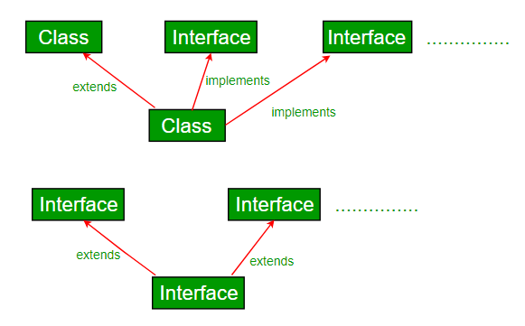

# Chapter 7: Interfaces and Polymorphism

**Name:** Daymian Snowden

**Assignment:** Midterm

---
## Chapter covers:
- Interfaces and Recap
- What are interfaces?
- Interfaces vs Abstract classes
- When to use interfaces vs abstract classes
- Interface syntax, rules, and restrictions
- How interfaces enable abstraction and polymorphism
- Multiple interface implementation
- Default and static methods in interfaces
- When NOT to use interfaces
- Example: University Interfaces
---

### Interfaces and Recap

In Chapter 6, we talked about inheritance and how it allows us to build class hierarchies.
We learned about abstract classes, which can have both abstract methods (no implementation) and concrete methods (with implementation).
We ended with the dangers of inheritance - the fragile base class problem, deep hierarchies, and tight coupling.

But what if we want to define behavior without any implementation at all?
Is that possible?
What if we want a class to have multiple "types", while avoiding the diamond problem?
What if we want maximum flexibility and minimum coupling?

This is where **interfaces** come in.
We have talked about them before, when it would be appropriate to use an interface and their value in OOD.
Indeed, interfaces are Java's solution to most of inheritance's problems.

### What Are Interfaces?

Okay, great - what are they?
An interface is a completely abstract contract - it defines **what** a class can do, without specifying **how** it does it.
Think of an interface as a promise - any class that implements the interface promises it will provide certain methods.
Deontology aside, these contracts offer great flexibility.

**Key characteristics of interfaces:**
- Defines method signatures without implementations (mostly, usually)
- Cannot be instantiated directly (you see `abstract` and we're not instantiating)
- A class can (and potentially should) implement multiple interfaces
- All methods are implicitly `public abstract` (at least, before Java 8)
- All fields are implicitly `public static final` (constants)
- No constructors, no instance fields

**Why do we need interfaces?**

Remember, Java doesn't allow multiple inheritance of classes - otherwise we get the diamond problem.
But sometimes, we do need a class to have multiple capabilities or types.
Interfaces give us a way to achieve this without the complications of multiple inheritance.
```java
// We can't do this in Java
public class WorkingStudent extends Student, Employee {  // Compile error
    // Multiple class inheritance not allowed
}

// But we can do this
public class WorkingStudent extends Person implements Student, Employee {
    // Gotcha!
    // Multiple interface implementation allowed!
}
```

**Interface as a Contract**

The interface says: "If you implement me, you must provide these methods."
The class says: "I promise to provide those methods."
And everyone lived happily ever after.
```java
// This interface is a contract
public interface Flyable {
    void fly();      // Contract: you must have a fly() method
    void land();     // Contract: you must have a land() method
}

// This class signs the contract
public class Bird implements Flyable {
    @Override
    public void fly() {
        System.out.println("Flapping wings");
    }
    
    @Override
    public void land() {
        System.out.println("Landing on branch");
    }
    // Contract fulfilled!
}
```

### Interfaces vs Abstract Classes

We covered abstract classes in Chapter 6, but let's do a detailed comparison with interfaces.
Understanding when to use each is the key to better design.

  
*Figure 1: Extend vs Implement - https://www.geeksforgeeks.org/java/difference-between-abstract-class-and-interface-in-java/*

**What Abstract Classes Can Do That Interfaces Can't**

Abstract classes can:
- Have instance fields (state)
- Have constructors
- Have protected or private methods
- Provide partial implementation with some abstract methods
```java
// Abstract class with state and partial implementation
public abstract class Animal {
    protected String name;        // Instance field
    protected int age;            // Instance field
    
    public Animal(String name, int age) {  // Constructor
        this.name = name;
        this.age = age;
    }
    
    // Concrete method with implementation
    public void eat() {
        System.out.println(name + " is eating");
    }
    
    // Abstract method - subclasses must implement
    public abstract void makeSound();
}
```

**What Interfaces Can Do That Abstract Classes Can't**

Interfaces can:
- Be implemented by multiple classes (allows for multiple interface implementation)
- Allow a class to have multiple "types" (identities)
- Avoid the diamond problem
- Define pure contracts without any implementation baggage
```java
// Multiple interfaces
public interface Flyable {
    void fly();
}

public interface Swimmable {
    void swim();
}

// A class can implement both
public class Duck implements Flyable, Swimmable {
    @Override
    public void fly() {
        System.out.println("Duck flying");
    }
    
    @Override
    public void swim() {
        System.out.println("Duck swimming");
    }
}
```

**Example Showing Both**

Let's see a case where both are used together:
```java
// Abstract class for shared state and behavior
public abstract class Vehicle {
    protected String brand;
    protected int year;
    
    public Vehicle(String brand, int year) {
        this.brand = brand;
        this.year = year;
    }
    
    public String getBrand() {
        return brand;
    }
    
    public abstract void start();
}

// Interface for capabilities
public interface Electric {
    void charge();
    int getBatteryLevel();
}

public interface Autonomous {
    void enableAutopilot();
    void disableAutopilot();
}

// Concrete class using both
public class Tesla extends Vehicle implements Electric, Autonomous {
    private int batteryLevel;
    private boolean autopilotEnabled;
    
    public Tesla(String model, int year) {
        super("Tesla", year);
        this.batteryLevel = 100;
        this.autopilotEnabled = false;
    }
    
    @Override
    public void start() {
        System.out.println("Tesla starting silently");
    }
    
    @Override
    public void charge() {
        batteryLevel = 100;
        System.out.println("Tesla charging");
    }
    
    @Override
    public int getBatteryLevel() {
        return batteryLevel;
    }
    
    @Override
    public void enableAutopilot() {
        autopilotEnabled = true;
        System.out.println("Autopilot enabled");
    }
    
    @Override
    public void disableAutopilot() {
        autopilotEnabled = false;
        System.out.println("Autopilot disabled");
    }
}
```

This design gives us:
- Shared state and behavior from `Vehicle` (our abstract class)
- Multiple capabilities from `Electric` and `Autonomous` (our interfaces)
- Clear separation between identity (Vehicle) and capabilities (Electric, Autonomous)

### When to Use Interfaces vs Abstract Classes

Often one of the more important design decisions we'll make, but how do we choose?

**Use Interfaces When:**

1. **Defining capabilities rather than identity**
```java
// Interface defines what something CAN do
public interface Flyable {
    void fly();
}

// Many different things can fly - birds, planes, drones
// They're not all the same type of thing
```

2. **Multiple inheritance is needed**
```java
// A class can have multiple capabilities
public class Drone implements Flyable, Controllable, Chargeable {
    // Implements all three interfaces
}
```

3. **Creating a pure contract with no shared implementation**
```java
// Just defines the contract
public interface Comparable<T> {
    int compareTo(T other);
}
```

4. **You want maximum flexibility and loose coupling**
```java
// Any class can implement this, regardless of hierarchy
// Useful when multiple hierarchies (but different children) use the same methods
public interface Sortable {
    void sort();
}
```

**Use Abstract Classes When:**

1. **Shared state is needed**
```java
// Abstract class can have instance fields
public abstract class Animal {
    protected String name;  // Shared state
    protected int age;      // Shared state
}
```

2. **Shared implementation is needed**
```java
// Abstract class provides default behavior
public abstract class Shape {
    protected String color;
    
    // Concrete method all shapes share
    public void setColor(String color) {
        this.color = color;
    }
    
    // Abstract method each shape implements differently
    public abstract double getArea();
}
```

3. **There is a clear "is-a" hierarchy**
```java
// Dog IS-A Animal (not just capable of animal things)
public abstract class Animal {
    // Common animal functionality
}

public class Dog extends Animal {
    // Dog-specific functionality
}
```

4. **You need constructors to enforce invariants**
```java
public abstract class Person {
    protected String name;
    
    // Constructor ensures name is always set
    public Person(String name) {
        if (name == null || name.isEmpty()) {
            throw new IllegalArgumentException("Name required");
        }
        this.name = name;
    }
}
```

**Decision Tree**

Here's a decision tree that can help you decide:
1. **Do you need to store state (instance fields)?**
   1. Use abstract class   
  

2. **Do you need multiple inheritance?**
   2. Use interfaces


3. **Do you need shared concrete methods?**
   3. Use abstract class


4. **Are you defining identities?**
   4. Use abstract class


5. **Are you defining capabilities?**
   5. Use interfaces


6. **Do you want maximum flexibility?**
   6. Use interfaces


7. **Not a single clue?**
   7. Start with interfaces - it is easier to change later

### Interface Syntax, Rules, and Restrictions

Let's dive into the technical details of how interfaces work in Java.

**Basic Interface Declaration**
```java
// Basic interface
public interface Printable {
    void print();  // Implicitly public abstract
}

// Interface with multiple methods
public interface Drawable {
    void draw();
    void erase();
    void move(int x, int y);
}
```

**Implementing an Interface**
```java
// Class implements interface
public class Document implements Printable {
    private String content;
    
    public Document(String content) {
        this.content = content;
    }
    
    @Override
    public void print() {
        System.out.println(content);
    }
}

// Multiple interfaces
public class Shape implements Drawable, Printable {
    @Override
    public void draw() {
        System.out.println("Drawing shape");
    }
    
    @Override
    public void erase() {
        System.out.println("Erasing shape");
    }
    
    @Override
    public void move(int x, int y) {
        System.out.println("Moving to (" + x + ", " + y + ")");
    }
    
    @Override
    public void print() {
        System.out.println("Printing shape");
    }
}
```

**Interface Constants**

Interfaces can have fields, but! The fields are always `public static final` (constants):
```java
public interface GameConstants {
    int MAX_PLAYERS = 4;           // Implicitly public static final
    String GAME_NAME = "Adventure"; // Implicitly public static final
    double VERSION = 1.0;          // Implicitly public static final
}

// Usage
System.out.println(GameConstants.MAX_PLAYERS);  // Access like static field
```

**Interface Restrictions (Why They Exist)**

Let's examine each restriction and understand the reasoning behind it:

1. **All methods are public abstract by default**
```java
public interface Flyable {
    void fly();  // Automatically public abstract
    
    // These are equivalent:
    public abstract void fly();
    abstract void fly();
    public void fly();
}
```
**Why?**

Interfaces define contracts that must be accessible to implementing classes.
Private or protected methods are not (or not as easily) accessible.

2. **All fields are public static final**
```java
public interface Constants {
    int MAX = 100;  // Automatically public static final
    
    // Cannot do this:
    // int count;  // Compile error - must be initialized
    // private int value = 5;  // Compile error - must be public
}
```
**Why?**

Interfaces can't have instance state - there are no constructors to initialize it.
Only constants make sense. Furthermore, they should be accessible to all (public) and shared (static).

3. **No constructors allowed**
```java
public interface Flyable {
    // This won't compile:
    // public Flyable() { }  // Compile error - no constructors
}
```
**Why?**

Interfaces can't be instantiated anyway, so constructors would serve no purpose.
Instead, the implementing classes use their own constructors.

4. **No instance fields**
```java
public interface Flyable {
    // Can't do this:
    // private int altitude;  // Compile error - no instance fields
    
    // Can do this:
    int MAX_ALTITUDE = 10000;  // Constant (static final)
}
```
**Why?**

Interfaces define behavior (methods); they **do not** define state (fields).
State belongs in the implementing classes.

5. **Cannot be instantiated**
```java
// This won't work:
// Flyable f = new Flyable();  // Compile error

// But this works:
Flyable f = new Bird();  // Reference to implementing class
```
**Why?**

Interfaces are incomplete - they have no implementation.
They rely on a concrete class to instantiate.

### How Interfaces Enable Abstraction

Abstraction is all about hiding complexity and showing only what's necessary.
Interfaces are the ultimate abstraction tool in Java.
We show the users what we want them to see, and hide the rest away for safekeeping.

**Hiding Implementation Details**
```java
// Interface defines what
// Interface does not define how
public interface DataStorage {
    void save(String data);
    String load();
}

// Implementation 1: File storage
public class FileStorage implements DataStorage {
    private String filename;
    
    public FileStorage(String filename) {
        this.filename = filename;
    }
    
    @Override
    public void save(String data) {
        // Complex file I/O code hidden
        // User doesn't need to know about FileWriter, BufferedWriter, etc.
    }
    
    @Override
    public String load() {
        // Complex file reading code hidden
        return "data from file";
    }
}

// Implementation 2: Database storage
public class DatabaseStorage implements DataStorage {
    private String connectionString;
    
    public DatabaseStorage(String connectionString) {
        this.connectionString = connectionString;
    }
    
    @Override
    public void save(String data) {
        // Complex database code hidden
        // User doesn't need to know about SQL, connections, etc.
    }
    
    @Override
    public String load() {
        // Complex query code hidden
        return "data from database";
    }
}
```

**Programming to an Interface, Not an Implementation**

This is a fundamental principle of good OOD, one that we have brought up at least once:
```java
// Bad: Tied to specific implementation
FileStorage storage = new FileStorage("data.txt");
storage.save("important data");

// Good: Program to the interface
DataStorage storage = new FileStorage("data.txt");
storage.save("important data");

// Can easily swap implementations
storage = new DatabaseStorage("jdbc:mysql://localhost");
storage.save("important data");  // Same code, different storage
```

### How Interfaces Enable Polymorphism

  
*Figure 2: Interface polymorphism visualization - https://dzone.com/articles/learning-java-what-vs-why*

Polymorphism with interfaces works the same way as it does with abstract classes - we can treat different objects uniformly through their interface type.

**Interface References Holding Different Implementations**
```java
// Different implementations of Flyable
public class Bird implements Flyable {
    @Override
    public void fly() {
        System.out.println("Bird flaps wings");
    }
}

public class Airplane implements Flyable {
    @Override
    public void fly() {
        System.out.println("Airplane uses jet engines");
    }
}

public class Drone implements Flyable {
    @Override
    public void fly() {
        System.out.println("Drone uses propellers");
    }
}

// Polymorphism in action
Flyable[] flyingThings = new Flyable[3];
flyingThings[0] = new Bird();
flyingThings[1] = new Airplane();
flyingThings[2] = new Drone();

for (Flyable thing : flyingThings) {
    thing.fly();  // Each one flies differently
}

// Output:
// Bird flaps wings
// Airplane uses jet engines
// Drone uses propellers
```


### Multiple Interfaces Implementation

  
*Figure 3: A Class With Multiple Interfaces - https://www.geeksforgeeks.org/java/interfaces-and-inheritance-in-java/*

This is where interfaces show off their flexibility - a class can implement as many interfaces as needed!

**Why Java Allows This But Not Multiple Inheritance**

With interfaces, the diamond problem ain't no problem:
```java
public interface A {
    void method();
}

public interface B {
    void method();
}

// No problem - class provides ONE implementation
public class C implements A, B {
    @Override
    public void method() {
        System.out.println("One implementation satisfies both");
    }
}
```

There's no ambiguity because:
- Interfaces don't have implementation
- The implementing class provides the one true implementation
- There's no question about which `method()` to inherit

**Practical Example: Duck**
```java
public interface Flyable {
    void fly();
    void land();
}

public interface Swimmable {
    void swim();
}

public interface Walkable {
    void walk();
}

// Duck can do all three
public class Duck implements Flyable, Swimmable, Walkable {
    private String name;
    
    public Duck(String name) {
        this.name = name;
    }
    
    @Override
    public void fly() {
        System.out.println(name + " is flying");
    }
    
    @Override
    public void land() {
        System.out.println(name + " is landing");
    }
    
    @Override
    public void swim() {
        System.out.println(name + " is swimming");
    }
    
    @Override
    public void walk() {
        System.out.println(name + " is walking");
    }
}

// Usage - can be treated as any of its types
Duck donald = new Duck("Donald");

Flyable flyingDuck = donald;
flyingDuck.fly();

Swimmable swimmingDuck = donald;
swimmingDuck.swim();

Walkable walkingDuck = donald;
walkingDuck.walk();
```

### Default and Static Methods in Interfaces

Java 8 introduced default and static methods in interfaces, adding some flexibility while maintaining backwards compatibility.
For reference, the most recent version is Java 25... Anyway.

**Default Methods**

Default methods provide a default implementation that implementing classes can use or override:
```java
public interface Greetable {
    // Abstract method - must be implemented
    String getName();
    
    // Default method - can be used as-is or overridden
    default void greet() {
        System.out.println("Hello, " + getName());
    }
    
    default void farewell() {
        System.out.println("Goodbye, " + getName());
    }
}

// Class can use defaults
public class Person implements Greetable {
    private String name;
    
    public Person(String name) {
        this.name = name;
    }
    
    @Override
    public String getName() {
        return name;
    }
    
    // Uses default greet() and farewell()
}

// Or override them
public class Robot implements Greetable {
    private String name;
    
    public Robot(String name) {
        this.name = name;
    }
    
    @Override
    public String getName() {
        return name;
    }
    
    @Override
    public void greet() {
        System.out.println("BEEP BOOP. HELLO " + getName().toUpperCase());
    }
    
    // Uses default farewell()
}
```

**Why Default Methods Were Added**

Default methods solve a specific problem: how can we change interfaces without breaking existing implementations?

Before Java 8:
```java
public interface List<E> {
    boolean add(E e);
    // ... other methods
}

// Millions of classes implement List

// Want to add a new method? Too bad Charlie.
// All existing implementations would break!
```

With default methods:
```java
public interface List<E> {
    boolean add(E e);
    // ... other methods
    
    // New method with default implementation
    default void sort(Comparator<? super E> c) {
        // Default implementation
    }
}

// Existing implementations still work
// They get the default sort(), for freeeee
```

**Static Methods in Interfaces**

Interfaces can also have static utility methods, which then can be freely employed across classes:
```java
public interface MathUtils {
    // Static method in interface
    static int add(int a, int b) {
        return a + b;
    }
    
    static int multiply(int a, int b) {
        return a * b;
    }
}

// Usage - like regular static methods
int sum = MathUtils.add(5, 3);
int product = MathUtils.multiply(4, 7);
```

### When NOT to Use Interfaces

Interfaces are good, they are useful - but they're not always the right choice.
Honestly, there are some hard rules in computer science.
But when it comes to design, we get to fail as much as we like, yay!

**Don't Use Interfaces When:**

1. **There's only one implementation (and there will never be more)**
```java
// Bad: Unnecessary interface
public interface UserService {
    void createUser(String name);
}

public class UserServiceImpl implements UserService {
    @Override
    public void createUser(String name) {
        // Only implementation
    }
}

// Better: Just use a class
public class UserService {
    public void createUser(String name) {
        // Implementation
    }
}
```

2. **You're creating marker interfaces (empty interfaces)**
```java
// Bad: Empty marker interface
public interface Serializable {
    // No methods - just marks class as serializable
}

// Better: Use annotations
@Serializable
public class User {
    // ...
}
```

3. **The interface would have tons of methods**
```java
// Bad: Too many methods in one interface
public interface IHaveBecomeGodInterface {
    void method1();
    void method2();
    // ... 50 more methods
}

// Better: Split into smaller, focused interfaces
public interface Readable {
    void read();
}

public interface Writable {
    void write();
}
```

4. **You need shared state or implementation**
```java
// Bad: Interface can't provide this
public interface Animal {
    // Can't have instance fields
    // Can't have constructors
}

// Better: Use abstract class
public abstract class Animal {
    protected String name;  // Shared state
    
    public Animal(String name) {  // Constructor
        this.name = name;
    }
}
```

### Example: University Interfaces

Let's extend our university system we made in Chapter 6 by adding interfaces.

**Adding Capability Interfaces**
```java
// Capability: Can teach courses
public interface Instructor {
    void teachCourse(String courseName);
    List<String> getCoursesTeaching();
}

// Capability: Can enroll in courses
public interface Learner {
    void enrollInCourse(String courseName);
    List<String> getCoursesEnrolled();
}

// Capability: Can be graded
public interface Gradable {
    void setGrade(String course, double grade);
    double getGrade(String course);
}

// Capability: Can pay tuition
public interface TuitionPayer {
    void payTuition(double amount);
    double getTuitionBalance();
}
```

**Person Hierarchy**
```java
// Abstract base class (identity)
public abstract class Person {
    protected String name;
    protected int id;
    protected String email;
    
    public Person(String name, int id, String email) {
        this.name = name;
        this.id = id;
        this.email = email;
    }
    
    public abstract String getRole();
    
    // Getters...
}
```

**Student with Interfaces**
```java
// Student IS-A Person, CAN learn, CAN be graded, CAN pay tuition
public class Student extends Person implements Learner, Gradable, TuitionPayer {
    private List<String> coursesEnrolled;
    private Map<String, Double> grades;
    private double tuitionBalance;
    
    public Student(String name, int id, String email) {
        super(name, id, email);
        this.coursesEnrolled = new ArrayList<>();
        this.grades = new HashMap<>();
        this.tuitionBalance = 0;
    }
    
    @Override
    public String getRole() {
        return "Student";
    }
    
    // Learner interface
    @Override
    public void enrollInCourse(String courseName) {
        if (!coursesEnrolled.contains(courseName)) {
            coursesEnrolled.add(courseName);
        }
    }
    
    @Override
    public List<String> getCoursesEnrolled() {
        return new ArrayList<>(coursesEnrolled);
    }
    
    // Gradable interface
    @Override
    public void setGrade(String course, double grade) {
        if (coursesEnrolled.contains(course)) {
            grades.put(course, grade);
        }
    }
    
    @Override
    public double getGrade(String course) {
        return grades.getOrDefault(course, 0.0);
    }
    
    // TuitionPayer interface
    @Override
    public void payTuition(double amount) {
        tuitionBalance -= amount;
    }
    
    @Override
    public double getTuitionBalance() {
        return tuitionBalance;
    }
}
```

**Professor with Interfaces**
```java
// Professor IS-A Person, CAN teach
public class Professor extends Person implements Instructor {
    private String department;
    private List<String> coursesTeaching;
    
    public Professor(String name, int id, String email, String department) {
        super(name, id, email);
        this.department = department;
        this.coursesTeaching = new ArrayList<>();
    }
    
    @Override
    public String getRole() {
        return "Professor";
    }
    
    // Instructor interface
    @Override
    public void teachCourse(String courseName) {
        if (!coursesTeaching.contains(courseName)) {
            coursesTeaching.add(courseName);
        }
    }
    
    @Override
    public List<String> getCoursesTeaching() {
        return new ArrayList<>(coursesTeaching);
    }
    
    public String getDepartment() {
        return department;
    }
}
```

**Teaching Assistant: Multiple Capabilities**
```java
// TA IS-A Student, CAN learn, CAN be graded, CAN pay tuition, AND CAN teach!
public class TeachingAssistant extends Student implements Instructor {
    private List<String> coursesTeaching;
    
    public TeachingAssistant(String name, int id, String email) {
        super(name, id, email);
        this.coursesTeaching = new ArrayList<>();
    }
    
    @Override
    public String getRole() {
        return "Teaching Assistant";
    }
    
    // Instructor interface
    @Override
    public void teachCourse(String courseName) {
        if (!coursesTeaching.contains(courseName)) {
            coursesTeaching.add(courseName);
        }
    }
    
    @Override
    public List<String> getCoursesTeaching() {
        return new ArrayList<>(coursesTeaching);
    }
    
    // Inherits all Learner, Gradable, TuitionPayer methods from Student
}
```

**Using the System Polymorphically (Bringing it home)**
```java
public class University {
    private List<Person> people;
    private List<Instructor> instructors;
    private List<Learner> learners;
    
    public University() {
        people = new ArrayList<>();
        instructors = new ArrayList<>();
        learners = new ArrayList<>();
    }
    
    public void registerPerson(Person person) {
        people.add(person);
        
        // Check capabilities and add to appropriate lists
        if (person instanceof Instructor) {
            instructors.add((Instructor) person);
        }
        if (person instanceof Learner) {
            learners.add((Learner) person);
        }
    }
    
    public void assignCourse(String courseName, Instructor instructor) {
        instructor.teachCourse(courseName);
    }
    
    public void enrollStudents(String courseName, List<Learner> students) {
        for (Learner student : students) {
            student.enrollInCourse(courseName);
        }
    }
    
    public void printDirectory() {
        for (Person person : people) {
            System.out.println(person.getRole() + ": " + person.getName());
        }
    }
}

// Usage
University university = new University();

Student student = new Student("Aisha", 1, "aisha@uni.edu");
Professor prof = new Professor("Dr. Smith", 2, "smith@uni.edu", "CS");
TeachingAssistant ta = new TeachingAssistant("Bob", 3, "bob@uni.edu");

university.registerPerson(student);
university.registerPerson(prof);
university.registerPerson(ta);

// TA can do both
university.assignCourse("CS 5004", ta);  // Teaching
ta.enrollInCourse("CS 5100");             // Learning

university.printDirectory();
```

**Why Is This Good Design?**

This design shows interfaces playing to their strengths:
- **Identity through inheritance** - Person → Student → TeachingAssistant (is-a)
- **Capabilities through interfaces** - Learner, Instructor, Gradable, etc. (can-do)
- **Multiple capabilities** - TeachingAssistant is both Learner and Instructor
- **Polymorphism** - Can treat objects by their capabilities
- **Flexibility** - Easy to add new person types or capabilities
- **No diamond problem** - Multiple interfaces work fine

If we tried to do what we just did only using inheritance... the thought makes me sad.
We would either need multiple inheritance (straight up not allowed in Java), or lots of duplicate code.

Interfaces are one of Java's most powerful features for building flexible, maintainable systems.
They enable:
- Pure abstraction without implementation
- Multiple capabilities per class
- Polymorphism without inheritance problems
- Loose coupling between components
- Easy testing through interface implementations

Use them wisely, use them well:
- For capabilities and contracts
   - Not for identity!
- Great for multiple implementations are likely
- Can enable polymorphism and almost also increases flexibility
-  With abstract classes when managing shared state/behavior

Now we've covered all seven chapters. Now we can approach OOD like professionals!
Well, okay maybe not professionals - they're paid... And I'm pretty tired.
Nevertheless, armed with this knowledge, we are no longer rank amateurs anymore!
Go forth, and good luck. Make something great.

---

### Academic Integrity Statement
I understand that my learning is dependent on individual effort and struggle,
and I acknowledge that this assignment is a 100% original work and that I received no other assistance other than what is listed here.

**Acknowledgements and assistance received:**
- Course Content, primarily modules and lecture content
- Java Interfaces - https://docs.oracle.com/javase/tutorial/java/IandI/createinterface.html
- Interface vs Abstract Class - https://www.geeksforgeeks.org/difference-between-abstract-class-and-interface-in-java/
- Java Interface - https://www.w3schools.com/java/java_interface.asp
- Default Methods in Interfaces - https://docs.oracle.com/javase/tutorial/java/IandI/defaultmethods.html
- Multiple Inheritance in Java - https://www.baeldung.com/java-inheritance-composition
- Interfaces and Polymorphism - https://www.geeksforgeeks.org/polymorphism-in-java/
- When to use Interfaces - https://stackoverflow.com/questions/479142/when-to-use-an-interface-instead-of-an-abstract-class
- Repository Pattern - https://martinfowler.com/eaaCatalog/repository.html
- Dependency Injection - https://www.baeldung.com/java-dependency-injection
- Java 8 Interface Changes - https://www.baeldung.com/java-static-default-methods
- Design by Contract - https://en.wikipedia.org/wiki/Design_by_contract
- SOLID Principles and Interfaces - https://www.baeldung.com/solid-principles

I did not use generative AI in any form to create this content and the final content was not adapted from generative AI created content.

I did not view content from anyone else's submission including submissions from previous semesters nor am I submitting someone else's previous work in part or in whole.

I am the only creator for this content. All sections are my work and no one else's with the exception being any starter content provided by the instructor.
If asked to explain any part of this content, I will be able to.

By putting my name and date here, I acknowledge that all of the above is true and I acknowledge that lying on this form is a violation of academic integrity and will result in no credit on this assignment and possible further repercussions as determined by the Khoury Academic Integrity Committee.

#### Signed: Daymian Snowden
#### Date: 10/19/2025

---